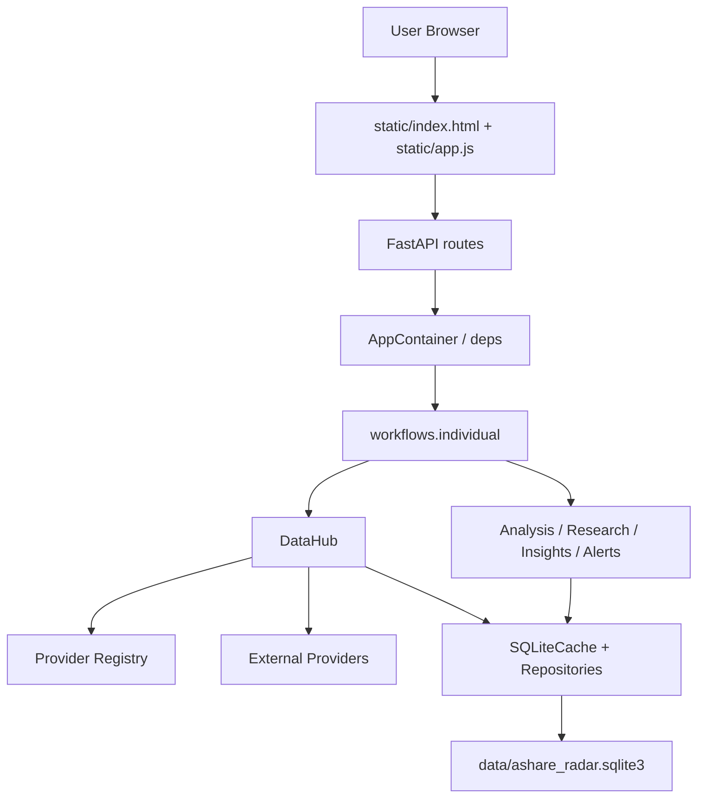
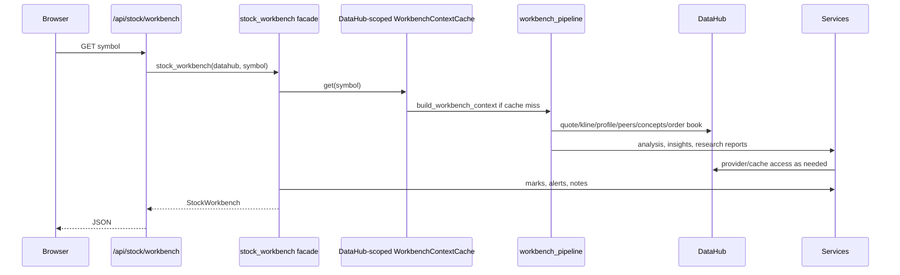
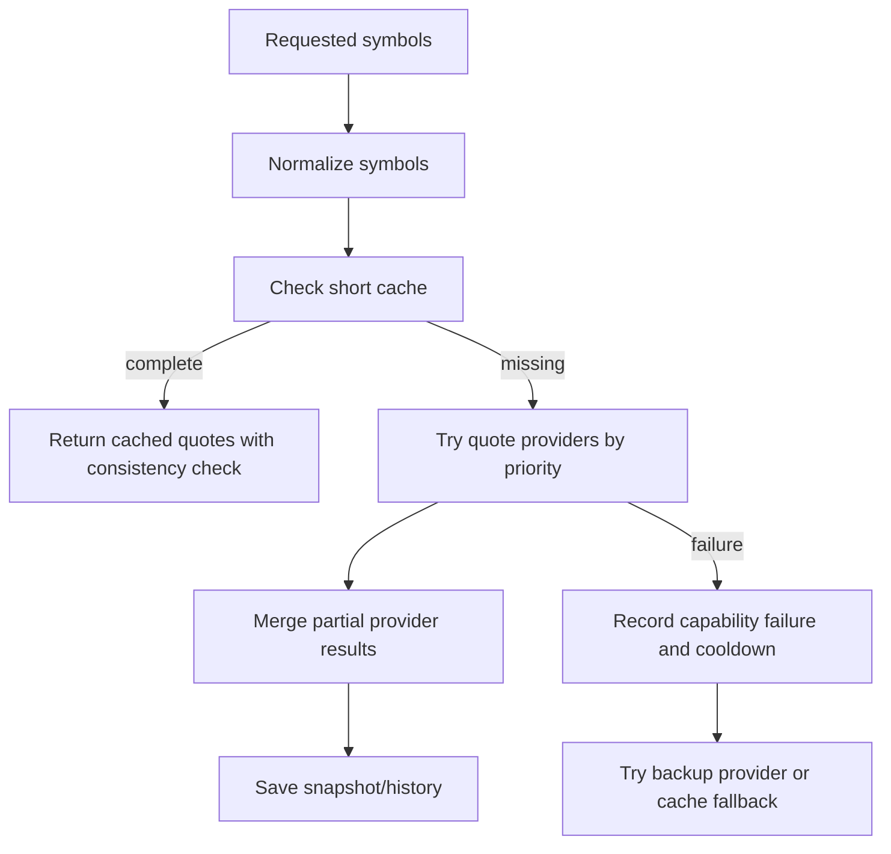

# Software Design Description

## 1. System Overview

AShareRadar is a local FastAPI + SQLite + static frontend application. The backend owns data acquisition, caching, analysis, diagnostics, and local user records. The frontend is a server-rendered static page with modular JavaScript.



## 2. Runtime Composition

- `app/main.py` creates the FastAPI application, mounts static files, registers routers, and starts/stops the scheduler.
- `app/api/container.py` builds the application container once: settings, datahub, scheduler, and the DataHub-owned workbench context cache.
- `app/api/deps.py` exposes dependency functions to routes.
- `app/api/errors.py` converts validation, not-found, data-source, and SQLite database failures into Chinese API responses. Validation errors are mapped through ordered message rules so numeric bounds, string length, parsing, boolean, missing-field, malformed all-zero stock symbols, and fallback messages stay consistent across routes.
- `static/js/symbols.js` mirrors the public stock-symbol rule used by the backend for UI search input: normalize legal SH/SZ symbols, but reject malformed or all-zero codes before starting a workbench request.

## 3. Layer Responsibilities

| Layer | Files | Responsibilities |
| --- | --- | --- |
| UI | `static/index.html`, `static/app.js`, `static/js/*`, `static/styles.css`, `static/css/*` | Render workbench, call APIs, maintain local UI state, draw chart, handle SSE, and style UI surfaces by module. |
| API | `app/api/routes/*` | Validate request parameters, call workflows/services, select response models, and keep streaming event formatting isolated from provider logic. |
| Workflow | `app/workflows/individual.py`, `app/workflows/stock_analysis.py`, `app/workflows/workbench_pipeline.py`, `app/workflows/market_overview.py`, `app/workflows/stock_lookup.py` | Compose data into user-facing stock use cases while keeping public compatibility imports stable. |
| Services | `app/services/*` | Provider orchestration, analysis, indicators, quality gates, alerts, diagnostics, research reports. |
| Repositories | `app/repositories/*` | SQLite read/write boundaries per data domain. |
| DB | `app/db/*` | Connection, schema, migrations, row-to-model mapping. |
| Models | `app/models/*.py` | Pydantic API and internal transfer models grouped by domain, with `schemas.py` kept as a compatibility re-export layer. |

## 4. Main Request Flows

### 4.1 Workbench Load



`stock_workbench` remains the public workflow facade, but its internal stages are separated into advice snapshot persistence, local state reads, and final response assembly. Local state helpers normalize the symbol themselves and use fixed read limits for chart marks, alert rules, alert events, and notes so user-state refresh behavior stays predictable even when the provider-heavy workbench context is cached.

### 4.2 Quote Retrieval



### 4.3 Alert Evaluation

- Scheduler or API triggers alert evaluation.
- Current quote and quality are loaded.
- Alert condition is evaluated only if data quality is acceptable.
- Trigger events respect cooldown.
- Recovery events are recorded when state returns below threshold.

## 5. Data Model Summary

SQLite initialization enters through `app/db/schema.py`; table/index definitions live in `app/db/schema_definitions.py`, while guarded compatibility columns, one-time migrations, migration records, and compatibility indexes live in `app/db/schema_migrations.py`. Row-to-model mapping is split by domain so repository changes can stay close to the data they read. Pydantic models are grouped by API/domain so response contracts can evolve without one oversized schema file:

| Module | Purpose |
| --- | --- |
| `app/models/market.py` | Quote, daily/minute K-lines, stock profile, plate/concept, provider capability, and order book models. |
| `app/models/analysis.py` | Core analysis result, data quality, signal snapshot, review, overview, fund-flow, strategy, finance, event, and rule-match models. |
| `app/models/research.py` | Factor lab, regime, validation, risk/reward, timeframe, diagnosis, Q&A, peer, theme, chip, replay, and minute-analysis report models. |
| `app/models/user_data.py` | Watchlist, alert, note, chart mark, and advice-history models. User input/update models forbid unknown fields and require finite user numeric inputs for alert thresholds and note prices so client mistakes do not become silent no-ops or bad local data. |
| `app/models/system.py` | Provider status, source plan, cache stats, runtime diagnostics, task, monitor, and scheduler models. |
| `app/models/workbench.py` | Composite stock workbench and market overview response models. |
| `app/models/schemas.py` | Backward-compatible import surface for existing route, repository, service, and test code. |

| Mapper Module | Purpose |
| --- | --- |
| `app/db/mappers.py` | Backward-compatible mapper import facade for older callers. |
| `app/db/market_mappers.py` | Quote, daily/minute K-line, stock pool, plate, and concept row mapping. |
| `app/db/system_mappers.py` | Provider status, provider capability, scheduled task, and monitor-event row mapping. |
| `app/db/user_mappers.py` | Watchlist, advice history, alert, note, and alert-condition label mapping. Advice history reads sanitize legacy dirty text/numbers; alert rule reads disable unsupported or non-finite legacy rows before they reach schedulers. |

Repository boundaries:

- `app/repositories/market_data.py` remains the backward-compatible market data repository composition used by `SQLiteCache`.
- `app/repositories/market_quotes.py` owns quote snapshots, quote history, trade-date extraction, and valuation-field persistence. Snapshot/history SQL and row tuples are generated from explicit column lists so adding quote fields does not require maintaining parallel tuple order by hand. Quote writes and cache reads pass the shared quote-validity rules so non-finite, non-positive, malformed OHLC, negative amount/volume, or legacy dirty snapshot/history rows cannot re-enter analysis.
- `app/repositories/market_klines.py` owns daily K-line and minute K-line cache reads/writes. It filters rows with `app/utils/market_data.py` on both write and read, keeping malformed provider rows out of cache and preventing legacy bad cache rows from re-entering analysis.
- `app/repositories/market_metadata.py` owns stock pool, plate rank, and stock concept cache reads/writes. Metadata persistence uses explicit column lists, stable read ordering, concept-name de-duplication, and finite optional numeric-field cleaning so display-only amount/turnover/leader-change fields cannot poison later reports.
- `app/repositories/provider_status.py` owns provider/capability upserts and queries; runtime success/failure updates preserve configured capability `enabled` state and read status rows through explicit column lists with stable ordering. `app/repositories/provider_status_aggregation.py` owns the policy for rolling capability state up to aggregate provider health. Aggregation first classifies enabled and active capabilities, normalizes invalid counts, then applies fallback history only when no enabled capability has runtime activity so disabled stale errors do not pollute current provider health.
- `app/repositories/update_fields.py` owns shared field-cleaning and SQL assignment generation used by user-data update methods.
- `app/repositories/advice.py` owns advice-history persistence and snapshot de-duplication. Dedupe compares only finite trend/support/resistance values, so malformed legacy rows are retained for display with mapper fallbacks but cannot swallow a fresh analysis snapshot.
- `app/repositories/alerts.py` owns alert-rule and alert-event persistence. Alert SQL uses explicit column lists and row builders, thresholds must be finite, cooldown seconds must be bounded, trigger counts are normalized to non-negative values during state updates, unsupported or non-finite legacy rules are kept readable but not executable, and rule/event reads stay in deterministic order so adding rule fields does not depend on tuple position.
- `app/repositories/notes.py` owns stock-note persistence and note-field cleaning. Note SQL uses explicit column lists and row builders; manual prices must be finite and positive, note content cannot be blank, blank trade dates are stored as `None`, and supported date/datetime formats are normalized before storage so chart marks and note ordering share a reliable date contract.
- Other repositories stay scoped by user data, provider/runtime state, maintenance, and cache statistics.

| Table | Purpose |
| --- | --- |
| `provider_status` | Aggregate provider health. |
| `provider_capability_status` | Provider health per capability such as quote, kline, minute, stock, plate. |
| `quote_snapshot` | Latest quote per symbol. |
| `quote_history` | Historical quote snapshots and valuation fields. |
| `kline_daily` | Daily K-line cache. |
| `kline_minute` | Minute K-line cache. |
| `stock_master` | Stock pool cache. |
| `stock_concept` | Concept/plate membership cache. |
| `plate_rank` | Industry/plate ranking cache. |
| `watchlist` | User watchlist. |
| `advice_history` | Analysis advice timeline. |
| `alert_rule` | Local alert rules. |
| `alert_event` | Trigger/recovery events. |
| `stock_note` | User notes and chart mark source. |
| `task_run` | Scheduler task history. |
| `monitor_event` | Runtime diagnostics and repeated warning merge. |
| `trading_calendar` | Trading day cache. |

## 6. Provider Design

Provider construction and capability checks are centralized in `app/services/provider_registry.py`. The registry owns the provider order, priority setting lookup, optional demo insertion, capability-kind field mapping, fallback capability metadata for providers without an explicit `capability()`, and the enabled checks used by `DataHub` status synchronization.

Default priority:

```text
Quote:  Tencent/Eastmoney -> AKShare
Daily:  Tencent/Eastmoney -> AKShare -> BaoStock
Minute: Futu -> AKShare
Stocks: AKShare -> Tushare -> BaoStock -> Local
Plates: AKShare -> Local
```

Provider calls must:

- Use bounded timeouts.
- Record success/failure per capability.
- Avoid marking a whole provider unhealthy when only one capability failed.
- Prefer explicit degraded status over fake real-time data.
- Reject malformed critical quote/K-line fields and empty order-book depth instead of silently converting them to usable data.
- Reject quotes with missing stock code/name, impossible timestamps, or open/current prices outside the reported high/low range.

Provider support modules:

- `app/services/datahub.py` owns high-level DataHub orchestration, the runtime settings instance, SQLite cache wiring, provider coordinator construction, and the DataHub-scoped workbench context cache. Coordinator construction is centralized so quote, K-line, metadata, order-book, and source-plan wiring share the same settings/cache/runtime/provider dependencies.
- `app/services/datahub_cache.py` owns pure cache/source tagging helpers, stock-pool freshness checks, quote matching, concept normalization, and explicit minute interval alias mapping.
- `app/services/datahub_klines.py` owns daily K-line and minute K-line fetching, cache reuse only when fresh cached rows cover the requested limit, the shared provider-attempt loop, invalid provider-row filtering followed by parsed date/time sorting and latest-window selection, bounded provider-call limits that ignore malformed runtime max-limit settings, missing-capability failure recording, cancellation propagation, empty-response failure handling, fallback cache tagging, unregistered-provider skip behavior, and minute interval validation.
- `app/services/datahub_metadata.py` owns stock pool/profile, plate rank, and concept membership fetching. It preserves incomplete-stock-pool semantics so small samples do not falsely mark a stock as nonexistent, shares the plate/concept provider-attempt loop, skips unregistered priority providers, treats empty metadata responses as source failures, records AKShare plate failures at capability level, and enriches confirmed profiles from local metadata without mutating cached primary rows or overriding authoritative misses.
- `app/services/datahub_orderbook.py` owns optional Futu order-book retrieval, ping checks, order-book capability state recording, and provider-error wrapping so timeouts degrade to the same 503 contract as other data-source failures.
- `app/services/datahub_quotes.py` owns quote fetching, partial cache reuse, fallback quote cache, quote quality entry, and multi-source consistency checks. Quote consistency and priority loops skip configured provider names that are not registered instead of turning configuration drift into request failures; public route parsing limits unique batch quote requests before provider calls.
- `app/services/datahub_runtime.py` owns provider call timeouts, capability success/failure recording, and short cooldowns.
- `app/services/datahub_source_plan.py` owns source-plan assembly, primary-source selection, provider decision rules, warning rule priority, and recovery suggestions. It normalizes and de-duplicates provider names/status rows before planning, ranks duplicate provider status records by recency/activity, de-duplicates warning/suggestion text, counts unique non-demo quote providers, and downgrades missing quote/K-line/minute primaries into explicit warnings instead of reporting a healthy plan. Decision rules keep cooling ahead of healthy/failed/disabled states; warning rules keep capability-level failures ahead of aggregate provider failures.
- `app/services/datahub_status.py` owns provider source-key normalization, capability labels/states, source-plan wording, recovery suggestions, and provider error text. Source keys, capability-state suffixes, summary templates, and recovery suggestions are ordered rules so source aliases, unprobed/healthy/failed states, network/proxy errors, remote disconnects, timeouts, and provider-specific setup hints keep stable priority. Provider/source/kind/error text is cleaned at this boundary, unknown sources fall back to `unknown`, duplicate capability statuses keep the newest/most active record, unhealthy capability labels are de-duplicated, and success-rate counts ignore `nan`, `inf`, and negative values.
- `app/services/system_diagnostics.py` owns monitoring diagnostics for cache freshness, provider/capability failures, quote-source redundancy, scheduler state, storage size, row-count health, and trading-calendar fallback. Provider diagnostics produce explicit decisions so failed capabilities take priority over aggregate provider failures, disabled capabilities are ignored, dirty capability names/kinds are cleaned, and warning lists stay capped for readable monitoring output. Storage row counts and table-count keys are sanitized to non-negative integers and displayable names so malformed local metadata cannot create negative runtime/user counts, duplicate warnings, or break diagnostics rendering.
- `app/services/providers.py` owns Tencent quote/K-line access and the local demo provider. Tencent quote/K-line calls separate URL construction, HTTP/text or JSON retrieval, payload-shape extraction that tolerates trailing whitespace while rejecting unclosed payloads, stripped field/minimum-count validation, payload-to-model parsing, stock code/name validation, real timestamp validation, critical price-field validation, open/current price containment inside high/low, missing change-percent fallback, finite non-negative core amount/volume guards, and malformed-row filtering so request behavior, source errors, and row-quality rules can be tested independently. Demo data generation uses local random generators, backs K-lines by previous weekdays until the requested limit is met, and preserves rounded open/price-within-high/low invariants so offline samples do not mutate process-global random state or bypass quote sanity checks.
- `app/services/scheduler.py` owns local refresh task execution, manual task runs, data-health monitor events, and runtime cleanup summaries. It uses the same `Settings` instance as its `DataHub` so tests and future multi-container runtimes cannot drift from global process settings. Task registration is driven by `TaskDefinition` rows with positive-integer interval sanitation, task-state serialization is isolated, refresh-task symbols are normalized/deduped before provider calls, K-line symbol limits ignore malformed non-positive settings instead of skipping all valid symbols, and data-health checks sanitize freshness thresholds before separating provider failure selection, quote/K-line freshness events, and cleanup wording. Manual task failures are re-raised to the API after failed task history is recorded, while background task failures are recorded and do not kill the scheduler. Key K-line refresh handles empty/invalid symbol lists, per-symbol empty results, and per-symbol failures while continuing to refresh the remaining watchlist. Rescheduling is based on task finish time and clamps malformed or non-positive intervals to avoid busy loops; runtime cleanup summaries count only finite positive removed-row counts.
- `app/services/eastmoney_client.py` owns Eastmoney lightweight HTTP quote/K-line access, endpoint retry, proxy bypass, request-symbol normalization with readable invalid-symbol errors, response JSON/object-shape validation, deduped fetch with request-order quote mapping, transparent `AKShare·东方财富直连` source labels, strict quote-field validation, missing change-percent fallback, and malformed-row/K-line rejection used by AKShare fallback.
- `app/services/akshare_provider.py`, `tushare_provider.py`, `baostock_provider.py`, `futu_provider.py`, and `local_metadata_provider.py` own source-specific optional provider adapters. AKShare quote retrieval first tries the lightweight Eastmoney bridge, then falls back to AKShare spot rows with explicit missing-code reporting. AKShare K-line access keeps its Eastmoney period mapping local to the adapter and falls back to the lightweight Eastmoney client when AKShare import or source calls fail, so dependency ABI issues do not block daily/minute K-line retrieval; once AKShare returns rows, schema/field errors are allowed to surface instead of being misreported as a successful fallback. Optional daily/minute K-line adapters use the shared validity rules from `app/utils/market_data.py` so non-finite, non-positive, malformed open/high/low/close, negative-volume, or malformed optional minute rows are skipped before analysis or cache persistence. Concept membership uses normalized candidate builders plus shared code-column detection and constituent matching so EM/Sina concept sources skip incomplete rows, escalate all-candidate constituent-loader failure as source unavailable, and keep rank/order stable.
- `app/services/akshare_mappers.py` owns AKShare quote/minute/stock-pool row parsing, code validation, positive-price quote guards, optional-field normalization, and malformed OHLC-row filtering so provider methods stay focused on source calls and fallback order.
- `app/services/provider_stock_mappers.py` owns shared stock-code extraction, market extraction, list-date normalization, and `StockInfo` row mapping for optional providers; malformed stock-pool rows must be skipped rather than poisoning the cache.
- `app/services/futu_provider.py` owns Futu API return-code checks, ordered snapshot validation, order-book depth cleaning, empty-depth rejection, minute interval mapping, and OpenD lifecycle boundaries.
- `app/services/futu_mappers.py` owns Futu snapshot/minute row parsing, critical price-field validation, minute OHLC filtering, and A-share filtering so non-A-share rows cannot be misclassified as SZ quotes and invalid minute rows do not enter analysis.
- `app/services/optional_providers.py` remains only as a backward-compatible re-export layer.
- Compatibility imports for `_provider_source_key` and `_provider_error_text` remain available from `app/services/datahub.py`; new code should import from `datahub_status.py`.
- Market overview and strong-stock workflows must normalize/dedupe sampled symbols before provider calls, reject explicit custom lists when every symbol is invalid or exceeds the custom-list limit, log skipped invalid or duplicate sample inputs, degrade per sampled symbol when quote batches or K-line retrieval fail, and keep returning the available index/stock sample instead of failing the whole market panel. Strong-stock ranking requires K-line evidence; symbols whose K-line retrieval failed are excluded from the ranking instead of being scored as neutral.

## 7. Data Quality Design

Data-quality scoring is intentionally split by reason for change:

- `app/services/data_quality_components.py` owns quote-source, quote-field, K-line requirement, freshness, and cross-source consistency scoring components. Quote-field checks first reject non-finite, negative, or zero critical values before any derived interval or change-percent diagnostics, then apply stricter high/low and change-percent boundaries so malformed bases do not produce misleading mismatch notes.
- `app/services/data_quality.py` assembles the public `DataQuality` object and keeps backward-compatible quality helper exports.
- `app/services/data_quality_time.py` owns quote timestamp parsing, trading-session freshness penalties, expected quote dates, and weekday/trading-day gaps.
- `app/services/data_quality_kline.py` owns K-line source/date/cache/fallback assessment. It selects the latest parsable K-line date and its source instead of trusting the input tail, so unsorted rows, malformed trailing rows, or stale/demo tail rows cannot hide a fresher row or mislabel the source. K-line level selection and score penalties are ordered rule tables so stale-data thresholds, fallback-cache penalties, and demo-source penalties can be tuned without changing assessment assembly. Short-cache, normal-cache, and fallback-cache wording stays distinct, and a completely missing K-line set emits only the missing-data note instead of duplicating it with an insufficient-count note.
- Cross-source consistency penalties are clamped so malformed comparisons cannot become negative penalties that accidentally add score. If an anomaly-level consistency result has no source notes, the component adds a stable anomaly note for downstream display.
- `app/services/analysis.py` computes technical signals from filtered valid K-lines while data-quality scoring can still inspect the raw input rows. The response `klines` list is filtered before it reaches downstream research modules or the chart.
- Downstream research modules still treat module-specific auxiliary numbers as untrusted. Chip analysis, replay statistics, signal validation, T-strategy wording, and factor/risk adjustments must project non-finite values to explicit fallback, `None`, or `待确认` states before producing user-facing summaries.

Low-quality data must downshift active buy signals, T-plan confidence, and alert triggering.

Optional LLM explanations are allowed to improve wording only after rule output exists. Numeric grounding rejects unreferenced values even when they appear next to punctuation; only narrow non-market numbers such as small list markers, moving-average labels, period lengths, or count units are exempt. Stock codes are handled as code references only when the text explicitly presents them as codes or standard SH/SZ symbols, so a stock code cannot accidentally authorize a fabricated price. LLM failure text is redacted before it reaches the API response state.

## 8. API Streaming Design

- `app/api/routes/quotes.py` owns `/api/quote`, `/api/quotes`, and `/api/stream/quotes` request parsing, public batch-size limits, watchlist/seed-symbol fallback caps that skip malformed fallback symbols, canonical symbol validation, SSE message formatting that converts non-JSON-native values and non-finite numbers into readable frames, quote-error events, refresh-interval lower bounds, and disconnect-aware stream iteration.
- Streaming routes should keep provider calls behind `DataHub` and keep event formatting in small helpers so frontend retry behavior can be tested without opening a long-lived browser connection.
- Non-streaming routes that touch providers, repositories, scheduler state, or diagnostics should call `run_api()` or `run_sync_api()` at the route edge. This keeps domain `ValueError`, `NotFoundError`, `RuntimeError`, and SQLite `DatabaseError` failures in one user-facing API contract instead of leaking raw 500 errors from individual route handlers.

## 9. Analysis Signal Design

- `app/services/analysis.py` owns the single-stock `AnalysisResult` assembly and keeps `build_strong_stock_watch` re-exported for compatibility. The entrypoint delegates trend metrics, gated signal-point set construction, optional history/peer input copying, and final result composition to separate helpers.
- `app/workflows/stock_analysis.py` treats quote and K-line data as hard dependencies for main analysis, but plate-rank industry context is optional. Plate failures are logged as fallback events and result in a missing `industry_context` rather than failing the whole stock analysis.
- `app/services/analysis_signals.py` remains the backward-compatible analysis signal facade for older private helper imports.
- `app/services/analysis_signal_points.py` owns risk level, buy/sell points, T-plan price zones, and strength tags. Risk level, buy-point, sell-point, and strength-tag selection are explicit ordered rule tables so data-quality gates, price breakdowns, weak trends, trend pullbacks, breakout watches, support pullbacks, sell-protection triggers, and strength labels keep reviewable priority. Base T-plan cards only print numeric low/high/stop zones after price and zone ordering are confirmed; invalid quote windows return `待确认` wording instead of `0.00` action levels.
- `app/services/analysis_signal_quality.py` owns low-quality data gates and quality-reason wording used by signals and advice. Severe-quality handling is split by signal kind so buy points, sell/risk actions, and T-plan items can be blocked or downgraded without changing one branch chain.
- `app/services/analysis_signal_snapshot.py` owns signal confidence, sanitized score/label/quality projection, contribution cleaning/de-duplication, note cleaning, risk-note cleaning, and signal summary text, including legacy direct calls to the summary helper.
- `app/services/analysis_signal_advice.py` owns action advice and beginner summary wording.
- `app/services/leader_scoring.py` owns shared leader-score profiles, score contribution rules, and tag rules used by both feature snapshots and strong-stock ranking.
- `app/services/strong_stocks.py` owns strong-stock ranking, ranking reason text, and the market-overview-specific leader-score profile usage.
- `app/services/indicators.py` remains the backward-compatible indicator facade for existing imports.
- `app/services/indicator_trend_components.py` owns trend score contribution components for moving averages, slopes, price position, turnover, and volume confirmation. Moving-average and volume-confirmation contributions are named rule tables so trend-score thresholds and wording can be tuned independently.
- `app/services/indicator_trend.py` owns the public trend score entrypoint and compatibility exports.
- `app/services/indicator_levels.py` owns support/resistance calculation. It builds a valid level window first, applies breakout/breakdown adjustments from recent valid bars, and enforces support/resistance order so malformed K-lines do not leak into key price levels.
- `app/services/indicator_volume.py` owns volume averages and recent volume-ratio calculations.
- `app/services/minute_analysis.py` owns intraday minute-line analysis and reuses `app/utils/market_data.py` minute K-line sanity filtering before any trend, volume, support/resistance, or T-plan calculation. Entry cleaning rejects non-finite prices and finite but invalid volume/amount/turnover values before context assembly; support/resistance candidates and T-plan zones are validated again so inverted, zero-width, or missing ranges cannot produce actionable text. It also owns unavailable-source reason mapping, analysis-context assembly, trend, momentum, volume pulse, warning selection, and T-plan assembly. `app/workflows/stock_analysis.py` confirms the stock profile before minute data is fetched, so nonexistent stocks return the same not-found contract as other stock endpoints while confirmed stocks can still degrade source failures into a conservative unavailable report. Unavailable reasons, trend labels, momentum labels, volume pulses, warning order, level specifications, T-plan zones, decision priority, confidence, execution text, and stop conditions are separate rule helpers so no-price, no-range, or insufficient-sample states can downshift confidence and wording without editing one large branch chain. Warning priority is data quality, action disabled, volume pullback, then narrow tradable space.
- `app/services/indicator_math.py` owns shared moving-average, ATR, volatility, drawdown, quantile, and percentage-change helpers.

## 10. Insight and Rule Design

- `app/services/stock_insights.py` remains the public compatibility facade and assembles the single-stock insight bundle.
- `app/services/stock_activity.py` owns rule-table fund-flow heat estimation, price-volume relation wording, positive amount/volume/turnover guardrails, order-book pressure rules, invalid-depth filtering, crossed-spread protection, and price-range pressure fallback. Order-book amount and spread calculations share the same cleaned valid depth rows, skip non-finite or negative values, and keep crossed spreads as unavailable rather than directional pressure. Bid/ask pressure thresholds are explicit constants and exact boundary values remain neutral, so future threshold tuning is testable. Fund-flow output remains a volume/price heat estimate until formal transaction-level fund-flow data is integrated. Current-session volume checks share the same quote-vs-K-line date policy as abnormal-event detection so stale daily K-lines do not hide intraday volume expansion.
- `app/services/stock_abnormal_events.py` owns abnormal-event assembly and delegates local quote/K-line metrics, detectors, and summary scoring to `stock_abnormal_context.py`, `stock_abnormal_rules.py`, and `stock_abnormal_summary.py`. The context layer isolates previous-close fallback, latest/average volume, volume ratio, amplitude, upper/lower shadow percentages, and zero-base-safe percentage math before detectors run. When quote data is for the current day and daily K-lines stop at a completed prior day, the current volume uses `quote.volume` while average volume uses completed K-lines only.
- `app/services/stock_lhb.py` owns LHB candidate scoring and verification checklists. Candidate signal rules, abnormal-event reason import, context action items, score calculation, and summary wording are separated so formal LHB seat data can later replace the local pre-check without disturbing event summaries.
- `app/services/stock_event_sources.py` owns event-source adapters, event reliability labels, external-source placeholder rules, and next steps. The same `EXTERNAL_EVENT_RULES` table drives both placeholder events and follow-up actions so LHB candidates, announcement checks, and margin-financing checks cannot drift apart.
- `app/services/stock_event_summary.py` owns stock event panel response assembly.
- `app/services/chart_marks.py` owns chart marks derived from notes and event summaries. Each source is converted through focused mark helpers, text and manual prices are sanitized before response assembly, categories are computed only from visible returned marks, and regular events are filtered before capping so abnormal duplicates do not crowd out later non-abnormal events. K-line alignment dates are produced only from fully parseable dates; malformed-date notes/events are retained as non-visible marks instead of being pinned to an arbitrary K-line or consuming the visible limit.
- `app/services/stock_events.py` remains a backward-compatible event re-export layer.
- `app/services/stock_overview.py` owns overview scoring, factor cards, main conflict text, beginner takeaways, key prices, and risk triggers. Score calculation, data-quality caps, main-conflict quality prefixes, and key-price assembly are separate helpers. Fundamental field evidence and missing-data handling are split into field-level results with positive-number and finite/clean-text guards so PE/PB/market-cap/industry scoring can be tuned independently from the overview assembly. Main-conflict wording is an ordered rule table, keeping weak data, low confidence, fund/trend divergence, and sell-pressure priority explicit; fund/trend divergence is only emitted when fund evidence is actually usable. Key-price output, beginner takeaways, and support-break risk triggers share the same normalized support/resistance order, while event factors are de-duplicated by visible category/title/level before scoring so repeated dated variants cannot amplify the overview score.
- `app/services/stock_strategy.py` owns strategy-card construction, quality downshifts, and fallback signal handling. Strategy status downshifts are explicit maps by data-quality band so severe/weak data can pause active signals, downgrade T-plan usage, and preserve passive waiting states predictably.
- `app/services/financial_metrics.py` owns shared PE/PB, market-cap, liquidity, finite-number guards, and amount-format interpretations through rule tables.
- `app/services/financial_health_components.py` owns financial-health scoring components, missing-financial-field messaging, metric cards, and liquidity wording.
- `app/services/financial_health.py` owns financial-health response assembly.
- `app/services/valuation_anchors.py` owns valuation price/PE/PB history anchors, peer percentile logic, and anchor labels. History valuation percentiles use safe positive-number extraction and stable latest-snapshot selection per day so malformed or out-of-order cached quote fields are skipped instead of breaking or skewing the valuation report. Anchor labels first choose bounded 0-100 valuation percentile evidence over price-position evidence, then pass the selected percentile through ordered high/elevated/low/discount bands.
- `app/services/valuation_components.py` owns valuation score components, percentile delta rule tables, evidence wording, missing-data policy, and watch points. Percentile score deltas ignore malformed or out-of-range percentiles instead of applying the wrong direction, PE/PB evidence text hides non-finite raw values, and summary wording distinguishes missing core fields from missing enrichment fields such as history or peer percentiles.
- `app/services/valuation_analysis.py` owns valuation response assembly and compatibility exports.
- `app/services/stock_finance.py` remains a backward-compatible re-export layer for older imports.
- `app/services/stock_rules.py` owns deterministic rule specifications, match-context assembly, scoring, sorting, version metadata, and quality gates. `RULE_SPECS` is the single source for rule definition order, raw evaluator order, and rule-match metadata such as name/category/version so definition and match responses cannot drift. Rule confidence values and quality-gate thresholds are centralized tables/constants. Breakout, break-MA20, support-rebound, fund/technology-divergence, high-valuation chase, and abnormal-risk rules separate trigger state, status, evidence, confidence, missing-data, and level selection so threshold tuning does not require rewriting response assembly. The 20-day breakout threshold is based on a complete 20-row valid-high window from completed K-lines before the current bar, so an intraday high does not raise its own breakout bar and short/malformed windows become missing data. Current price, MA20, support, volume ratio, fund-flow score, and valuation score must be finite and positive where the rule semantics require positive inputs; invalid values are written to missing-data/evidence instead of being coerced to `0.00`. High-valuation chase risk uses only valid positive valuation scores, so non-positive or non-finite valuation inputs cannot falsely trigger the risk. Data-quality gates use explicit context/decision helpers so risk rules keep cautious risk status while positive/close signals are downshifted predictably under weak data, and final sorting uses rule-spec order as a stable tie-breaker.
- `app/services/scoring.py` owns shared 0-100 score clamping and level labels.
- Workflows may request rule definitions through `app/services/stock_insights.py` only for backward-compatible imports; new rule logic belongs in `stock_rules.py`.
- Rule matches must include versioned parameters so future threshold changes can be traced in API responses and tests.

## 11. Research Report Design

- `app/services/research.py` remains the public compatibility facade for research report builders and question answering.
- `app/services/market_sampling.py` owns market-breadth and peer-symbol sampling, seed-code exclusion, stock-pool symbol/code/market/industry consistency filtering, market/industry quota sampling, stock-pool failure logging, batched quote fallback to single-symbol retries, duplicate-safe even sampling, and sampling-failure event logs. The market-width sample is built from explicit market groups plus industry groups after trimming/case-normalizing metadata and dropping invalid literal industry names such as `nan`, then filled from remaining valid SH/SZ candidates so seed symbols do not consume sample diversity. Peer sampling excludes the target stock by normalized code and matches cleaned industry names, regardless of whether the input was `600519`, `sh600519`, or `600519.SH`. Quote responses are filtered back to the requested symbols and sorted by request order before entering breadth or peer samples, so provider mix-ups cannot contaminate samples; batch responses that miss symbols retry only the missing symbols and log stable fallback messages. Data-source fallback helpers catch provider failures at the sampling boundary while allowing cancellation/control-flow exceptions to propagate.
- `app/services/research_alpha_points.py` owns Alpha evidence point adapters and impact weights for trend, overview, rules, events, factor lab, market regime, timeframe, and risk/reward.
- `app/services/research_alpha.py` owns Alpha evidence report assembly, positive/negative evidence buckets, missing-data merge, verdict selection, and confidence scoring. Evidence buckets filter non-finite impact values and non-displayable title/reason text before strength sorting, return empty output for non-positive display limits, de-duplicate by cleaned title/reason before applying display limits, and keep bucket limiting isolated from report construction. Confidence clamps component scores into 0-100 before composing the final number and before summary display, while verdict context projects non-finite feature scores, evidence power, and market-risk multipliers to conservative fallbacks. Missing-data, data-quality-note, and summary output normalize whitespace, de-duplicate case-insensitively, drop blank or invalid literal text such as `None/null/nan/inf/N/A`, tolerate empty rule-match collections, explicitly record absent factor/regime/timeframe/risk-reward inputs and abnormal feature fields, and verdict priority remains an ordered rule table so data-quality pauses, timeframe conflicts, risk/reward suppression, market risk, and positive/negative evidence dominance stay explicit.
- `app/services/research_features.py` owns feature snapshot and leadership report assembly. Feature snapshot construction uses one cleaning boundary for non-finite or non-positive prices, amount, turnover, volume ratio, ATR/volatility, moving averages, support/resistance, and trend/signal/data-quality/fund/valuation/financial scores before the values reach display fields, leader-score inputs, or downstream research modules. Leadership reports clean feature inputs again at the report boundary, filter concept evidence with blank names or non-finite change percentages, and sort concepts stably by change, rank, and original input order. Missing `stock_profile` data is reported as `公司画像` in `missing_data`.
- `app/services/research_breadth.py` owns market breadth sample filtering, score components, label bands, summaries, and the market-wide risk adjustment input used by regime reports. Invalid quote samples without price or usable change percent are ignored instead of silently neutralizing the environment score.
- `app/services/research_chip.py` owns daily-K chip distribution approximation, valid-K filtering, guarded bucket construction, concentration, and nearest support/pressure bands. Valid chip rows require finite positive close/high/low-derived prices and volume; if the feature snapshot price is non-finite or non-positive, the report falls back to the latest valid K-line close instead of allowing `nan`/`inf` into cost-center or distance text. The module separates insufficient-sample fallback, bucket context/indexing, distribution construction, band selection, and labeling so flat ranges, upper-bound prices, and current-zone bands stay explicit while a future tick-level chip model can replace only the distribution layer.
- `app/services/research_diagnosis.py` owns final diagnosis assembly and keeps backward-compatible helper aliases.
- `app/services/research_diagnosis_decisions.py` owns diagnosis headline selection, final action downgrade rules, and confidence adjustment. Headline/action priorities are explicit rule tables so defensive gates, environment risk, risk/reward state, and positive evidence cannot accidentally change order during later tuning.
- `app/services/research_diagnosis_sections.py` owns confirmation signals, hard risks, watch focus, and diagnosis summary text. Section builders separate base items from contextual overlays, skip missing key-price text, and de-duplicate repeated suggestions before returning UI-facing lists.
- `app/services/research_evidence.py` owns evidence-chain support/opposition/confirmation/invalidation lists.
- `app/services/research_events.py` owns event digest bucketing and event-level missing-data notes.
- `app/services/research_factors.py` owns factor lab assembly and remains the backward-compatible helper export surface.
- `app/services/research_factor_current.py` owns current factor list construction and valuation-anchor factor assembly.
- `app/services/research_factor_report.py` owns factor lab aggregate metrics, top positive/negative factors, notes, and report assembly.
- `app/services/research_factor_scoring.py` owns score normalization, volume/risk/chip factor scoring, calibration quality, and weighted total scoring. Volume confirmation uses named rules for positive expansion, negative expansion, low-volume large moves, and normal-volume neutrality. Risk pressure is built from named contributions for risk level, data quality, abnormal events, sell pressure, and MA20 location. Chip-position scoring separates no-chip fallback, distance-to-cost-center adjustments, and concentration adjustment so chip thresholds can be tuned without changing factor assembly.
- `app/services/research_factor_weights.py` owns stock-profile-specific dynamic factor weight policy. Profile matching is an ordered rule table, and data-quality overlays are applied separately so new stock styles or degradation rules can be added without editing one branch chain.
- `app/services/research_factor_text.py` owns factor impact scoring, historical-reference wording, and alpha/validation/diagnosis helper text.
- `app/services/research_factor_specs.py` owns immutable grouped factor specifications, duplicate-ID validation, whitespace-safe ID validation, historical proxy scores, trigger matching, and rolling helper metrics. Registered specs are exposed through a read-only snapshot while `_factor_specs()` still returns a fresh map for caller compatibility, so callers cannot mutate global factor registration state. Historical proxy scoring uses shared score contexts and rule tables so trend, volume, risk, chip, and leadership thresholds can be tuned without mixing invalid-data fallback with score assembly. Score-context construction keeps boundary checks, complete moving-average windows, complete price-range windows, and final context assembly in separate helpers; malformed metric windows return neutral/pending context instead of partial proxy scores. Trigger matching rejects non-finite current scores and clamps out-of-range scores before boundary comparisons.
- `app/services/research_factor_calibration.py` owns historical calibration, percentile calculation, and scenario bucket summaries. Matching-sample collection, forward-return statistics, confidence labels, expected-level rules, bucket-scene rules, bucket statistics, and bucket-note rules are separated so calibration thresholds can be tuned without rewriting the scan loop.
- `app/services/research_features.py` owns feature snapshots, feature metrics, shared leader-score usage, and leadership report assembly. Feature cleaning, leadership evidence filtering, concept heat ordering, company-profile missing-data notes, and score-summary thresholds are separate helper rules so each can be tuned independently.
- `app/services/research_peer.py` owns peer comparison, relative strength percentile, peer valuation labels, leader sorting, and peer-risk notes. Peer sample filtering, aggregate stats, metric text, and risk rules are separated so relative-strength and valuation policies can be tuned independently.
- `app/services/research_qa.py` remains the backward-compatible public Q&A facade.
- `app/services/research_qa_answer.py` owns free-form stock-question answering. Topic-specific evidence, action suggestions, invalidations, conclusions, and wording are registered together in `TopicAnswerStrategy` entries and selected through one whitespace-normalized strategy lookup with a conservative default fallback; `综合判断` intentionally maps to that default strategy. Evidence/actions/invalidations pass through shared Q&A text cleaning, de-duplication, caps, and conservative fallbacks if a strategy returns only blank, duplicate, `None/null`, `nan`, or `inf` text. Answer confidence starts from diagnosis/signal/data-quality consensus and then applies named penalty rules for market risk, validation status, topic data quality, and missing theme context. User-facing number formatting passes through finite-number helpers so malformed downstream metrics produce `待确认` instead of `nan` or `inf`.
- `app/services/research_qa_report.py` owns fixed FAQ-style stock Q&A report generation. Report items are normalized before response assembly so future fixed-card changes still clean blank questions/answers and evidence. Risk/reward FAQ evidence rechecks current price, upside target, and downside stop before formatting numbers; next-session focus checks support/resistance are finite, positive, and on the correct side of current price; T-plan and theme evidence have conservative fallbacks. Missing, wrong-side, blank, or non-finite levels inherit `待确认` wording instead of leaking `0.00`, `nan`, or `inf` into downstream answers.
- `app/services/research_qa_topics.py` owns question topic routing and related-question suggestions.
- `app/services/research_qa_utils.py` owns shared Q&A text cleaning, invalid-literal filtering, case-insensitive de-duplication, and bounded clean-item helpers.
- `app/services/research_regime.py` owns market-regime labels, stock-state classification, risk multiplier, evidence, and environment suggestions. Report assembly first builds a cleaned regime context where scores, price levels, industry change, breadth score, and factor inputs are projected into finite values or explicit `待确认` text. Empty industry names, empty factor names, and blank breadth summaries are filtered before evidence text is assembled, preventing placeholder output such as empty-factor drag messages or industry evidence without a name; blank breadth summaries fall back to `市场宽度样本不足，环境参考待确认。`. Market-label priority and factor-lab risk adjustments are explicit ordered rule tables, while risk-multiplier inputs are named adjustment components so low-confidence data, hard risk, market breadth, stock tailwind, industry headwind, and factor-score contributions can be tuned or diagnosed independently. Non-finite adjustment values are ignored before final multiplier clamping so malformed auxiliary inputs do not force an extreme environment score.
- `app/services/research_replay.py` owns historical signal replay, pattern detection, and replay-pattern statistics. Pattern recognition is driven by explicit context/rule tables: K-line window validation, finite positive price/volume checks, 5-day volume comparison, price-range context assembly, case-note templates, and pattern-note wording are separated so new replay patterns can be added without changing the scan loop. Forward returns are calculated only from finite valid target bars; missing or invalid target-day K-lines stay as `None`/`待确认`. Recent or pending signals remain in the case list but are excluded from mature 5-day success-rate and average-return calculations, which use only finite returns; completed sample counts are bounded to observed samples before note selection so direct helper calls cannot inflate confidence.
- `app/services/research_risk.py` owns risk radar item scoring, levels, and top-risk extraction. Risk radar items are built from ordered rules so trend, valuation, event, liquidity, market, timeframe, risk/reward, and data-quality risks can be tuned independently.
- `app/services/research_risk_reward.py` owns target/stop calculation, finite risk/reward metrics, risk-reward rating, scenario probabilities, and scenario plans. Public report construction is staged into metric/rating/scenario parts before final response mapping so field rounding and wording stay isolated from domain calculations. Report assembly cleans non-finite or non-positive price, target, defense, ATR, volatility, and risk-multiplier inputs before ratio and summary text are built, caps abnormal upside targets relative to price/ATR/volatility, filters stale structural stops that sit too far below current price, and rejects target/stop levels on the wrong side before distance math, so reward/risk output cannot be polluted by `nan`, `inf`, stale levels, or fake 100% downside distances. When required values are missing or on the wrong side of current price, summaries render them as `待确认` and withhold the reward/risk ratio. Downside stops are built from structural candidates, ATR/volatility candidates, risk-environment loss bounds, and ordered volatility/ATR adjustment rules. Rating priority is an ordered rule table so timeframe conflict, external risk priority, attractive ratio, wait-confirmation, and default boundaries can be tuned without changing the report assembly; mixed timeframe states from ratio `1.35` upward stay in wait-confirmation rather than being treated as ordinary acceptable risk/reward. Scenario probabilities are calculated and integer-normalized separately from scenario wording, preserve a neutral-path floor after normalization, sanitize malformed factor/risk inputs before probability normalization, and then apply rating/validation/timeframe caps so active positive paths cannot remain high under cycle conflict, risk priority, or waiting states. Scenario wording uses explicit missing-price/default-action/default-status/default-timeframe fallbacks instead of printing misleading zero price levels, `nan/inf`, or empty quotes.
- `app/services/research_theme.py` owns industry/concept theme context, relative strength, ordered evidence rules, opportunities, risks, and missing-data notes. Theme stats clean industry names, industry change, stock change, concept names, concept ranks, and concept change percentages before scoring or text assembly, so blank concepts or non-finite upstream values do not produce `nan/inf` text or become the strongest concept. Evidence slots are rule helpers so industry, concept, average, and relative-strength explanations keep stable order while wording or thresholds evolve. Concept report output is capped after de-duplication and scoring, so UI payload size stays bounded without truncating the statistics used for score/summary/strongest-concept decisions.
- `app/services/research_timeframe.py` owns short/swing/mid-term timeframe trends, alignment score, and conflict level. Timeframe row selection, metric calculation, score components, conflict classification, label selection, and evidence text are separated so moving-average, return, drawdown, short-term trend-blend, and same-direction conflict rules can be tuned independently.
- `app/services/research_t_strategy.py` owns intraday T strategy style, suitability, low/high zones, and stop conditions. Style and suitability are ordered rule tables so market risk, narrow range, trend rolling, data-quality blocks, tradable range, and validation-risk gates keep explicit priority. Low/high zone and stop-condition wording use explicit `待确认` fallbacks when key price levels are unavailable, while missing resistance can still use price plus volatility buffer rather than collapsing to a false zero zone.
- `app/services/research_validation.py` owns signal validation items, status/confidence scoring, overall validation status, and validation summary. Timeframe levels, status labels, overall labels, risk thresholds, volume-confirmation ratio, and defensive status groups are centralized constants. Risk multiplier, confidence adjustment, base confidence, factor score, and factor stability inputs are sanitized to neutral/conservative finite defaults before rule evaluation. Item-level status, confidence penalties, and overall status are ordered rule tables so environment suppression, reverse-risk triggers, timeframe conflict, weak factor history, and confirmation counts keep explicit priority. The intraday T-range validation uses a strict open interval between support and resistance, and its wording makes clear that doing T is only a cost-reduction adjustment on existing holdings, not a new-position signal.
- New report domains should be extracted beside `research.py` first, then re-exported from `research.py` only when existing routes or tests need backward-compatible imports.

## 12. Frontend Design

The frontend is intentionally plain static assets:

- `static/app.js`: page orchestration, API calls, load-request freshness guards, symbol input synchronization, stale advice/minute/chart-mark guards, rendering, companion-panel refreshes with market/strong-stock fallback helpers, duplicate-submit prevention, SSE frame handling, stream restart after watchlist changes, and UI event binding.
- `static/js/api.js`: fetch wrapper and readable API error response handling for string, array, and object `detail` payloads.
- `static/js/alerts.js`: alert rule CRUD, manual evaluation, and alert event rendering.
- `static/js/chart.js`: canvas K-line drawing, frontend OHLC sanity filtering before canvas coordinate math, moving-average lines, chart mark filtering/date matching, and mark rendering helpers.
- `static/js/diagnostics.js`: provider/cache/source-plan diagnostics, provider-detail helpers, scheduler status helpers, source-plan rendering helpers, task controls, and monitor event rendering.
- `static/js/dom.js`: DOM helpers and HTML escaping.
- `static/js/errors.js`: rule-table compact user-facing errors.
- `static/js/format.js`: numeric and tone formatting with neutral output for missing or non-finite values.
- `static/js/notes.js`: stock note CRUD and note-list rendering.
- `static/js/research-panels.js`: AI dashboard, Q&A submit flow with stale-request guards, evidence chain, Alpha/timeframe/risk-reward view helpers, factor lab, theme, chip, replay, research-panel rendering, and card-level view helpers for Q&A answers, theme concepts, calibrated factors, and replay cases.
- `static/js/research-render-utils.js`: shared escaped list, metric-pair, missing-data, signed-value, and threshold-tone helpers for research panels.
- `static/js/symbols.js`: UI symbol normalization and malformed/all-zero search-input validation.
- `static/js/watchlist.js`: watchlist CRUD and watchlist rendering.
- `static/js/workbench.js`: main stock card, insight panels, valuation/minute-analysis view helpers, minute-analysis detail helpers, stock-event/evidence rendering helpers, quality/review panels, market strip, and quote-list rendering.
- `static/js/workbench-render-utils.js`: shared safe array/object coercion and escaped list/tag rendering helpers for workbench panels.
- `static/styles.css`: CSS entry manifest. Keep imports ordered from global foundations to responsive overrides.
- `static/css/base.css`: design tokens, global reset, top bar, base layout, search controls, and shared hover behavior.
- `static/css/sidebar.css`: watchlist, data-source health, scheduler tasks, and monitor-event styles.
- `static/css/workspace-core.css`: market strip, workspace tabs, stock header, metrics, summary, quality, and core research panels.
- `static/css/research-panels.css`: AI Q&A dashboard, evidence chain, insight panels, theme/chip/replay/finance panels.
- `static/css/interactions.css`: rule cards, strategy cards, events, review/timeline, alerts, notes, chart marks, and minute-analysis styles.
- `static/css/side-footer.css`: right-side quote/leader lists, footer, empty states, and error states.
- `static/css/responsive.css`: responsive layout rules.

External data text must be escaped before rendering, including review values and other nested panel fields. Large renderers should keep formatting, view-state construction, and DOM template assembly in separate helpers so UI changes do not mix data fallback logic with markup.

## 13. Configuration Design

Runtime configuration uses the `ASHARE_RADAR_*` environment namespace:

```text
ASHARE_RADAR_LLM_API_KEY
ASHARE_RADAR_LLM_BASE_URL
ASHARE_RADAR_LLM_MODEL
ASHARE_RADAR_LLM_ENABLED
ASHARE_RADAR_LLM_TIMEOUT_SECONDS
ASHARE_RADAR_TUSHARE_TOKEN
ASHARE_RADAR_FUTU_ENABLED
ASHARE_RADAR_SCHEDULER_ENABLED
ASHARE_RADAR_MAX_QUOTE_HISTORY_ROWS
```

LLM answers require `ASHARE_RADAR_LLM_API_KEY`, `ASHARE_RADAR_LLM_BASE_URL`, and `ASHARE_RADAR_LLM_MODEL` to be set explicitly, either in the process environment or `/Users/zl/.zshrc`; the code does not provide a vendor URL or model fallback.

Provider, scheduler, cache, retention, and quality-threshold settings are resolved through `app/config.py`. Provider credentials and switches are injected from `Settings` by `app/services/provider_registry.py`, so individual provider adapters do not read environment variables directly. Legacy aliases such as `TUSHARE_TOKEN`, `FUTU_ENABLED`, `SCHEDULER_*`, and `MAX_*` remain accepted for local compatibility, but new settings should use `ASHARE_RADAR_*`. `app/config.py` additionally reads the LLM variables from `/Users/zl/.zshrc` for local desktop convenience. `Settings` resolves environment-backed defaults when it is instantiated, and malformed boolean/numeric values fall back to safe defaults instead of crashing startup.

## 14. Known Design Debt

- `app/services/research.py` is now a thin compatibility facade. Keep new research behavior in domain modules and re-export only stable public builders from the facade.
- Frontend JS and CSS are now split by surface, with shared render-helper modules for repeated escaped list/tag/metric output. Static tests guard against oversized JS functions and fake-DOM tests cover stale AI answers plus escaped workbench/research rendering, but the remaining frontend debt is browser-level visual regression coverage for high-risk layout changes.
- Pydantic models are now grouped by domain. Keep `app/models/schemas.py` as a compatibility layer, and prefer domain-module imports when touching code for a real change.
- `DataHub` is now a thin orchestration facade for provider flows; quote/kline/metadata/order-book/cache/status/runtime/source-plan helpers have been split.
- Data quality is now split into response assembly, score components, quote-time freshness, and K-line freshness modules. Keep public compatibility imports in `app/services/data_quality.py`.
- SQLite schema code is split into initialization, definitions, and guarded compatibility migrations. Keep `app/db/schema.py` as the stable import surface for cache initialization, keep `app/db/mappers.py` as the stable import surface for legacy row-mapper imports, and keep direct migration helpers safe for partial legacy databases.
- Runtime data is intentionally outside source control. Keep database files, WAL/SHM files, and generated trading calendars under `data/` only as local state.
