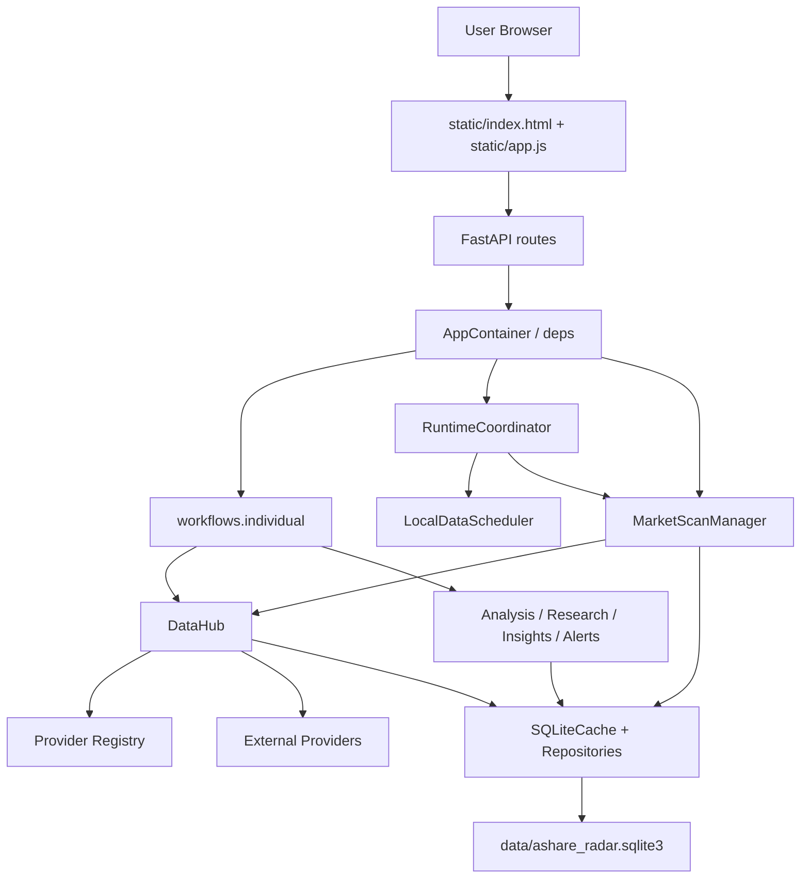
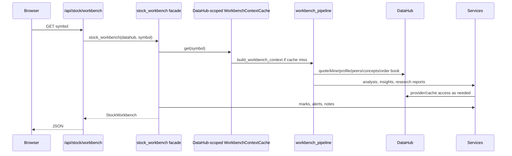
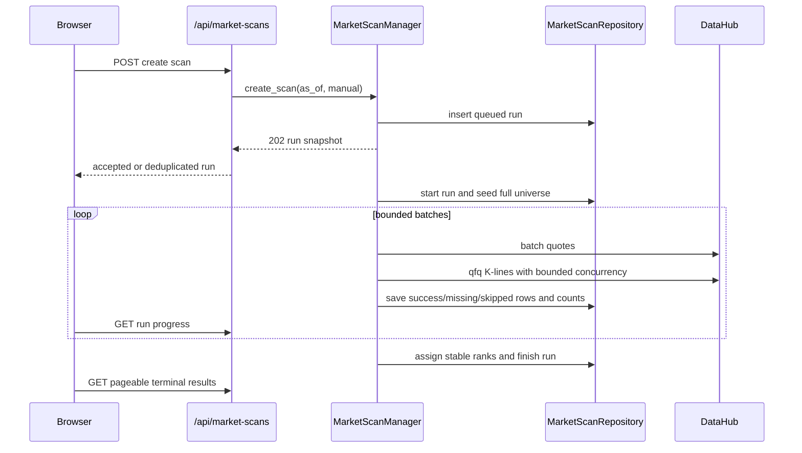
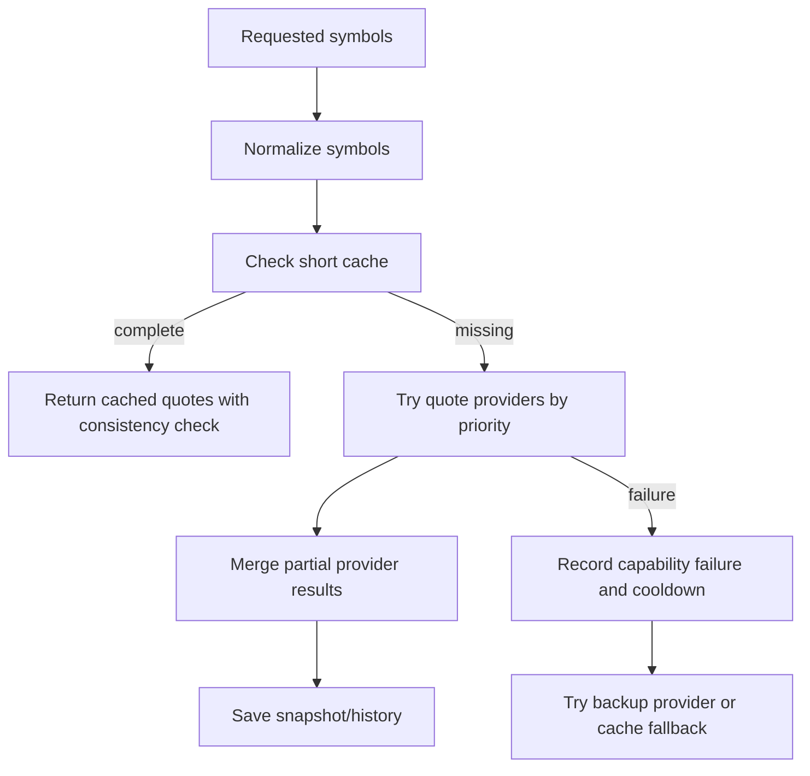

# Software Design Description

## 1. System Overview

AShareRadar is a local FastAPI + SQLite + static frontend application. The backend owns data acquisition, adjustment-aware caching, analysis, diagnostics, local user records, and runtime-data maintenance. The frontend is a server-rendered static page with modular JavaScript.



## 2. Runtime Composition

- `app/main.py` creates the FastAPI application, mounts revalidating static files, registers routers, and starts/stops the runtime coordinator.
- `app/api/container.py` builds the application container once: settings, datahub, scheduler, market scanner, runtime leadership/coordinator, and the DataHub-owned workbench context cache.
- The same container owns one `MarketScanManager`. Its tasks are process-local, while the unique active-run database index is the cross-request/cross-process duplicate guard. The scheduler and manual API share that manager.
- `app/api/deps.py` exposes dependency functions to routes.
- `app/services/runtime_coordinator.py` owns one non-blocking advisory lock at `<SQLite path>.runtime-leader.lock`. Leadership activates the scheduler and full-market scanner together; a process that cannot acquire it stays available for reads, reports live standby state through service guards, and polls for takeover. Shutdown has a bounded synchronous phase, then keeps leadership through any non-cooperative scheduler/scanner task until both services report true quiescence. Only then can a standby take over both. Partial activation uses a restartable scanner rollback, so a transient scheduler failure does not permanently close the standby's scanner. The old `.scheduler.lock` and `.market-scan.lock` paths remain restore-time compatibility guards only; they are not independent runtime leaders. One Uvicorn worker remains the supported topology because task status and controls are process-local.
- Supported Uvicorn starts set `--timeout-graceful-shutdown 5`, bounding graceful drain of SSE and active HTTP data requests. This server deadline is separate from application cleanup and the daemon provider-worker exit guarantee; it cannot terminate a running SDK thread.
- `app/api/security.py` provides a same-origin mutation boundary ahead of route side effects. For `POST`/`PUT`/`PATCH`/`DELETE` and `GET` requests with a truthy `refresh` query, any request carrying browser origin metadata must have its Host-derived request origin in the configured allowlist, and any supplied `Origin` or `Referer` must independently resolve to an allowed origin; when those source headers are absent, explicit cross-site fetch metadata is rejected. This prevents an attacker-controlled Host/DNS-rebinding target from becoming trusted merely because its matching Origin is echoed. Default ports are normalized, ordinary read-only requests are unaffected, and non-browser clients without browser origin metadata remain supported.
- `app/api/errors.py` separates client request validation from internal model failure. `RequestValidationError` remains a Chinese `422`; a Pydantic `ValidationError` raised while mapping internal/provider/SQLite data is logged with traceback and returned as a generic `503` without exposing model input. Async routes use `run_sync_api_async()` for synchronous repository/diagnostic calls so SQLite work runs outside the event-loop thread while preserving the same not-found/domain/database error contract.
- `static/js/symbols.js` mirrors the public stock-symbol rule used by the backend for UI search input: normalize legal SH/SZ symbols, but reject malformed or all-zero codes before starting a workbench request.

## 3. Layer Responsibilities

| Layer | Files | Responsibilities |
| --- | --- | --- |
| UI | `static/index.html`, `static/app.js`, `static/js/*`, `static/styles.css`, `static/css/*` | Render workbench, call APIs, maintain local UI state, draw chart, handle SSE, and style UI surfaces by module. |
| API | `app/api/routes/*` | Validate request parameters, call workflows/services, select response models, and keep streaming event formatting isolated from provider logic. |
| Workflow | `app/workflows/individual.py`, `app/workflows/stock_analysis.py`, `app/workflows/workbench_pipeline.py`, `app/workflows/market_overview.py`, `app/workflows/stock_lookup.py` | Compose data into user-facing stock use cases while keeping public compatibility imports stable. |
| Services | `app/services/*` | Provider orchestration, analysis, indicators, quality gates, alerts, diagnostics, research reports. |
| Repositories | `app/repositories/*` | SQLite read/write boundaries per data domain. |
| DB | `app/db/*` | Connection, schema, migrations, row-to-model mapping. |
| Models | `app/models/*.py` | Pydantic API and internal transfer models grouped by domain, with `schemas.py` kept as a compatibility re-export layer. |

## 4. Main Request Flows

### 4.1 Workbench Load



`stock_workbench` remains the public workflow facade, but its internal stages are separated into non-blocking advice snapshot persistence, local state reads, and final response assembly. Synchronous SQLite reads/writes in async workflows use `run_cache_io()`/`run_cache_io_best_effort()` (`asyncio.to_thread`), and route-level repository calls use `run_sync_api_async()`, keeping database waits off the event loop. This includes market-sampling event logs, stock-lookup quote-confirmation/profile persistence, and quote-stream watchlist fallback reads rather than only primary workbench cache access. Local state helpers normalize the symbol themselves and use fixed read limits for chart marks, alert rules, alert events, and notes so user-state refresh behavior stays predictable even when the provider-heavy workbench context is cached. Local user-state read failures are logged best-effort and degrade to empty chart marks, alerts, events, or notes; optional enrichment such as market breadth, peer samples, order book, and concept membership has its own short workflow timeout and becomes missing-data context on expiry. These optional paths must not block the provider-backed stock analysis response.

The workbench payload carries up to 240 daily K-lines. The current research path requires the explicit `qfq` contract; every provider series declares adjustment mode, as-of date, data version, contract version, and source before it can be cached or analyzed. The browser renders 20, 60, 120, or 240 rows from that payload without another HTTP request. Recommendation timeline, advice-review, and minute-analysis/chart data are companion requests with independent ownership guards, so one companion cannot repaint another stock. A valid timeline request immediately replaces prior content with a symbol-specific loading state; its symbol and stock-load sequence retain ownership through A-B-A switches. Minute responses are validated before state assignment, so empty/no-content payloads and symbol/interval mismatches clear the minute canvas and enter explicit unavailable state. A new minute interval issues one request; reselecting the active interval does not.

The main-query and watchlist inputs share a browser-side stock-search controller. A complete valid 6-digit code bypasses search and continues through the direct submit/add path. Other non-empty user input starts a 250 ms debounce, then calls the existing `GET /api/stocks` endpoint with an 8-item limit. The controller aborts superseded requests, rejects responses that no longer own the current sequence, caches at most 40 normalized queries with LRU eviction, and exposes separate loading, ready, empty, unavailable, and closed states. Arrow keys, Enter, Escape, pointer selection, `aria-expanded`, and `aria-activedescendant` are bound by `static/app.js`; autocomplete requests are outside the four-request stock-switch baseline and occur only after user input.

Daily and minute canvases expose immutable inspection snapshots from the rows and moving averages already used for drawing. `static/js/chart-inspector.js` maps CSS pointer coordinates to canvas plot coordinates and the nearest row; desktop pointer movement, touch/pointer press, and `ArrowLeft`/`ArrowRight`/`Home`/`End`/`Escape` share the same index model. The overlay reports event time, OHLC, open-to-close percentage, volume, enabled MA values, source, cache/fallback state, and fetch time. Redraws replace the snapshot and clear prior inspection state; inspection itself performs no HTTP request.

The tools view's local research activity is also a frontend projection rather than a new backend aggregate. `static/js/research-activity.js` validates, normalizes, and time-sorts existing recommendation timeline rows, alert events, and notes. The unfiltered view is capped at the latest 12 rows and each source filter at 20. Source ownership and loading/unavailable state remain independent, so one failed source can coexist with valid rows from the other two, while a genuine all-source empty result stays distinct. Existing note and alert mutation reload chains update their source arrays and then rerender the projection. This surface does not represent official announcements, news, or a company-event calendar.

### 4.2 Full-Market Scan And Ranking



`app/services/market_scan_universe.py` accepts only normalized SH/SZ/BJ current-listing A-share metadata whose code, symbol, and inferred stock exchange agree; Shanghai and Shenzhen B-share prefixes are rejected. The generic symbol parser still permits explicitly identified cross-prefix instruments such as market indexes, while the A-share universe boundary rejects those rows as non-stock or malformed metadata. `app/utils/stock_pool.py` is the shared pure normalization boundary: DataHub coverage decisions and `MarketMetadataRepository.replace_stock_pool()` consume the same normalized, required-field-validated, symbol-de-duplicated rows. A full replacement uses `BEGIN IMMEDIATE`, deletes and writes in one transaction, verifies the persisted count, and rolls back on any mismatch, so a partial provider/cache write cannot become the next authoritative pool. DataHub requests the stock pool with no row limit and a required-market contract, so a provider missing BJ is skipped in favor of the next provider instead of becoming a silently partial universe. Full stock-pool calls have a dedicated timeout because their exchange-list fallbacks may require several pages. Full scans may use only the normal fresh-cache window, not the 30-day keyword fallback. Before seeding, the manager enforces the configured total plus per-market minimum counts and baseline-retention ratios. Delisted-name rows and invalid/duplicate symbols are excluded and counted; ST and stocks inside the configured new-listing window remain in the universe with tags. The metadata source is copied into every seeded result.

`MarketScanManager.create_scan()` writes a queued run and returns immediately. A partial unique index permits only one `queued`/`running`/`cancelling` run, making concurrent manual, scheduled, and repeated browser requests converge on the same active record. The linked `task_run` is created and attached in the same SQLite transaction, so an attachment failure cannot leave an unowned running task. Work is split by configurable batch size; quote batches have an outer timeout and preserve partial provider results, while per-symbol K-line calls use a semaphore, timeout, bounded retries, and linear backoff. Cancellation leaves the current not-yet-committed batch pending. The repository computes one immutable `MarketScanRetryPlan`; manager validation and transactional derived-run creation use that same plan and reject a concurrent source change. Clean successes are copied, while missing, skipped, quote/K-line fallback, metadata-degraded, and stale-stock-pool rows return to pending. A retry that needs new market data is limited to the same completed trading date; once the data date advances, the user creates a new run. The run's `data_date`, rather than its creation timestamp, is the explicit end-of-day snapshot boundary: quote revisions from that same date remain eligible even when timestamped later than run creation, while a quote or K-line from another date is rejected. Startup leadership reconciles orphaned active scans to `interrupted`; a fully processed clean run interrupted between its final batch and rank assignment can still be derived directly into finalization without downloading data again.

`app/services/market_scan_manager.py` is the public orchestration facade. `market_scan_execution.py` owns stock-pool recovery, batching, quote/K-line acquisition, and scoring calls; `market_scan_completion.py` owns terminal policy, diagnostics, and persistence; `market_scan_lifecycle.py` owns process-guard views, local task registration, cancellation, and release. Pure score and universe rules remain in `market_scan_scoring.py` and `market_scan_universe.py`. Terminal persistence retries only SQLite `BUSY`/`LOCKED` failures, for three bounded attempts. A persistent failure is remembered in process memory; after the local worker exits, only the instance that still owns unified runtime leadership may converge that known run to `interrupted` during a status or later scan operation. Another instance cannot perform that recovery, while crash takeover still uses repository ownership reconciliation.

The first scan requests 260 completed `qfq` daily rows through ordinary DataHub fallback. A later scan first reuses a fresh compatible cache. When the business date advances, `KlineCoordinator` fetches a small recent window, requires overlap with the cached latest row, and compares adjusted OHLC values across every overlap. A match merges and persists the window; any mismatch is treated as a possible corporate-action rebase and falls back to a full history refresh. Provider source, adjustment mode, contract version, and data date remain attached to the rows.

`app/services/market_scan_scoring.py` is deterministic and versioned as `full-market-score-v1`. It filters invalid, duplicate, and post-cutoff bars; requires one consistent `qfq` sequence, a current completed trading date, a matching quote event date, enough history, positive quote amount/volume, explicit turnover, continuous recent K-line volume, and the configured data-quality floor. Missing, stale, suspended, or malformed inputs raise explicit missing/skipped outcomes and never receive a synthetic zero. The score is `round(0.85 * leader_score + 0.15 * data_quality_score)`; the reused leader score consumes trend, change percentage, recent volume ratio, amount, turnover, and data quality. No LLM dependency is reachable from this path.

Ranks are assigned only when a run finishes as `success` or `degraded`. Database rank order is `score DESC, trend_score DESC, change_pct DESC, amount DESC, symbol ASC`; API default ordering and the browser default view use persisted rank ascending. Runs persist as-of/data dates, trigger, rule version, counts, progress, coverage, duration, and errors. Results persist universe metadata/source, quote and K-line sources, adjustment mode, data date, scores, metrics, reasons, errors, and the structured fields `quote_fallback_used`, `kline_fallback_used`, `metadata_degraded`, and `degradation_reasons`. Display tags are derived from those fields and never drive retry, terminal status, or filtering decisions. `finish_run()` validates coverage/ranking and updates the scan plus its linked `task_run` in one SQLite transaction; an idempotent terminal call repairs a mismatched task, while a task write failure rolls the scan update back. Historical runs are immutable; retry always creates another snapshot.

The browser scan entrypoint is the compatibility facade `static/js/market-scan.js`. Contracts/status classification live in `market-scan-contracts.js`, rendering/formatting/ARIA in `market-scan-view.js`, single-timer retry scheduling in `market-scan-polling.js`, and request/state/event orchestration in `market-scan-controller.js`. The controller loads the latest run only when its workspace is active, polls active progress without overlap, pauses while hidden, validates run/result/start response shapes before state assignment, and loads at most 100 rows per terminal page. A run `404` or repeated refresh failure returns to `latest`; failures use bounded exponential backoff, an `online` event retries immediately, and discovering a different run clears stale result state and resets pagination. Milestone announcements use one polite live region, and progress keeps `aria-busy`, labels, and values synchronized. Filters map directly to API parameters, and a selected result returns through the existing single-stock workbench flow.

The scheduler calls `scheduled_tick()` once per loop, but the manager accepts an automatic run only on a trading day after both the configured schedule and the 15:15 publication floor. A successful/degraded/active run or manual cancellation for the same data date suppresses another automatic run; a failed scheduled/retry attempt is not recreated every second. The unique active-run guard prevents scheduled and manual work from overlapping.

Full-market retention treats `ASHARE_RADAR_MAX_MARKET_SCAN_RUNS` as a target for unprotected snapshots, not an unconditional hard row ceiling. Active runs and ancestors still referenced by retained retry children are safety exceptions. Cleanup visits `market_scan_run` before `task_run`; expired retry chains therefore converge from leaf to root over later maintenance passes, and an old linked task can be released in the same pass once its scan reference disappears. Result rows cascade with their parent run.

### 4.3 Quote Retrieval



### 4.4 Alert Evaluation

- Scheduler or API triggers alert evaluation.
- Current quote and quality are loaded.
- Alert condition is evaluated only if data quality is acceptable.
- Trigger events respect cooldown.
- Recovery events are recorded when state returns below threshold.
- Alert-event keyset pagination is ordered by the immutable event `id`. `after_created_at` remains an optional legacy companion only when `after_id` is present and is not part of cursor ordering, avoiding missed events when timestamps collide or arrive out of order.

### 4.5 Advice Reviews and Watchlist Scan

An advice-review plan is bound transactionally to one persisted advice snapshot, including its symbol, market time, and entry price. Creation enforces `target > snapshot > stop`, a 1-60 trading-day horizon, required hypothesis/trigger/invalidation text, and bounded evidence references. Edits increment the plan revision; evaluations are keyed by plan, revision, as-of time, and rule version, and the plan list shows only the latest evaluation for the current revision. Evaluation uses valid completed daily bars after the snapshot day and no bars after `as_of`, stops at the first target/stop barrier or horizon, labels a same-day target-and-stop hit as ambiguous, and preserves pending versus insufficient-data states. Selecting today omits `as_of` so the server uses its current Shanghai market time instead of a synthetic future end-of-day timestamp; a past date maps to Shanghai-local end of day. In the Replay workspace, each plan exposes an optional historical cutoff date and a lazy, retryable evaluation-history view across plan revisions. `DELETE /api/reviews/plans/{plan_id}` removes the plan and cascades through all of its evaluation history, but deliberately retains the source advice snapshot. Plan mutations remain bound to the symbol that owns the rendered panel even while another stock load is pending, and symbol, plan, sequence, history-epoch, and pending-evaluation ownership prevent stale history or evaluation responses from repainting another stock after an edit or deletion.

`POST /api/watchlist/scan` accepts only the versioned fixed conditions `close_above_ma20`, `close_below_ma20`, `breakout_20d_high`, and `volume_surge_5d`. The Replay workspace lets the user select the active, non-excluded watchlist or enter a normalized, de-duplicated custom universe, and optionally choose a historical cutoff date. Both paths are capped at 50 symbols, use completed daily bars at the requested `as_of`, fetch through the ordinary `qfq` DataHub path with concurrency five, and return successful evaluations separately from sanitized missing-data rows. Today follows the same server-current-time rule as review evaluation; only a past date sends an explicit Shanghai end-of-day cutoff. A row matches only when all selected conditions match; arbitrary expressions or scripts are not accepted.

### 4.6 Local Data and Runtime Operations

User-data export/import is a versioned, strict JSON contract over an explicit table allowlist. Merge is source-wins on primary-key conflict; replace requires all currently available user-data tables. Schema identity and foreign keys are checked in one transaction, and dry-run executes the same writes before rollback. Preview and commit operations run under `SQLiteCache.exclusive_local_data_operation()`. A dry run issues a ten-minute, single-use server claim bound to the resolved database path, import mode, bundle digest, and current user-data digest. Commit consumes that claim while holding the same lock, rejects state/file/mode drift, creates and verifies a full runtime rollback backup, and only then applies the import. A backup failure leaves user data unchanged. The browser adds a 50 MB file limit and enables commit only for the matching preview response. File reads, import previews, commits, and cleanup previews carry generation ownership: a late completion cannot replace a newer file/mode/preview or action state. After a successful current import, browser caches and all runtime-owned panels are reloaded, and the quote SSE subscription is closed and rebuilt from the imported watchlist; a superseded or failed import does not trigger that reload.

Full runtime backup is separate from user-data portability. `app/services/runtime_backup.py` creates a consistent SQLite snapshot and manifest, verifies its hash, schema/user versions, row counts, and integrity, and restores through a staged atomic replacement. Operations for the same database or backup directory acquire thread locks and cross-process file leases in sorted path order, with one 30-second deadline across acquisition. Creation, verification, rotation, restore-source staging, rollback creation, and pruning stay inside that lease, so concurrent callers cannot delete a bundle being verified/restored and managed retention still converges to `ASHARE_RADAR_MAX_RUNTIME_BACKUPS`. Restore also requires an explicit stopped-service acknowledgement, refuses the unified `runtime-leader` lock, either legacy `.scheduler.lock`/`.market-scan.lock`, or an active database, and creates a rollback snapshot of the current target. API and CLI callers explicitly pass the configured limit so one operation cannot silently use a different process-global value. Automatic scheduler cleanup calls the regenerable-only retention path, so it cannot delete watchlists, rules, notes, review data, alert events, or advice history. User-invoked cleanup has a non-mutating preview; if alert/advice history is eligible, it creates a verified rollback backup before deletion. Advice snapshots referenced by a review plan are never retention candidates.

Retention uses window-function candidate queries and one set-based `DELETE` per table instead of Python partition loops. Quote history is bounded per symbol, daily K-lines per symbol and adjustment, minute K-lines per symbol and interval, and concepts per symbol; scans, tasks, cache/monitor events, and explicit user-history limits are global. Automatic regenerable maintenance is monotonic-time throttled by `ASHARE_RADAR_RUNTIME_MAINTENANCE_INTERVAL_SECONDS` (one hour by default), so frequent health checks do not repeatedly scan SQLite.

`GET /api/system/diagnostics` combines cache fetch activity and market freshness with provider/capability state, scheduler state, storage budget, categorized row counts, warnings, and suggestions. Cache freshness includes stock-pool and plate metadata alongside quote and daily/minute K-line domains; existing metadata rows without a usable timestamp are diagnosed as missing rather than silently skipped. Storage reports total bytes plus separate SQLite and managed-backup bytes/count, and separates quote, K-line, full-market-scan, other cache, other runtime, and user row groups. Scheduler responses preserve `degraded` task outcomes for fallback/partial runs and expose standby ownership separately from a stopped scheduler.

Browser alert notifications remain a client-side opt-in with a persistent enabled/disabled preference. After a user permission action, enabling establishes a no-backfill event-ID cursor in local storage, then drains keyset-paginated alert events every 30 seconds, notifies only later `触发` rows, and collapses bursts above three events. Disabling stops and invalidates polling and clears the cursor; re-enabling creates a fresh baseline so the disabled interval is not replayed. Pagination failure leaves the persisted cursor unchanged; notification-construction failure advances it only through the successfully delivered prefix, so the failed event and all later events are retried in order. There is no closed-page background worker.

## 5. Data Model Summary

SQLite initialization enters through `app/db/schema.py`; table/index definitions live in `app/db/schema_definitions.py`, while guarded compatibility columns, one-time migrations, migration records, and compatibility indexes live in `app/db/schema_migrations.py`. Indexes that depend on compatibility-added columns are created only after those columns and row backfills exist, so partially upgraded databases can initialize idempotently. Row-to-model mapping is split by domain so repository changes can stay close to the data they read. Pydantic models are grouped by API/domain so response contracts can evolve without one oversized schema file:

| Module | Purpose |
| --- | --- |
| `app/models/market.py` | Quote with cache/fallback flags; adjustment/as-of/data/contract provenance for daily K-lines; minute K-lines, stock profile, plate/concept, provider capability, and order book models. |
| `app/models/analysis.py` | Core analysis result, data quality, signal snapshot, review, overview, fund-flow, strategy, finance, event, and rule-match models. |
| `app/models/research.py` | Factor lab, regime, validation, risk/reward, timeframe, diagnosis, Q&A, peer, theme, chip, replay, and minute-analysis report models. |
| `app/models/user_data.py` | Watchlist research-queue, view/unread state, alert, note, chart mark, advice-history, conclusion snapshot, and timeline-comparison models. User input/update models forbid unknown fields and require finite user numeric inputs for alert thresholds and note prices so client mistakes do not become silent no-ops or bad local data. |
| `app/models/reviews.py` | Snapshot-bound advice-review plans/evaluations and versioned fixed-condition watchlist-scan contracts. |
| `app/models/market_scan.py` | Full-market run lifecycle, deterministic ranked-result, pagination, filter, and sorting contracts. |
| `app/models/local_data.py` | Strict user-data bundle/import preview, cleanup preview, and runtime backup/restore manifest contracts. |
| `app/models/system.py` | Provider status, source plan, cache stats, runtime diagnostics, task, monitor, and scheduler models. |
| `app/models/workbench.py` | Composite stock workbench and market overview response models. |
| `app/models/schemas.py` | Backward-compatible import surface for existing route, repository, service, and test code. |

| Mapper Module | Purpose |
| --- | --- |
| `app/db/mappers.py` | Backward-compatible mapper import facade for older callers. |
| `app/db/market_mappers.py` | Quote, daily/minute K-line, stock pool, plate, and concept row mapping. |
| `app/db/system_mappers.py` | Provider status, provider capability, scheduled task, and monitor-event row mapping. |
| `app/db/user_mappers.py` | Watchlist, advice history, alert, note, and alert-condition label mapping. Advice history reads sanitize legacy dirty text/numbers; alert rule reads disable unsupported or non-finite legacy rows before they reach schedulers; stock-note reads keep legacy dirty rows displayable with safe text/price/visibility fallbacks. |

Repository boundaries:

- `app/repositories/market_scan.py` is the stable composition facade. `market_scan_lifecycle.py` owns create/start/cancel/retry, unified retry plans, atomic scan/task terminal writes, and reconciliation; `market_scan_results.py` owns seed/result writes, validation, counts, and ranking; `market_scan_queries.py` owns run/pending/result reads and pagination; `market_scan_mapping.py` maps rows and derives display tags from structured degradation fields; `market_scan_context.py` declares the shared connection/lock protocol. These modules must remain repository-only and preserve immutable source snapshots plus transactional retry copying.
- `app/repositories/market_data.py` remains the backward-compatible market data repository composition used by `SQLiteCache`.
- `app/utils/market_time.py` owns market-event time normalization. Aware datetimes and ISO offsets are converted to `Asia/Shanghai`; naive market times remain Shanghai-local; compact dates, epoch seconds/milliseconds, and time-only values with an event date are accepted; output is fixed `YYYY-MM-DD HH:MM:SS`. It also projects accepted values to a market epoch for chronological comparison.
- `app/repositories/market_quotes.py` owns quote snapshots, quote history, trade-date extraction, and valuation-field persistence. Snapshot/history SQL and row tuples are generated from explicit column lists so adding quote fields does not require maintaining parallel tuple order by hand. `SQLiteConnectionFactory` registers deterministic `ashare_market_epoch()`, and both snapshot and per-symbol/trade-date upserts compare event epochs instead of timestamp strings. A newer event always wins. At an equal event time, a non-fallback row wins first, then the row with more populated optional quality fields, then a non-older fetched-at epoch; a later fallback or sparser completion therefore cannot erase a clean, richer quote. Existing UTC ISO rows remain comparable. Quote writes and cache reads also pass the shared quote-validity rules so non-finite/non-positive values, malformed OHLC, negative amount/volume, or legacy dirty rows cannot re-enter analysis.
- `app/repositories/market_klines.py` owns daily K-line and minute K-line cache reads/writes. Daily identity is `(symbol, adjustment_mode, date)`, so `qfq`, `hfq`, raw, and migrated legacy `unknown` rows can coexist without cross-mode reads. A daily write rejects mixed adjustment/as-of/data/contract values; known modes require complete provenance. The repository filters rows with `app/utils/market_data.py` on both write and read, keeping malformed provider rows out of cache and preventing legacy bad cache rows from re-entering analysis.
- `app/repositories/cache_stats.py` reports aggregate K-line rows for compatibility while exposing daily and minute K-line counts and timestamps separately. `latest_kline_at` is the daily K-line freshness timestamp used by trend-health checks; fresh minute K-line writes must not mask stale daily K-line cache.
- `app/repositories/market_metadata.py` owns stock pool, plate rank, and stock concept cache reads/writes. Stock-pool replacement shares `app/utils/stock_pool.py` normalization with DataHub coverage checks, rejects malformed required identity/provenance fields, de-duplicates by canonical symbol, and atomically replaces plus verifies the authoritative set. Other metadata persistence uses explicit column lists, stable read ordering, concept-name de-duplication, and finite optional numeric-field cleaning so display-only amount/turnover/leader-change fields cannot poison later reports. Empty or all-invalid plate/concept write batches preserve the previous good cache instead of deleting usable fallback data.
- `app/repositories/provider_status.py` owns provider/capability upserts and queries; runtime success/failure updates preserve configured capability `enabled` state and read status rows through explicit column lists with stable ordering. `app/services/provider_errors.py` sanitizes URL/userinfo/query/auth forms plus quoted sensitive keys in JSON- and Python-style mappings. Provider error text is sanitized and length-bounded before every general/capability write, while `app/db/system_mappers.py` sanitizes `last_error` again on read so historical dirty rows cannot leak credentials through status or diagnostics responses. `app/repositories/provider_status_aggregation.py` owns the policy for rolling capability state up to aggregate provider health. Aggregation first classifies enabled and active capabilities, normalizes invalid counts, then applies fallback history only when no enabled capability has runtime activity so disabled stale errors do not pollute current provider health.
- `app/repositories/update_fields.py` owns shared field-cleaning and SQL assignment generation used by user-data update methods.
- `app/repositories/watchlist.py` owns watchlist identity and local research-queue state. `PATCH` applies only fields explicitly supplied by the client; queue reads sort active before excluded, due before not due, then high/medium/low priority, pinned state, update recency, and symbol. `mark_viewed()` records `last_viewed_at` without a provider call. When clearing is requested with a valid `viewed_through_advice_id`, it recomputes the remaining unread count from comparable conclusion changes after that displayed snapshot under `BEGIN IMMEDIATE`; a missing watermark preserves the count, and an unknown or foreign-symbol watermark is rejected. Symbols marked `excluded` are omitted from quote-refresh symbol lists.
- `app/repositories/advice.py` owns advice-history persistence, conclusion snapshot provenance, timeline reads, and snapshot de-duplication. `save_snapshot()` opens `BEGIN IMMEDIATE` before reading the latest row and deciding update versus insert. A new advice row increments `watchlist.unread_change_count` in that same transaction only when comparison with the preceding row is both comparable and changed; first, unchanged, legacy, or version-changed snapshots do not increment it, and an unread-update exception rolls back the insert. A de-duplicated repeat updates `repeat_count` without incrementing unread. Dedupe compares the versioned conclusion identity rather than transient prose. Timeline assembly reads one extra baseline row, compares newest to oldest within the requested page, and labels no-previous, legacy, or version-changed rows as non-comparable instead of inventing changes. Malformed legacy rows remain displayable with mapper fallbacks but cannot swallow a fresh analysis snapshot.
- `app/repositories/advice_reviews.py` binds one plan to one advice-history row under `BEGIN IMMEDIATE`, freezes snapshot identity/price, increments revisions on material edits, and upserts idempotent versioned evaluations. Current-plan list/detail reads do not present an older revision's evaluation as current.
- `app/repositories/alerts.py` owns alert-rule and alert-event persistence. Alert SQL uses explicit column lists and row builders, thresholds must be finite, cooldown seconds must be bounded, trigger counts are normalized to non-negative values during state updates, unsupported or non-finite legacy rules are kept readable but not executable, and rule/event reads stay in deterministic order. Evaluation state writes compare the rule snapshot fields before updating, so overlapping evaluators or a concurrent rule edit cannot duplicate an event or overwrite newer state.
- `app/repositories/notes.py` owns stock-note persistence and note-field cleaning. Note SQL uses explicit column lists and row builders; manual prices must be finite and positive, note content cannot be blank, blank trade dates are stored as `None`, and supported date/datetime formats are normalized before storage so chart marks and note ordering share a reliable date contract.
- `app/repositories/runtime.py` owns task-run and monitor-event persistence. Non-cancelled completion updates apply only while a run is `running`; a cancellation racing a just-persisted `success` may replace it, and once `cancelled` is stored, late `success` or `failed` updates are ignored.
- `app/repositories/maintenance.py` owns exact retention candidates, set-based deletion, throttling state, and categorized table counts. Regenerable/runtime specifications are separate from user-history specifications so automatic scheduler cleanup cannot reach advice or alert history. Window functions enforce partitioned quote, daily/minute K-line, and concept limits with one deletion statement per table. Active scans, running tasks, retained retry ancestry, linked tasks, and review-referenced advice are protected. Scan cleanup precedes task cleanup, allowing an unreferenced old task to disappear in the same pass and an expired retry chain to converge leaf-to-root over later passes.
- Other repositories stay scoped by user data and cache statistics.

| Table | Purpose |
| --- | --- |
| `provider_status` | Aggregate provider health. |
| `provider_capability_status` | Provider health per capability such as quote, kline, minute, stock, plate. |
| `quote_snapshot` | Latest quote per symbol. |
| `quote_history` | Historical quote snapshots and valuation fields. |
| `kline_daily` | Daily K-line cache keyed by symbol, adjustment mode, and date. |
| `kline_minute` | Minute K-line cache. |
| `stock_master` | Stock pool cache. |
| `stock_concept` | Concept/plate membership cache. |
| `plate_rank` | Industry/plate ranking cache. |
| `watchlist` | Research queue metadata, last-viewed time, and comparable changed-advice unread count. |
| `advice_history` | Versioned analysis conclusion snapshots and timeline source rows. |
| `advice_review_plan` | Snapshot-bound, revisioned hypotheses and target/stop/horizon plans. |
| `advice_review_result` | Versioned no-lookahead evaluation history. |
| `alert_rule` | Local alert rules. |
| `alert_event` | Trigger/recovery events. |
| `stock_note` | User notes and chart mark source. |
| `task_run` | Scheduler task history. |
| `monitor_event` | Runtime diagnostics and repeated warning merge. |
| `trading_calendar` | Trading day cache. |

## 6. Provider Design

Provider construction and capability checks are centralized in `app/services/provider_registry.py`. The registry owns the provider order, priority setting lookup, optional demo insertion, capability-kind field mapping, fallback capability metadata for providers without an explicit `capability()`, and the enabled checks used by `DataHub` status synchronization.

Default priority:

```text
Quote:  Tencent/Eastmoney -> AKShare
Daily:  Tencent/Eastmoney -> AKShare -> BaoStock
Minute: Futu -> AKShare
Stocks: AKShare -> Tushare -> BaoStock -> Local
Plates: AKShare -> Local
```

Provider calls must:

- Use bounded timeouts.
- Record success/failure per capability.
- Avoid marking a whole provider unhealthy when only one capability failed.
- Prefer explicit degraded/fallback context over fake real-time data.
- Reject malformed critical quote/K-line fields and empty order-book depth instead of silently converting them to usable data.
- Reject quotes with missing stock code/name, impossible timestamps, or open/current prices outside the reported high/low range.

Provider support modules:

- `app/services/datahub.py` owns high-level DataHub orchestration, the runtime settings instance, SQLite cache wiring, provider coordinator construction, and the DataHub-scoped workbench context cache. Coordinator construction is centralized so quote, K-line, metadata, order-book, status, and source-plan wiring share the same settings/cache/runtime/provider dependencies while public `DataHub` methods remain thin compatibility entrypoints.
- `app/services/datahub_cache.py` owns pure cache/source tagging helpers, stock-pool freshness checks, quote matching, concept normalization, and explicit minute interval alias mapping.
- `app/services/datahub_klines.py` owns daily K-line and minute K-line fetching, cache reuse only when fresh cached rows cover the requested limit, provider attempts through `ProviderRuntime`, invalid provider-row filtering followed by parsed date/time sorting and latest-window selection, best-effort cache persistence after provider success, bounded provider-call limits that ignore malformed runtime max-limit settings, missing-capability failure recording, cancellation propagation, empty-response failure handling, fallback cache tagging, unregistered-provider skip behavior without writing provider status noise, and minute interval validation. Daily provider/cache rows must pass the current `daily-kline.v1`/`qfq` contract with uniform as-of and data versions; incompatible or legacy `unknown` rows are not reused as `qfq`. Daily cache reuse and K-line quality share the trading-calendar publish boundary: the current trading day is not required before 15:15 Shanghai time and is required from 15:15 onward. Minute cache reuse checks the latest market timestamp against the same quote/minute session matrix; during 13:00-13:15 it accepts either an 11:25-11:30 morning-close snapshot or a fresh afternoon row, while after the grace window it requires afternoon data.
- `app/services/trading_calendar.py` treats `data/trading_calendar.json` and the read-only `app/resources/trading_calendar.json` as independent snapshots. Both require canonical sorted/unique dates and matching source, update time, bounds, and count metadata. Selection is target/interval aware: only snapshots covering the complete request qualify, then newer `updated_at` wins, runtime wins a timestamp tie, and coverage bounds break only later ties. This lets a refreshed runtime override bundled dates throughout their overlap even when runtime ends sooner; bundle supplies dates outside runtime bounds, while a newer bundle may supersede an older runtime. Invalid runtime state cannot mask a valid bundle. Implicit automatic recovery starts one daemon background coordinator and returns immediately with the current trusted/closed decision; the coordinator uses the one-in-flight provider gate and 15-second wait bound, atomically replaces runtime, then clears the calendar cache. The explicit refresh API instead waits from `asyncio.to_thread` and returns its result. A timed-out provider worker retains the in-flight lease until it really exits, so retries fail promptly instead of accumulating blocked SDK threads. The bundle is never changed at runtime. Outside all trusted coverage, boolean/session checks close conservatively while expected/previous/gap date derivation raises `TradingCalendarCoverageError`; no weekday-positive fallback exists.
- `app/services/datahub_metadata.py` is the stable compatibility facade. `datahub_metadata_stock_pool.py` owns stock-pool/profile resolution, normalization, coverage and cache fallback; `datahub_metadata_coordinator.py` coordinates plate/concept flows; `datahub_metadata_provider.py` contains provider attempts, health recording, error wording, and best-effort cache writes; `datahub_metadata_mapping.py` contains pure row/profile mapping. `StockPoolResolver` keeps cache miss, coverage miss, authoritative empty, and stale fallback states explicit through `StockPoolResolution`; coverage and persistence must continue to consume the same normalized rows. Authoritative empty results are not overridden by stale/local data, incomplete provider responses continue to backups, and empty/all-invalid external metadata responses remain source failures rather than successful cache replacement.
- `app/services/datahub_orderbook.py` owns optional Futu order-book retrieval, ping checks, order-book capability state recording, and provider-error wrapping so timeouts degrade to the same 503 contract as other data-source failures.
- `app/services/datahub_quotes.py` owns quote fetching, partial cache reuse, fallback quote cache, best-effort cache persistence after provider success, quote quality entry, and multi-source consistency checks. Realtime provider rows pass the same quote-validity rules before they can be returned or cached, so malformed OHLC, non-finite prices, or invalid core volume/amount fields fall through to backup providers or cache fallback instead of reaching analysis. Cached quote responses must carry `from_cache`, and 24-hour fallback-cache responses must also carry `fallback_used`, so API clients and quality gates do not have to parse source strings. Quote provider attempts use the shared `ProviderRuntime` iterator, but quote completion remains quote-specific: partial provider hits are recorded as successful usable coverage, saved best-effort, logged as coverage gaps, and only missing symbols are requested from later providers. Single-symbol `quote()` validates the symbol strictly before entering batch lookup, while batch lookup can still skip invalid empty inputs in sampling contexts. Quote consistency and priority loops skip configured provider names that are not registered instead of turning configuration drift into request failures; public route parsing limits unique batch quote requests before provider calls.
- `app/services/datahub_runtime.py` owns provider call timeouts, timed call results, provider-attempt iteration over priority rows, source-name fallback, best-effort capability success/failure recording, and short cooldowns. Every `DataHub` owns one `ProviderRuntime`, which in turn owns a dedicated four-worker `DaemonThreadPoolExecutor` from `app/services/daemon_executor.py`; the existing per-provider/capability admission gate bounds different requests before executor submission, and `run_provider_io()` uses a context variable so blocking SDK calls do not consume the SQLite/default executor. Identical result-defining request keys share one task. A caller timeout or cancellation leaves a running shared task alive; after its last waiter leaves it becomes orphaned, so different keys fail over while the same key may rejoin. `aclose()` rejects new calls, cancels async waiters and executor items that have not started, then waits only for its bounded timeout. It returns `False` while a worker is still running and reuses one tracked deferred close task; provider clients remain open until runtime quiescence, then close automatically without a second caller. The worker threads are daemon threads, so an SDK call that never returns does not block interpreter/process exit; this is an exit guarantee, not forced cancellation or completion of provider cleanup. Lifespan cleanup first cancels shared workbench builds and then invokes `DataHub.aclose()` on normal shutdown and startup failure. Provider status writes remain best-effort and cannot reclassify usable data as an outage.
- `app/services/datahub_source_plan.py` owns source-plan assembly, primary-source selection, provider decision rules, warning rule priority, and recovery suggestions. It normalizes and de-duplicates provider names/status rows before planning, ranks duplicate provider status records by recency/activity, de-duplicates warning/suggestion text, counts unique non-demo quote providers, and downgrades missing quote/K-line/minute primaries into explicit warnings instead of reporting a healthy plan. Decision rules keep cooling ahead of healthy/failed/disabled states; warning rules keep capability-level failures ahead of aggregate provider failures.
- `app/services/datahub_status.py` owns provider source-key normalization, capability labels/states, source-plan wording, recovery suggestions, and provider error text. Source keys, capability-state suffixes, summary templates, and recovery suggestions are ordered rules so source aliases, unprobed/healthy/failed states, network/proxy errors, remote disconnects, timeouts, and provider-specific setup hints keep stable priority. Provider/source/kind/error text is cleaned at this boundary, unknown sources fall back to `unknown`, duplicate capability statuses keep the newest/most active record, unhealthy capability labels are de-duplicated, and success-rate counts ignore `nan`, `inf`, and negative values.
- `app/services/datahub_status_service.py` owns DataHub status assembly. Status reads build capability snapshots from `provider_registry`, read current provider status/cache stats, and delegate source-plan decisions to `SourcePlanBuilder` without writing provider tables. Configured provider/capability enabled synchronization remains an explicit startup/config-sync operation, so `/api/data/status` cannot fail merely because SQLite is write-locked during a health read.
- `app/services/provider_failure_status.py` owns the shared recent-failure window used by monitoring diagnostics and scheduler health events. It intentionally does not replace `datahub_status.py` source-plan state labels, where `最近失败` means the capability still carries an active provider error for fallback planning.
- `app/services/system_diagnostics.py` owns monitoring diagnostics for cache freshness, provider/capability failures, quote-source redundancy, scheduler state, storage size, row-count health, and trading-calendar coverage. Cache timestamp diagnostics are rule-table driven across quote, daily K-line, minute K-line, stock-pool, and plate domains so missing/invalid/stale states can evolve without adding branch-heavy condition chains. Calendar-dependent freshness assessment runs only with trusted current-date coverage; `out_of_coverage` and `unavailable` instead produce explicit conservative-shutdown warnings and runtime-refresh/bundled-maintenance actions. Metadata availability checks still report an empty stock pool or plate cache when calendar coverage is available but no timestamp exists. Provider diagnostics produce explicit decisions so failed capabilities take priority over aggregate provider failures, disabled capabilities are ignored, dirty capability names/kinds are cleaned, stale failures are suppressed through the shared recent-failure window, and warning lists stay capped for readable monitoring output. Storage row counts and table-count keys are sanitized to non-negative integers and displayable names so malformed local metadata cannot create negative runtime/user counts, duplicate warnings, or break diagnostics rendering.
- `app/services/advice_review.py` owns review-plan read/create/update/delete boundaries, validated current or historical `as_of` values, and adjustment-aware K-line retrieval for evaluation; `app/services/research_replay.py` owns completed-bar windowing, target/stop ordering, no-lookahead metrics, and the `advice-review-v1` rule result. `app/repositories/advice_reviews.py` retains evaluation history across plan revisions while the plan exists, cascades that history on plan deletion, preserves the source advice snapshot, and exposes only the current revision's latest result in detail reads.
- `app/services/watchlist_scan.py` owns the four `watchlist-scan-v1` conditions, active-watchlist/custom-universe resolution, historical completed-bar filtering, bounded concurrency, all-condition matching, and per-symbol missing-data isolation.
- `app/services/user_data_portability.py` owns allowlisted, versioned export plus transactional dry-run/commit import. `app/services/local_data_import_guard.py` owns bounded single-use preview claims and user-data state digests. `app/services/runtime_backup.py` owns consistent SQLite snapshots, manifest verification, restore locking/staging, and automatic rollback snapshots; `tools/runtime_data.py` is the operator CLI.
- `app/services/providers.py` owns Tencent quote/K-line access and the local demo provider. Tencent quote/K-line calls separate URL construction, HTTP/text or JSON retrieval, payload-shape extraction that tolerates trailing whitespace while rejecting unclosed payloads, stripped field/minimum-count validation, payload-to-model parsing, stock code/name validation, real timestamp validation, critical price-field validation, open/current price containment inside high/low, missing change-percent fallback, finite non-negative core amount/volume guards, and malformed-row filtering so request behavior, source errors, and row-quality rules can be tested independently. Demo data generation uses local random generators, backs K-lines by previous weekdays until the requested limit is met, and preserves rounded open/price-within-high/low invariants so offline samples do not mutate process-global random state or bypass quote sanity checks.
- `app/services/scheduler.py` is the stable compatibility facade. `scheduler_service.py` composes `LocalDataScheduler`; `scheduler_contracts.py` owns types/constants and guard adapters; `scheduler_lifecycle.py` owns startup, shutdown, cancellation, and leadership integration; `scheduler_execution.py` owns manual/background execution and status; `scheduler_tasks.py` owns refresh handlers; `scheduler_schedule.py` owns task definitions, timing, and status transitions; `scheduler_health.py` owns health decisions; and `scheduler_helpers.py` owns bounded utility and sanitized persistence-failure fallback. The scheduler and market scanner receive views of the single runtime-leadership lease, so neither can independently acquire ownership. Task cancellation remains terminal, blocking SQLite work stays off the event loop, fallback/incomplete usable results persist as `degraded`, and one API worker remains the supported topology for deterministic process-local controls.
- `app/services/eastmoney_client.py` owns Eastmoney lightweight HTTP quote/K-line access, endpoint retry, proxy bypass, request-symbol normalization with readable invalid-symbol errors, response JSON/object-shape validation, deduped fetch with request-order quote mapping, transparent `AKShare·东方财富直连` source labels, strict quote-field validation, missing change-percent fallback, and malformed-row/K-line rejection used by AKShare fallback.
- `app/services/akshare_provider.py`, `tushare_provider.py`, `baostock_provider.py`, `futu_provider.py`, and `local_metadata_provider.py` own source-specific optional provider adapters. AKShare quote retrieval first tries the lightweight Eastmoney bridge, then falls back to AKShare spot rows with explicit missing-code reporting. Its stock pool prefers exchange listing APIs; a failed BSE endpoint falls through to the AKShare Eastmoney BSE list and then `app/services/sina_client.py`, whose independent `hs_bjs` pagination validates the advertised count and every code/name row before returning. Tencent, AKShare, Tushare, BaoStock, and demo daily providers request or produce forward-adjusted rows and stamp the shared `qfq` contract before returning them. AKShare K-line access keeps its Eastmoney period mapping local to the adapter and falls back to the lightweight Eastmoney client when AKShare import or source calls fail, so dependency ABI issues do not block daily/minute K-line retrieval; once AKShare returns rows, schema/field errors are allowed to surface instead of being misreported as a successful fallback. Optional daily/minute K-line adapters use the shared validity rules from `app/utils/market_data.py` so non-finite, non-positive, malformed open/high/low/close, negative-volume, or malformed optional minute rows are skipped before analysis or cache persistence. Concept membership uses normalized candidate builders plus shared code-column detection and constituent matching so EM/Sina concept sources skip incomplete rows, escalate all-candidate constituent-loader failure as source unavailable, and keep rank/order stable.
- `app/services/akshare_mappers.py` owns AKShare quote/minute/stock-pool row parsing, code validation, positive-price quote guards, optional-field normalization, and malformed OHLC-row filtering so provider methods stay focused on source calls and fallback order.
- `app/services/provider_stock_mappers.py` owns shared stock-code extraction, market extraction, list-date normalization, and `StockInfo` row mapping for optional providers; malformed stock-pool rows must be skipped rather than poisoning the cache.
- `app/services/futu_provider.py` owns Futu API return-code checks, ordered snapshot validation, order-book depth cleaning, empty-depth rejection, minute interval mapping, and OpenD lifecycle boundaries.
- `app/services/futu_mappers.py` owns Futu snapshot/minute row parsing, critical price-field validation, minute OHLC filtering, and A-share filtering so non-A-share rows cannot be misclassified as SZ quotes and invalid minute rows do not enter analysis.
- `app/services/optional_providers.py` remains only as a backward-compatible re-export layer.
- Compatibility imports for `_provider_source_key` and `_provider_error_text` remain available from `app/services/datahub.py`; new code should import from `datahub_status.py`.
- Market overview and strong-stock workflows normalize/dedupe sampled symbols before provider calls and use `QuoteSampleResult` as the internal availability contract. The result retains normalized requests, ordered successful quotes, missing symbols, and the number of batches that triggered single-symbol fallback; it does not mislabel incomplete batch responses as batch failures. Public responses expose requested/success/missing counts plus bounded warnings. Available index/stock rows survive partial failure, default-scope all-failure is an explicit degraded response, explicit custom-list all-failure remains a 503, and an unconfigured default sample is distinct from a provider outage. Strong-stock ranking requires K-line evidence; failed K-lines are excluded and partial/all K-line loss is surfaced in response warnings instead of appearing as an ordinary empty ranking.

## 7. Data Quality Design

Data-quality scoring is intentionally split by reason for change:

- `app/services/data_quality_components.py` owns quote-source/cache, quote-field, K-line requirement, freshness, and cross-source consistency scoring components. Quote fallback decisions should prefer `Quote.from_cache` and `Quote.fallback_used` while preserving source-string compatibility for old cached rows. Quote-field checks first reject non-finite, negative, or zero critical values before any derived interval or change-percent diagnostics, then apply stricter high/low and change-percent boundaries so malformed bases do not produce misleading mismatch notes.
- `app/services/data_quality.py` assembles the public `DataQuality` object and keeps backward-compatible quality helper exports.
- `app/services/data_quality_time.py` owns Shanghai-time quote timestamp parsing, the shared quote/minute market-event freshness matrix, expected quote dates, the 15:15 daily publish boundary, and trading-day gaps. Morning/live rows have a bounded delay; the lunch break requires an 11:25-11:30 snapshot; 13:00-13:15 accepts that snapshot or fresh afternoon data; later afternoon checks require fresh afternoon data; and after close accepts same-trading-day events at or after 14:55, including provider-stamped after-hours updates that are not later than the check time. Weekend/holiday checks use the previous trading day's closing snapshot.
- `app/services/data_quality_kline.py` owns K-line source/date/cache/fallback assessment and uses the same `latest_expected_daily_kline_date()` policy as actual cache reuse. It selects the latest parsable K-line date and its source instead of trusting the input tail, so unsorted rows, malformed trailing rows, or stale/demo tail rows cannot hide a fresher row or mislabel the source. K-line level selection and score penalties are ordered rule tables so stale-data thresholds, fallback-cache penalties, and demo-source penalties can be tuned without changing assessment assembly. Short-cache, normal-cache, and fallback-cache wording stays distinct, and a completely missing K-line set emits only the missing-data note instead of duplicating it with an insufficient-count note.
- Cross-source consistency penalties are clamped so malformed comparisons cannot become negative penalties that accidentally add score. If an anomaly-level consistency result has no source notes, the component adds a stable anomaly note for downstream display.
- `app/services/analysis.py` computes technical signals from filtered valid K-lines while data-quality scoring can still inspect the raw input rows. The response `klines` list is filtered before it reaches downstream research modules or the chart.
- Downstream research modules still treat module-specific auxiliary numbers as untrusted. Chip analysis, replay statistics, signal validation, T-strategy wording, and factor/risk adjustments must project non-finite values to explicit fallback, `None`, or `待确认` states before producing user-facing summaries.

Low-quality data must downshift active buy signals, T-plan confidence, and alert triggering.

Optional LLM explanations are allowed to improve wording only after rule output exists. Chat messages contain the current question/topic, symbol/name, deterministic answer, authoritative conclusion/confidence/support/resistance/actions/invalidations, selected quote/indicator facts, at most four data-quality notes, and at most six evidence items. They exclude watchlists, stock notes, alert rules/events, advice history, provider credentials, and other local collections. The request separately carries the configured model and generation parameters plus the LLM API key as transport authentication; the key is never inserted into chat messages.

The first model response must decode as the exact structured shape, preserve every authoritative binding, and pass explanation, action, conclusion, and numeric-grounding checks. Any `LlmOutputValidationError` can trigger one correction request with the same bounded context and a stricter numberless/non-action explanation instruction; the previous raw response is not echoed back. One outer `asyncio.timeout` wraps initial generation, local validation, and the optional correction, so `ASHARE_RADAR_LLM_TIMEOUT_SECONDS` is a shared total budget rather than a fresh allowance per attempt. There is no third attempt, SDK transport retries are disabled, and request failure, total-budget expiry, or a second validation failure returns the deterministic rule answer. Sanitized diagnostics do not echo model output, the question, or credentials.

## 8. API Streaming Design

- `app/api/routes/quotes.py` owns `/api/quote`, `/api/quotes`, and `/api/stream/quotes` request parsing, public batch-size limits, canonical symbol validation, API-error mapping before SSE stream creation, JSON-safe SSE frames, quote-error events, refresh-interval lower bounds, and disconnect-aware iteration. Explicit stream symbols take precedence. For an empty query, active non-excluded watchlist symbols are used; configured seeds are used only when the watchlist table is truly empty. A non-empty all-excluded table maps to `422` instead of silently subscribing seed symbols, while explicitly requested excluded symbols remain legal. The SQLite selection read is dispatched through `run_sync_api_async()` before the stream is created.
- Streaming routes should keep provider calls behind `DataHub` and keep event formatting in small helpers so frontend retry behavior can be tested without opening a long-lived browser connection.
- Non-streaming routes that touch providers should call `run_api()`; async routes that invoke synchronous repositories, scheduler state, or diagnostics should call `run_sync_api_async()` (with `run_sync_api()` reserved for already-synchronous boundaries). This keeps domain `ValueError`, `NotFoundError`, `RuntimeError`, SQLite `DatabaseError`, and internal `ValidationError` failures in one user-facing API contract without blocking the event loop or leaking raw 500/model details.

## 9. Analysis Signal Design

- `app/services/analysis.py` owns the single-stock `AnalysisResult` assembly and keeps `build_strong_stock_watch` re-exported for compatibility. The entrypoint delegates trend metrics, gated signal-point set construction, optional history/peer input copying, and final result composition to separate helpers.
- `app/workflows/stock_analysis.py` treats quote and K-line data as hard dependencies for main analysis, but plate-rank industry context, local quote-history enrichment, and advice-history snapshot persistence are optional. Stock lookup first prefers stock-pool confirmation; when the stock pool is unavailable or misses a code, a quote provider may build a temporary profile only if it returns the same normalized code/market with a displayable name. Quote responses for the wrong symbol are rejected, source-unavailable quote failures become not-found after a pool miss, and unexpected quote parsing/caller errors are propagated instead of being masked as stock-pool outages. Quote-confirmed profile persistence and confirmation/fallback event logs use best-effort SQLite offload. Plate failures, quote-history read failures, and advice-snapshot write failures are logged as fallback events and must not fail quote/K-line-backed analysis.
- `app/services/analysis_signals.py` remains the backward-compatible analysis signal facade for older private helper imports.
- `app/services/analysis_signal_points.py` owns risk level, buy/sell points, T-plan price zones, and strength tags. Risk level, buy-point, sell-point, and strength-tag selection are explicit ordered rule tables so data-quality gates, price breakdowns, weak trends, trend pullbacks, breakout watches, support pullbacks, sell-protection triggers, and strength labels keep reviewable priority. Base T-plan cards only print numeric low/high/stop zones after price and zone ordering are confirmed; invalid quote windows return `待确认` wording instead of `0.00` action levels.
- `app/services/analysis_signal_quality.py` owns low-quality data gates and quality-reason wording used by signals and advice. Severe-quality handling is split by signal kind so buy points, sell/risk actions, and T-plan items can be blocked or downgraded without changing one branch chain.
- `app/services/analysis_signal_snapshot.py` owns signal confidence, sanitized score/label/quality projection, contribution cleaning/de-duplication, note cleaning, risk-note cleaning, and signal summary text, including legacy direct calls to the summary helper.
- `app/services/analysis_signal_advice.py` owns action advice and beginner summary wording.
- `app/services/leader_scoring.py` owns shared leader-score profiles, score contribution rules, and tag rules used by both feature snapshots and strong-stock ranking.
- `app/services/strong_stocks.py` owns strong-stock ranking, ranking reason text, and the market-overview-specific leader-score profile usage.
- `app/services/indicators.py` remains the backward-compatible indicator facade for existing imports.
- `app/services/indicator_trend_components.py` owns trend score contribution components for moving averages, slopes, price position, turnover, and volume confirmation. Moving-average and volume-confirmation contributions are named rule tables so trend-score thresholds and wording can be tuned independently.
- `app/services/indicator_trend.py` owns the public trend score entrypoint and compatibility exports.
- `app/services/indicator_levels.py` owns support/resistance calculation. It builds a valid level window first, applies breakout/breakdown adjustments from recent valid bars, and enforces support/resistance order so malformed K-lines do not leak into key price levels.
- `app/services/indicator_volume.py` owns volume averages and recent volume-ratio calculations.
- `app/services/minute_analysis.py` owns intraday minute-line analysis and reuses `app/utils/market_data.py` sanity filtering before any trend, volume, support/resistance, or T-plan calculation. It parses supported naive, offset, `Z`, slash, and compact timestamps, interprets naive values in `Asia/Shanghai`, sorts by the represented instant, keeps the last valid revision of duplicate instants, and analyzes only the latest Shanghai-local market date rather than merging sessions. `MinuteAnalysisReport` always exposes `availability`, `availability_reason`, `reason_code`, and filtered `klines`: provider/empty unavailable responses use an empty audit list, while insufficient-sample responses may retain only filtered latest-date rows. The model clears supports, resistances, and executable T-plan ranges whenever availability is `unavailable`, so audit rows cannot become trade ranges. `app/workflows/stock_analysis.py` confirms the stock profile before minute data is fetched, so nonexistent stocks return the same not-found contract as other stock endpoints while confirmed stocks can still degrade source failures into a conservative unavailable report. Fallback event logging on that degraded path is best-effort and must not turn source-unavailable reports into local-database failures.
- `app/services/indicator_math.py` owns shared moving-average, ATR, volatility, drawdown, quantile, and percentage-change helpers.

## 10. Insight and Rule Design

- `app/services/stock_insights.py` remains the public compatibility facade and assembles the single-stock insight bundle.
- `app/services/stock_activity.py` owns rule-table fund-flow heat estimation, price-volume relation wording, positive amount/volume/turnover guardrails, order-book pressure rules, invalid-depth filtering, crossed-spread protection, and price-range pressure fallback. Order-book amount and spread calculations share the same cleaned valid depth rows, skip non-finite or negative values, and keep crossed spreads as unavailable rather than directional pressure. Bid/ask pressure thresholds are explicit constants and exact boundary values remain neutral, so future threshold tuning is testable. Fund-flow output remains a volume/price heat estimate until formal transaction-level fund-flow data is integrated. Current-session volume checks share the same quote-vs-K-line date policy as abnormal-event detection so stale daily K-lines do not hide intraday volume expansion.
- `app/services/stock_abnormal_events.py` owns abnormal-event assembly and delegates local quote/K-line metrics, detectors, and summary scoring to `stock_abnormal_context.py`, `stock_abnormal_rules.py`, and `stock_abnormal_summary.py`. The context layer isolates previous-close fallback, latest/average volume, volume ratio, amplitude, upper/lower shadow percentages, and zero-base-safe percentage math before detectors run. When quote data is for the current day and daily K-lines stop at a completed prior day, the current volume uses `quote.volume` while average volume uses completed K-lines only.
- `app/services/stock_lhb.py` owns LHB candidate scoring and verification checklists. Candidate signal rules, abnormal-event reason import, context action items, score calculation, and summary wording are separated so formal LHB seat data can later replace the local pre-check without disturbing event summaries.
- `app/services/stock_event_sources.py` owns event-source adapters, event reliability labels, external-source placeholder rules, and next steps. The same `EXTERNAL_EVENT_RULES` table drives both placeholder events and follow-up actions so LHB candidates, announcement checks, and margin-financing checks cannot drift apart.
- `app/services/stock_event_summary.py` owns stock event panel response assembly.
- `app/services/chart_marks.py` owns chart marks derived from notes and event summaries. Each source is converted through focused mark helpers, text and manual prices are sanitized before response assembly, categories are computed only from visible returned marks, and regular events are filtered before capping so abnormal duplicates do not crowd out later non-abnormal events. K-line alignment dates are produced only from fully parseable dates; malformed-date notes/events are retained as non-visible marks instead of being pinned to an arbitrary K-line or consuming the visible limit.
- `app/services/stock_events.py` remains a backward-compatible event re-export layer.
- `app/services/stock_overview.py` owns overview scoring, factor cards, main conflict text, beginner takeaways, key prices, and risk triggers. Score calculation, data-quality caps, main-conflict quality prefixes, and key-price assembly are separate helpers. Fundamental field evidence and missing-data handling are split into field-level results with positive-number and finite/clean-text guards so PE/PB/market-cap/industry scoring can be tuned independently from the overview assembly. Main-conflict wording is an ordered rule table, keeping weak data, low confidence, fund/trend divergence, and sell-pressure priority explicit; fund/trend divergence is only emitted when fund evidence is actually usable. Key-price output, beginner takeaways, and support-break risk triggers share the same normalized support/resistance order, while event factors are de-duplicated by visible category/title/level before scoring so repeated dated variants cannot amplify the overview score.
- `app/services/stock_strategy.py` owns strategy-card construction, quality downshifts, and fallback signal handling. Strategy status downshifts are explicit maps by data-quality band so severe/weak data can pause active signals, downgrade T-plan usage, and preserve passive waiting states predictably.
- `app/services/financial_metrics.py` owns shared PE/PB, market-cap, liquidity, finite-number guards, and amount-format interpretations through rule tables.
- `app/services/financial_health_components.py` owns financial-health scoring components, missing-financial-field messaging, metric cards, and liquidity wording.
- `app/services/financial_health.py` owns financial-health response assembly.
- `app/services/valuation_anchors.py` owns valuation price/PE/PB history anchors, peer percentile logic, and anchor labels. History valuation percentiles use safe positive-number extraction and stable latest-snapshot selection per day so malformed or out-of-order cached quote fields are skipped instead of breaking or skewing the valuation report. Anchor labels first choose bounded 0-100 valuation percentile evidence over price-position evidence, then pass the selected percentile through ordered high/elevated/low/discount bands.
- `app/services/valuation_components.py` owns valuation score components, percentile delta rule tables, evidence wording, missing-data policy, and watch points. Percentile score deltas ignore malformed or out-of-range percentiles instead of applying the wrong direction, PE/PB evidence text hides non-finite raw values, and summary wording distinguishes missing core fields from missing enrichment fields such as history or peer percentiles.
- `app/services/valuation_analysis.py` owns valuation response assembly and compatibility exports.
- `app/services/stock_finance.py` remains a backward-compatible re-export layer for older imports.
- `app/services/stock_rules.py` owns deterministic rule specifications, match-context assembly, scoring, sorting, version metadata, and quality gates. `RULE_SPECS` is the single source for rule definition order, raw evaluator order, and rule-match metadata such as name/category/version so definition and match responses cannot drift. Rule confidence values and quality-gate thresholds are centralized tables/constants. Breakout, break-MA20, support-rebound, fund/technology-divergence, high-valuation chase, and abnormal-risk rules separate trigger state, status, evidence, confidence, missing-data, and level selection so threshold tuning does not require rewriting response assembly. The 20-day breakout threshold is based on a complete 20-row valid-high window from completed K-lines before the current bar, so an intraday high does not raise its own breakout bar and short/malformed windows become missing data. Current price, MA20, support, volume ratio, fund-flow score, and valuation score must be finite and positive where the rule semantics require positive inputs; invalid values are written to missing-data/evidence instead of being coerced to `0.00`. High-valuation chase risk uses only valid positive valuation scores, so non-positive or non-finite valuation inputs cannot falsely trigger the risk. Data-quality gates use explicit context/decision helpers so risk rules keep cautious risk status while positive/close signals are downshifted predictably under weak data, and final sorting uses rule-spec order as a stable tie-breaker.
- `app/services/scoring.py` owns shared 0-100 score clamping and level labels.
- Workflows may request rule definitions through `app/services/stock_insights.py` only for backward-compatible imports; new rule logic belongs in `stock_rules.py`.
- Rule matches must include versioned parameters so future threshold changes can be traced in API responses and tests.

## 11. Research Report Design

- `app/services/research.py` remains the public compatibility facade for research report builders and question answering.
- `app/services/market_sampling.py` owns market-breadth and peer-symbol sampling, seed-code exclusion, stock-pool symbol/code/market/industry consistency filtering, market/industry quota sampling, stock-pool failure logging, batched quote fallback to single-symbol retries, duplicate-safe even sampling, and sampling-failure event logs. Sampling event writes use best-effort cache offload so logging cannot block the event loop. The market-width sample is built from explicit market groups plus industry groups after trimming/case-normalizing metadata and dropping invalid literal industry names such as `nan`, then filled from remaining valid SH/SZ candidates so seed symbols do not consume sample diversity. Peer sampling excludes the target stock by normalized code and matches cleaned industry names, regardless of whether the input was `600519`, `sh600519`, or `600519.SH`. Quote responses are filtered back to the requested symbols and sorted by request order before entering breadth or peer samples, so provider mix-ups cannot contaminate samples; batch responses that miss symbols retry only the missing symbols and log stable fallback messages. Data-source fallback helpers catch provider failures at the sampling boundary while allowing cancellation/control-flow exceptions to propagate.
- `app/services/research_alpha_points.py` owns Alpha evidence point adapters and impact weights for trend, overview, rules, events, factor lab, market regime, timeframe, and risk/reward.
- `app/services/research_alpha.py` owns Alpha evidence report assembly, positive/negative evidence buckets, missing-data merge, verdict selection, and confidence scoring. Evidence buckets filter non-finite impact values and non-displayable title/reason text before strength sorting, return empty output for non-positive display limits, de-duplicate by cleaned title/reason before applying display limits, and keep bucket limiting isolated from report construction. Confidence clamps component scores into 0-100 before composing the final number and before summary display, while verdict context projects non-finite feature scores, evidence power, and market-risk multipliers to conservative fallbacks. Missing-data, data-quality-note, and summary output normalize whitespace, de-duplicate case-insensitively, drop blank or invalid literal text such as `None/null/nan/inf/N/A`, tolerate empty rule-match collections, explicitly record absent factor/regime/timeframe/risk-reward inputs and abnormal feature fields, and verdict priority remains an ordered rule table so data-quality pauses, timeframe conflicts, risk/reward suppression, market risk, and positive/negative evidence dominance stay explicit.
- `app/services/research_features.py` owns feature snapshot and leadership report assembly. Feature snapshot construction uses one cleaning boundary for non-finite or non-positive prices, amount, turnover, volume ratio, ATR/volatility, moving averages, support/resistance, and trend/signal/data-quality/fund/valuation/financial scores before the values reach display fields, leader-score inputs, or downstream research modules. Leadership reports clean feature inputs again at the report boundary, filter concept evidence with blank names or non-finite change percentages, and sort concepts stably by change, rank, and original input order. Missing `stock_profile` data is reported as `公司画像` in `missing_data`.
- `app/services/research_breadth.py` owns market breadth sample filtering, score components, label bands, summaries, and the market-wide risk adjustment input used by regime reports. Invalid quote samples without price or usable change percent are ignored instead of silently neutralizing the environment score.
- `app/services/research_chip.py` owns daily-K chip distribution approximation, valid-K filtering, guarded bucket construction, concentration, and nearest support/pressure bands. Valid chip rows require finite positive close/high/low-derived prices and volume; if the feature snapshot price is non-finite or non-positive, the report falls back to the latest valid K-line close instead of allowing `nan`/`inf` into cost-center or distance text. The module separates insufficient-sample fallback, bucket context/indexing, distribution construction, band selection, and labeling so flat ranges, upper-bound prices, and current-zone bands stay explicit while a future tick-level chip model can replace only the distribution layer.
- `app/services/research_diagnosis.py` owns final diagnosis assembly and keeps backward-compatible helper aliases.
- `app/services/research_diagnosis_decisions.py` owns diagnosis headline selection, final action downgrade rules, and confidence adjustment. Headline/action priorities are explicit rule tables so defensive gates, environment risk, risk/reward state, and positive evidence cannot accidentally change order during later tuning.
- `app/services/research_diagnosis_sections.py` owns confirmation signals, hard risks, watch focus, and diagnosis summary text. Section builders separate base items from contextual overlays, skip missing key-price text, and de-duplicate repeated suggestions before returning UI-facing lists.
- `app/services/research_evidence.py` owns evidence-chain support/opposition/confirmation/invalidation lists.
- `app/services/research_events.py` owns event digest bucketing and event-level missing-data notes.
- `app/services/research_factors.py` owns factor lab assembly and remains the backward-compatible helper export surface.
- `app/services/research_factor_current.py` owns current factor list construction and valuation-anchor factor assembly.
- `app/services/research_factor_report.py` owns factor lab aggregate metrics, top positive/negative factors, notes, and report assembly. Aggregate calibration support uses the minimum participating per-factor sample count because factors commonly reuse the same trading dates; sample counts are never summed across factors to unlock confidence or reduce risk.
- `app/services/research_factor_scoring.py` owns score normalization, volume/risk/chip factor scoring, calibration quality, and weighted total scoring. Volume confirmation uses named rules for positive expansion, negative expansion, low-volume large moves, and normal-volume neutrality. Risk pressure is built from named contributions for risk level, data quality, abnormal events, sell pressure, and MA20 location. Chip-position scoring separates no-chip fallback, distance-to-cost-center adjustments, and concentration adjustment so chip thresholds can be tuned without changing factor assembly.
- `app/services/research_factor_weights.py` owns stock-profile-specific dynamic factor weight policy. Profile matching is an ordered rule table, and data-quality overlays are applied separately so new stock styles or degradation rules can be added without editing one branch chain.
- `app/services/research_factor_text.py` owns factor impact scoring, historical-reference wording, and alpha/validation/diagnosis helper text.
- `app/services/research_factor_specs.py` owns immutable grouped factor specifications, duplicate-ID validation, whitespace-safe ID validation, historical proxy scores, trigger matching, and rolling helper metrics. Registered specs are exposed through a read-only snapshot while `_factor_specs()` still returns a fresh map for caller compatibility, so callers cannot mutate global factor registration state. Historical proxy scoring uses shared score contexts and rule tables so trend, volume, risk, chip, and leadership thresholds can be tuned without mixing invalid-data fallback with score assembly. Score-context construction keeps boundary checks, complete moving-average windows, complete price-range windows, and final context assembly in separate helpers; malformed metric windows return neutral/pending context instead of partial proxy scores. Trigger matching rejects non-finite current scores and clamps out-of-range scores before boundary comparisons.
- `app/services/research_factor_calibration.py` owns historical calibration, percentile calculation, and scenario bucket summaries. The minimum row boundary is derived from scan start plus the forward horizon, so 35 rows remain insufficient and 36 rows can produce the first valid 10-day sample. Matching-sample collection, forward-return statistics, confidence labels, expected-level rules, bucket-scene rules, bucket statistics, and bucket-note rules are separated so calibration thresholds can be tuned without rewriting the scan loop.
- `app/services/research_peer.py` owns peer comparison, relative strength percentile, peer valuation labels, leader sorting, and peer-risk notes. Peer sample filtering, aggregate stats, metric text, and risk rules are separated so relative-strength and valuation policies can be tuned independently.
- `app/services/research_qa.py` remains the backward-compatible public Q&A facade.
- `app/services/research_qa_answer.py` owns free-form stock-question answering. Topic-specific evidence, action suggestions, invalidations, conclusions, and wording are registered together in `TopicAnswerStrategy` entries and selected through one whitespace-normalized strategy lookup with a conservative default fallback; `综合判断` intentionally maps to that default strategy. Evidence/actions/invalidations pass through shared Q&A text cleaning, de-duplication, caps, and conservative fallbacks if a strategy returns only blank, duplicate, `None/null`, `nan`, or `inf` text. Answer confidence starts from diagnosis/signal/data-quality consensus and then applies named penalty rules for market risk, validation status, topic data quality, and missing theme context. User-facing number formatting passes through finite-number helpers so malformed downstream metrics produce `待确认` instead of `nan` or `inf`.
- `app/services/research_qa_report.py` owns fixed FAQ-style stock Q&A report generation. Report items are normalized before response assembly so future fixed-card changes still clean blank questions/answers and evidence. Risk/reward FAQ evidence rechecks current price, upside target, and downside stop before formatting numbers; next-session focus checks support/resistance are finite, positive, and on the correct side of current price; T-plan and theme evidence have conservative fallbacks. Missing, wrong-side, blank, or non-finite levels inherit `待确认` wording instead of leaking `0.00`, `nan`, or `inf` into downstream answers.
- `app/services/research_qa_topics.py` owns question topic routing and related-question suggestions.
- `app/services/research_qa_utils.py` owns shared Q&A text cleaning, invalid-literal filtering, case-insensitive de-duplication, and bounded clean-item helpers.
- `app/services/research_breadth.py` owns breadth statistics and availability semantics. A genuine zero/invalid sample stays neutral and says `样本不足`; source or pool warnings produce `市场宽度数据降级`, a conservative score/risk adjustment, and bounded sanitized warnings. Partial-source samples keep their computed breadth score while giving back part of any positive risk credit. `app/services/research_regime.py` owns market-regime labels, stock-state classification, risk multiplier, evidence, and environment suggestions. Its cleaned context preserves breadth warnings, adds them to evidence, and prevents degraded breadth from raising the environment rating; empty industry/factor names, blank breadth summaries, and non-finite adjustment values still fall back conservatively.
- Peer sampling is represented twice on purpose: `PeerQuoteSampleResult` is the internal workflow result, while `PeerSampleInfo` is the stable analysis/API contract. Status values distinguish not-requested, not-applicable, insufficient, available, degraded, and unavailable states. `research_peer.py` keeps valid partial quotes, reports source warnings separately, and uses different summaries for missing industry, provider failure, invalid returned quotes, and a genuinely small peer group.
- `stock_workbench` reloads local user state outside the cached research context. Advice snapshot, chart-mark, alert-rule, alert-event, and note failures remain non-blocking, but each failed component contributes a sanitized `WorkbenchDataWarning`; raw exception text is limited to diagnostic logs. The frontend shows the bounded warning summary beside source metadata and does not label the core quote connection as fully healthy when local state degraded.
- `app/services/research_replay.py` owns historical signal replay, pattern detection, and replay-pattern statistics. Pattern recognition is driven by explicit context/rule tables: K-line window validation, finite positive price/volume checks, 5-day volume comparison, price-range context assembly, case-note templates, and pattern-note wording are separated so new replay patterns can be added without changing the scan loop. Forward returns are calculated only from finite valid target bars; missing or invalid target-day K-lines stay as `None`/`待确认`. Recent or pending signals remain in the case list but are excluded from mature 5-day success-rate and average-return calculations, which use only finite returns; completed sample counts are bounded to observed samples before note selection so direct helper calls cannot inflate confidence.
- `app/services/research_risk.py` owns risk radar item scoring, levels, and top-risk extraction. Risk radar items are built from ordered rules so trend, valuation, event, liquidity, market, timeframe, risk/reward, and data-quality risks can be tuned independently.
- `app/services/research_risk_reward.py` owns target/stop calculation, finite risk/reward metrics, risk-reward rating, scenario probabilities, and scenario plans. Public report construction is staged into metric/rating/scenario parts before final response mapping so field rounding and wording stay isolated from domain calculations. Report assembly cleans non-finite or non-positive price, target, defense, ATR, volatility, and risk-multiplier inputs before ratio and summary text are built, caps abnormal upside targets relative to price/ATR/volatility, filters stale structural stops that sit too far below current price, and rejects target/stop levels on the wrong side before distance math, so reward/risk output cannot be polluted by `nan`, `inf`, stale levels, or fake 100% downside distances. When required values are missing or on the wrong side of current price, summaries render them as `待确认` and withhold the reward/risk ratio. Downside stops are built from structural candidates, ATR/volatility candidates, risk-environment loss bounds, and ordered volatility/ATR adjustment rules. Rating priority is an ordered rule table so timeframe conflict, external risk priority, attractive ratio, wait-confirmation, and default boundaries can be tuned without changing the report assembly; mixed timeframe states from ratio `1.35` upward stay in wait-confirmation rather than being treated as ordinary acceptable risk/reward. Scenario probabilities are calculated and integer-normalized separately from scenario wording, preserve a neutral-path floor after normalization, sanitize malformed factor/risk inputs before probability normalization, and then apply rating/validation/timeframe caps so active positive paths cannot remain high under cycle conflict, risk priority, or waiting states. Scenario wording uses explicit missing-price/default-action/default-status/default-timeframe fallbacks instead of printing misleading zero price levels, `nan/inf`, or empty quotes.
- `app/services/research_theme.py` owns industry/concept theme context, relative strength, ordered evidence rules, opportunities, risks, and missing-data notes. Theme stats clean industry names, industry change, stock change, concept names, concept ranks, and concept change percentages before scoring or text assembly, so blank concepts or non-finite upstream values do not produce `nan/inf` text or become the strongest concept. Evidence slots are rule helpers so industry, concept, average, and relative-strength explanations keep stable order while wording or thresholds evolve. Concept report output is capped after de-duplication and scoring, so UI payload size stays bounded without truncating the statistics used for score/summary/strongest-concept decisions.
- `app/services/research_timeframe.py` owns short/swing/mid-term timeframe trends, alignment score, and conflict level. Requested 20/60/120-day identities remain fixed, and only windows with complete row coverage participate in alignment or conflict; one complete window cannot be described as multi-period resonance. Timeframe row selection, metric calculation, score components, conflict classification, label selection, and evidence text remain separate.
- `app/services/research_t_strategy.py` owns intraday T strategy style, suitability, low/high zones, and stop conditions. Style and suitability are ordered rule tables so market risk, narrow range, trend rolling, data-quality blocks, tradable range, and validation-risk gates keep explicit priority. Low/high zone and stop-condition wording use explicit `待确认` fallbacks when key price levels are unavailable, while missing resistance can still use price plus volatility buffer rather than collapsing to a false zero zone.
- `app/services/research_validation.py` owns signal validation items, status/confidence scoring, overall validation status, and validation summary. Required price, support, resistance, and moving-average inputs must be finite and positive before an item can leave `等待确认`. Timeframe levels, status labels, overall labels, risk thresholds, volume-confirmation ratio, and defensive groups are centralized constants; status/confidence/overall decisions remain ordered rule tables. The intraday T-range uses a strict open interval and remains a cost-reduction adjustment on existing holdings, not a new-position signal.
- New report domains should be extracted beside `research.py` first, then re-exported from `research.py` only when existing routes or tests need backward-compatible imports.

## 12. Frontend Design

The frontend is intentionally plain static assets:

- `app/api/static_assets.py` mounts static files with `Cache-Control: no-cache`; `static/index.html` uses one import-map version token for the market-scan entrypoint and all of its transitive scan modules so a browser revalidates rather than mixing revisions.
- `static/app.js`: page orchestration, core-workbench-first cold-load dispatch before global panels, separate load/render/companion failure states, main-load request freshness guards, invalid-search load invalidation, symbol input synchronization, independent advice-timeline and minute abort/sequence scopes, stale advice/minute/chart-mark/plate-rank guards, local daily-range redraws, delayed chart-redraw state checks, component-level warning summaries, duplicate-action prevention, failed-load stream shutdown, fresh-session SSE backoff reset, reconnect scoping, frame validation, stale-stream callback guards, and UI event binding. The document order is query, workspace, local controls, then the side column so mobile visual and keyboard order agree without CSS `order`; symbol errors use `role=alert`/`aria-invalid`, workspace tabs implement tablist/tab/tabpanel state plus roving `tabindex` and arrow/Home/End navigation, and chart-mark toggles synchronize `aria-pressed`.
- `static/js/api.js`: fetch wrapper and readable API error response handling for string, array, and object `detail` payloads.
- `static/js/alerts.js`: alert rule CRUD, manual evaluation, independent persistence request scopes, scoped/cancellable post-mutation reloads, duplicate-evaluation prevention, explicit partial-evaluation failure rendering, and local reconciliation after successful writes so a failed rules readback cannot leave the edited row stale or imply that the write failed.
- `static/js/advice-reviews.js`: snapshot-bound plan creation/editing/deletion, explicit irreversible cascade confirmation, server-current-time evaluation for today, Shanghai end-of-day cutoffs for past dates, lazy per-plan evaluation history with retry, rendered-symbol/plan/sequence ownership, pending-request invalidation after deletion, current-revision result projection, escaped rendering, and conservative pending/insufficient states.
- `static/js/advice-timeline.js`: recommendation snapshot timeline rendering, comparable-change labels, provenance display, and legacy/version-change fallbacks.
- `static/js/chart-inspector.js`: request-free daily/minute canvas row hit-testing, pointer/touch selection, keyboard traversal, immutable inspection values, and lifecycle cleanup.
- `static/js/chart.js`: daily/minute canvas K-line drawing, frontend OHLC sanity filtering before canvas coordinate math, moving-average lines, chart mark filtering/date matching, and mark rendering helpers. Mark labels flip inside the right edge and use occupied bounds to avoid drawing readable labels on top of one another; dots remain bounded by the stable mark limit even when the chart cannot fit every label. Daily ranges are slices of the existing 240-row workbench payload; unavailable minute audit rows are not drawn as actionable charts.
- `static/js/diagnostics.js`: provider/cache/source-plan diagnostics, request-scoped scheduler/monitor/system polling, degraded-task and standby-instance rendering, storage budget and categorized row-count rendering, task controls with failed-run error preservation, and monitor event rendering.
- `static/js/dom.js`: DOM helpers and HTML escaping.
- `static/js/errors.js`: rule-table compact user-facing errors.
- `static/js/format.js`: numeric and tone formatting with neutral output for missing or non-finite values.
- `static/js/local-data.js`: versioned JSON download, 50 MB file/JSON validation, latest-selection/read/preview/commit ownership, matching server-preview token enforcement, merge/replace commit with rollback-backup feedback, and latest-request-only retention-cleanup preview/confirmation.
- `static/js/market-scan.js`: stable re-export facade for the scan workspace.
- `static/js/market-scan-contracts.js`: strict run/start/result response validation plus active/published/retryable classification and run-identity comparison.
- `static/js/market-scan-controller.js`: scan requests, state ownership, pagination reset, online/visibility events, and UI binding.
- `static/js/market-scan-polling.js`: one timer, bounded exponential backoff, and latest-run recovery after `404` or repeated failures.
- `static/js/market-scan-view.js`: escaped table/summary rendering, URL construction, progress state, and one polite ARIA announcement channel.
- `static/js/notes.js`: stock note CRUD, independent persistence request scopes, scoped/cancellable post-mutation reload/chart-mark refresh, and note-list rendering.
- `static/js/notifications.js`: explicit enable/disable and browser-permission actions, persistent delivery preference, 30-second event-ID-keyset polling, fresh no-backfill baselines after initial enable or re-enable, in-flight poll invalidation while disabled, trigger-only de-duplication, individual/burst delivery, and successful-prefix cursor advancement so failed/later events retry while the page is open.
- `static/js/research-panels.js`: AI dashboard, Q&A submit flow with stale-request and duplicate-submit guards, evidence chain, Alpha/timeframe/risk-reward view helpers, factor lab, theme, chip, replay, panel-level rendering isolation for optional research cards, and card-level view helpers for Q&A answers, theme concepts, calibrated factors, and replay cases.
- `static/js/research-activity.js`: request-free merging, normalization, stable time ordering, source filters, escaped rendering, and independent loading/empty/partial-or-total-unavailable states for recommendation changes, alert events, and notes.
- `static/js/research-render-utils.js`: shared safe array/object/text coercion, escaped list, metric-pair, missing-data, signed-value, and threshold-tone helpers for research panels.
- `static/js/stock-search.js`: shared 250 ms debounced `/api/stocks` autocomplete with abort/sequence ownership, bounded LRU caching, response validation, explicit result states, and deterministic selection movement.
- `static/js/symbols.js`: UI symbol normalization and malformed/all-zero search-input validation.
- `static/js/watchlist.js`: watchlist research-queue add/delete, metadata patching, mark-viewed handling, response-shape guardrails, request-scoped reads, independent persistence request scopes, duplicate-submit prevention, stale-form preservation after navigation, last-known list preservation on readback failure, and rendering. Watchlist/alert/note writes are not children of a stock-load abort signal and do not cancel sibling writes; navigation or a newer mutation may invalidate/cancel only their UI/readback tails, so an accepted server commit can finish without repainting stale state.
- `static/js/watchlist-scan.js`: fixed-condition selection, current-watchlist/custom-universe controls, optional historical cutoff validation, symbol normalization/de-duplication/caps, stale-result ownership, all-condition match ordering, and escaped success/missing rendering with as-of/rule provenance.
- `static/js/workbench.js`: main stock card, insight panels, valuation/minute-analysis view helpers, minute-analysis detail helpers, stock-event/evidence rendering helpers, quality/review panels, market strip, and quote-list rendering.
- `static/js/workbench-render-utils.js`: shared safe array/object coercion and escaped list/tag rendering helpers for workbench panels.
- `static/styles.css`: CSS entry manifest. Keep imports ordered from global foundations to responsive overrides.
- `static/css/base.css`: design tokens, global reset, top bar, base layout, search controls, and shared hover behavior.
- `static/css/sidebar.css`: watchlist, data-source health, scheduler tasks, and monitor-event styles.
- `static/css/workspace-core.css`: market strip, workspace tabs, stock header, metrics, summary, quality, and core research panels.
- `static/css/research-panels.css`: AI Q&A dashboard, evidence chain, insight panels, theme/chip/replay/finance panels.
- `static/css/interactions.css`: rule cards, strategy cards, events, review/timeline, alerts, notes, chart marks, and minute-analysis styles.
- `static/css/side-footer.css`: right-side quote/leader lists, leader-scope wrapping, footer, empty states, and error states.
- `static/css/responsive.css`: responsive layout rules.

External data text must be escaped before rendering, including review values and other nested panel fields. Large renderers should keep formatting, view-state construction, and DOM template assembly in separate helpers so UI changes do not mix data fallback logic with markup.

## 13. Configuration Design

Runtime configuration uses the `ASHARE_RADAR_*` environment namespace. The complete variable table is maintained in [OPERATIONS.md](OPERATIONS.md); this design document records the ownership boundary rather than duplicating every runtime knob.

LLM answers require `ASHARE_RADAR_LLM_API_KEY`, `ASHARE_RADAR_LLM_BASE_URL`, and `ASHARE_RADAR_LLM_MODEL`. Process environment values win; otherwise `app/config.py` accepts only simple top-level assignments for the allowlisted `ASHARE_RADAR_LLM_*` names in `$HOME/.zshrc`. The profile is parsed rather than executed, and there is no vendor default, project-file, browser, or imported-user-data fallback.

Provider, scheduler, cache, retention, quality-threshold, and LLM settings are resolved through `app/config.py`. Provider credentials and switches are injected from `Settings` by `app/services/provider_registry.py`, so individual provider adapters do not read environment variables directly. Legacy aliases remain accepted where documented for local compatibility, but new settings use `ASHARE_RADAR_*`; LLM settings have no legacy aliases and only the bounded shell-profile fallback described above. Missing optional values use defaults, while present but malformed boolean/numeric values and unsafe LLM URLs fail fast. Configuration is process-scoped and requires restart after changes.

Python dependencies follow a four-file boundary: `requirements.txt` and `requirements-dev.txt` declare direct runtime and engineering inputs; `requirements-lock.txt` and `requirements-dev-lock.txt` pin complete, hashed Python 3.12 resolutions. Reproducible runtime installs use the runtime lock, while development and CI install the development lock directly because it already includes the runtime input. JavaScript development dependencies are installed from `package-lock.json` with `npm ci`. CI runs `pip check` and verifies generated API/function documents through non-mutating `--check` modes.

## 14. Known Design Debt

- `app/services/research.py` is now a thin compatibility facade. Keep new research behavior in domain modules and re-export only stable public builders from the facade.
- Frontend JS and CSS are now split by surface, with shared render-helper modules for repeated escaped list/tag/metric output. Static tests guard against oversized JS functions and fake-DOM tests cover stale AI answers plus escaped workbench/research rendering, but the remaining frontend debt is browser-level visual regression coverage for high-risk layout changes.
- Pydantic models are now grouped by domain. Keep `app/models/schemas.py` as a compatibility layer, and prefer domain-module imports when touching code for a real change.
- `DataHub` is now a thin orchestration facade for provider flows; quote/kline/metadata/order-book/cache/status/runtime/source-plan helpers have been split.
- Data quality is now split into response assembly, score components, quote-time freshness, and K-line freshness modules. Keep public compatibility imports in `app/services/data_quality.py`.
- SQLite schema code is split into initialization, definitions, and guarded compatibility migrations. Keep `app/db/schema.py` as the stable import surface for cache initialization, keep `app/db/mappers.py` as the stable import surface for legacy row-mapper imports, and keep direct migration helpers safe for partial legacy databases.
- Runtime data is intentionally outside source control. Keep database files, WAL/SHM files, and generated trading calendars under `data/` only as local state.
