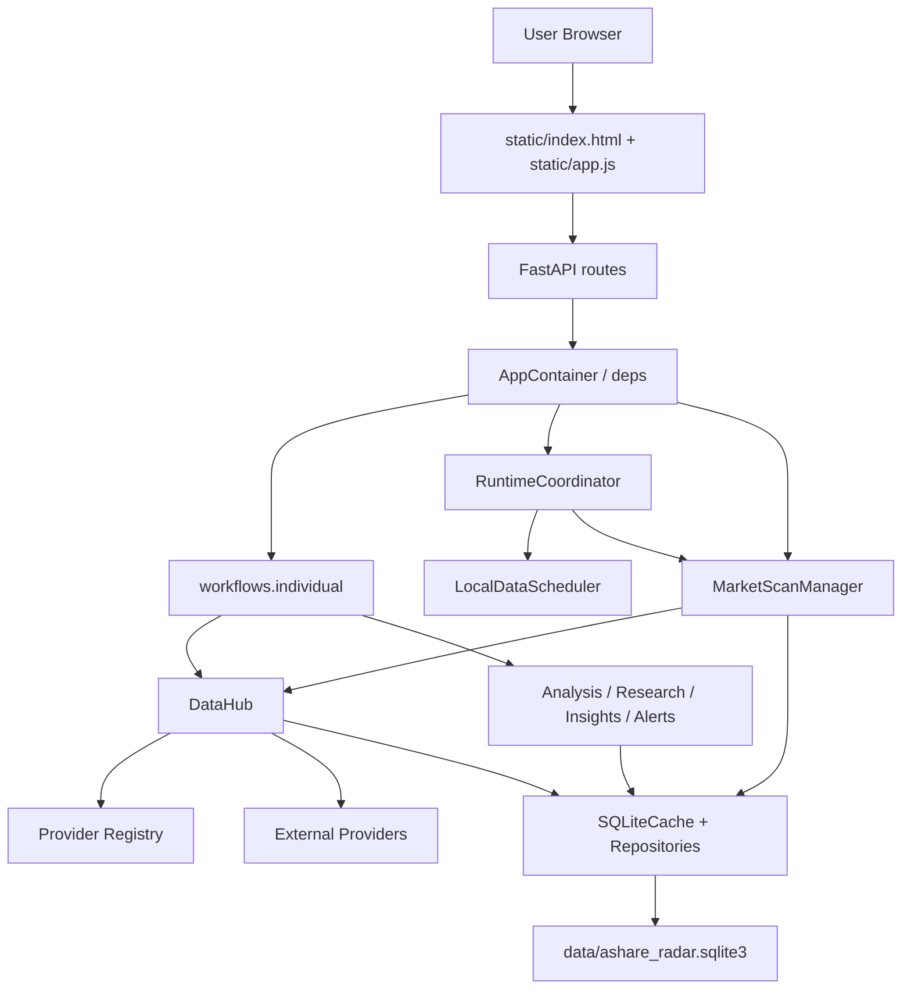
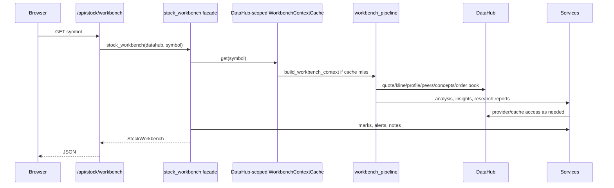
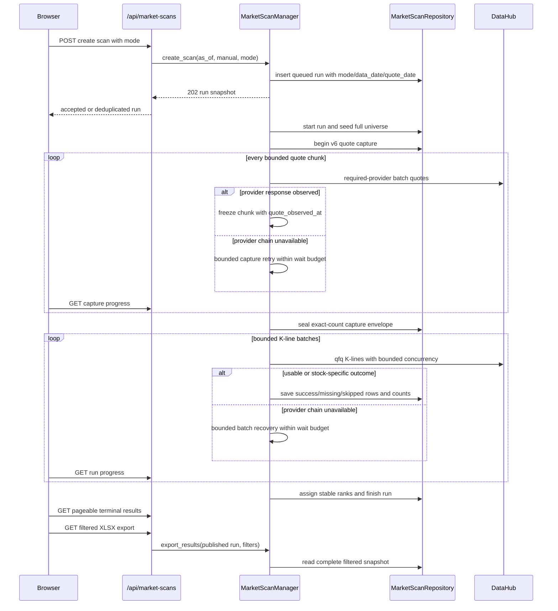
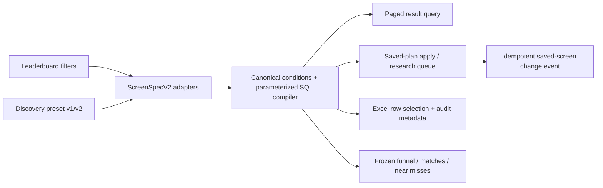
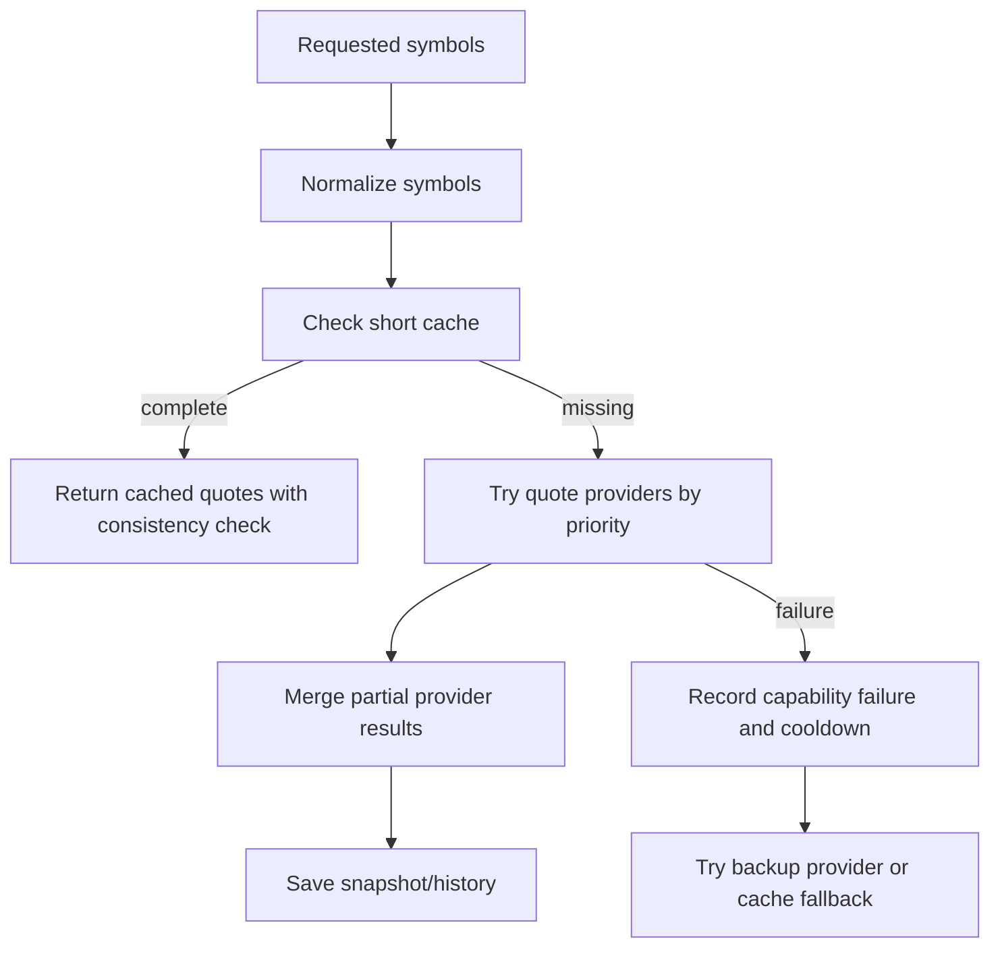

# Software Design Description

## 1. System Overview

AShareRadar is a local FastAPI + SQLite + static frontend application. The backend owns data acquisition, adjustment-aware caching, analysis, diagnostics, local user records, and runtime-data maintenance. The frontend is a server-rendered static page with modular JavaScript.


```mermaid
flowchart TD
  U["User Browser"] --> UI["static/index.html + static/app.js"]
  UI --> API["FastAPI routes"]
  API --> DI["AppContainer / deps"]
  DI --> WF["workflows.individual"]
  DI --> RC["RuntimeCoordinator"]
  DI --> MS["MarketScanManager"]
  RC --> SCH["LocalDataScheduler"]
  RC --> MS
  WF --> DH["DataHub"]
  WF --> SV["Analysis / Research / Insights / Alerts"]
  DH --> PR["Provider Registry"]
  DH --> EXT["External Providers"]
  DH --> CACHE["SQLiteCache + Repositories"]
  MS --> DH
  MS --> CACHE
  SV --> CACHE
  CACHE --> DB["data/ashare_radar.sqlite3"]
```

## 2. Runtime Composition

- `app/main.py` creates the FastAPI application, mounts revalidating static files, registers routers, and starts/stops the runtime coordinator.
- `app/api/container.py` builds the application container once: settings, datahub, scheduler, market scanner, runtime leadership/coordinator, and the DataHub-owned workbench context cache.
- SQLite composition is split by layer. `RepositoryBundle` creates repositories that share one path and process lock without performing domain reads; `DomainServiceBundle` is assembled and bound by `AppContainer`. API dependency functions resolve domain services from that bundle, and the scheduler receives the same `StrategyAutomationService` instance explicitly; neither production boundary locates a service through `datahub.cache`. `SQLiteCache` remains a compatibility façade for older callers, with lazy service composition only for cache-only use. Default paper-account creation belongs to idempotent schema bootstrap rather than cache construction.
- Full-market commands remain behind `MarketScanManager`, while `MarketScanQueryService` owns side-effect-free run/result/research reads, `MarketScanResearchStores` owns explicit artifact paths, and `MarketScanTerminalRecovery` owns the explicit terminal-recovery command. Ordinary GET/read calls do not repair or otherwise write lifecycle state.
- The same container owns one `MarketScanManager`. Its tasks are process-local, while the unique active-run database index is the cross-request/cross-process duplicate guard. The scheduler and manual API share that manager.
- `app/api/deps.py` exposes dependency functions to routes.
- `app/services/runtime_coordinator.py` owns one non-blocking advisory lock at `<SQLite path>.runtime-leader.lock`. Leadership activates the scheduler and full-market scanner together; a process that cannot acquire it stays available for reads, reports live standby state through service guards, and polls for takeover. Shutdown has a bounded synchronous phase, then keeps leadership through any non-cooperative scheduler/scanner task until both services report true quiescence. Only then can a standby take over both. Partial activation uses a restartable scanner rollback, so a transient scheduler failure does not permanently close the standby's scanner. The old `.scheduler.lock` and `.market-scan.lock` paths remain restore-time compatibility guards only; they are not independent runtime leaders. One Uvicorn worker remains the supported topology because task status and controls are process-local.
- Supported Uvicorn starts set `--timeout-graceful-shutdown 5`, bounding graceful drain of SSE and active HTTP data requests. This server deadline is separate from application cleanup and the daemon provider-worker exit guarantee; it cannot terminate a running SDK thread.
- `app/api/security.py` provides a same-origin mutation boundary ahead of route side effects. For `POST`/`PUT`/`PATCH`/`DELETE` and `GET` requests with a truthy `refresh` query, any request carrying browser origin metadata must have its Host-derived request origin in the configured allowlist, and any supplied `Origin` or `Referer` must independently resolve to an allowed origin; when those source headers are absent, explicit cross-site fetch metadata is rejected. This prevents an attacker-controlled Host/DNS-rebinding target from becoming trusted merely because its matching Origin is echoed. Default ports are normalized, ordinary read-only requests are unaffected, and non-browser clients without browser origin metadata remain supported.
- `app/api/errors.py` separates client request validation from internal model failure. `RequestValidationError` remains a Chinese `422`; a Pydantic `ValidationError` raised while mapping internal/provider/SQLite data is logged with traceback and returned as a generic `503` without exposing model input. Async routes use `run_sync_api_async()` for synchronous repository/diagnostic calls so SQLite work runs outside the event-loop thread while preserving the same not-found/domain/database error contract.
- `static/js/symbols.js` mirrors the public stock-symbol rule used by the backend for UI search input: normalize legal SH/SZ symbols, but reject malformed or all-zero codes before starting a workbench request.

### 2.1 Runtime Contract

The supported interpreter contract is executable rather than prose-only:

- Python must be 3.12.x. `.python-version`, Ruff, mypy, both hashed Python locks, and GitHub Actions use that baseline.
- Node.js 22.x is the default declared by `.node-version`; Node.js 22.x and 24.x are supported for development checks. npm 10.x and 11.x are accepted.
- `package.json` records `^22.0.0 || ^24.0.0` and `>=10 <12`; `tools/runtime_contract.py` verifies the installed versions and detects declaration drift across these files.
- The primary macOS quality job uses Python 3.12 and Node 22. A separate macOS Node 24 job runs the runtime contract and JavaScript smoke checks. Browser regression runs desktop Chromium, Firefox, and WebKit plus mobile Chromium on Ubuntu and does not redefine the supported local runtime.

Node is an engineering dependency for JavaScript checks, Playwright, npm auditing, and npm SBOM generation. It is not required by the FastAPI process at runtime.

### 2.2 Time Semantics

Time is separated by meaning and all direct wall-clock access is isolated in `app/utils/clock.py`:

| Meaning | Representation | Owner | Examples |
| --- | --- | --- | --- |
| Market/event time | aware `Asia/Shanghai`; legacy/UI market text may be Shanghai-naive | `market_now()`, `market_now_naive()`, `app/utils/market_time.py` | trading sessions, quote event time, K-line business dates, 15:15 publication boundary |
| Audit/persistence time | aware UTC serialized as ISO 8601 with `Z` | `utc_now()`, `app/utils/audit_time.py` | created/updated/fetched timestamps, task and scan lifecycle, provider status, health reports |
| Elapsed time | process-local monotonic/performance seconds | `monotonic_now()`, `performance_now()` | TTLs, deadlines, retries, throttles, latency and duration measurements |

`20260724_audit_timestamps_utc_v2` is an idempotent SQLite compatibility migration. For allowlisted audit columns only, it interprets historical `YYYY-MM-DD HH:MM:SS[.fraction]` values as Shanghai local time and rewrites them to UTC `...Z`, preserving fractions. Existing aware ISO values are left intact. Market-event columns are not bulk-converted, and `ashare_audit_epoch()` keeps mixed legacy/aware audit rows chronologically comparable during transition. Tests run with non-Shanghai host time zones to ensure business behavior does not depend on the machine setting.

## 3. Layer Responsibilities

| Layer | Files | Responsibilities |
| --- | --- | --- |
| UI | `static/index.html`, `static/app.js`, `static/js/*`, `static/styles.css`, `static/css/*` | Render workbench, call APIs, maintain local UI state, draw chart, handle SSE, and style UI surfaces by module. |
| API | `app/api/routes/*` | Validate request parameters, call workflows/services, select response models, and keep streaming event formatting isolated from provider logic. |
| Workflow | `app/workflows/individual.py`, `app/workflows/stock_analysis.py`, `app/workflows/workbench_pipeline.py`, `app/workflows/market_overview.py`, `app/workflows/stock_lookup.py` | Compose data into user-facing stock use cases while keeping public compatibility imports stable. |
| Services | `app/services/*` | Provider orchestration, analysis, indicators, quality gates, alerts, diagnostics, research reports. |
| Repositories | `app/repositories/*` | SQLite read/write boundaries per data domain. |
| DB | `app/db/*` | Connection, schema, migrations, row-to-model mapping. |
| Models | `app/models/*.py` | Pydantic API and internal transfer models grouped by domain, with `schemas.py` kept as a compatibility re-export layer. |

The checked dependency direction is `API -> workflows -> services -> repositories/DB`, with domain models and utilities shared downward. `db`, `repositories`, `models`, and `utils` may not import `app.api`, `app.services`, or `app.workflows`; production code imports domain model modules directly rather than the `app.models.schemas` compatibility facade. Provider error contracts and advice/rule constants therefore live in lower-layer model/utility modules, while service modules may provide compatibility re-exports. `tests/test_architecture_boundaries.py` also rejects application import cycles and direct `datetime.now()` outside the clock adapter.

Artifact byte handling is a separate lower-level boundary under `app/artifacts/io.py`. It supplies canonical finite JSON, bounded regular-file reads, `O_NOFOLLOW`/identity checks, deterministic gzip, and exclusive atomic content-addressed publication. Probability, probability-source, and future-range domain modules retain their own schema and semantic replay validators while delegating only these byte-level primitives. Golden byte/digest tests prevent a refactor from silently changing existing artifact identities.

## 4. Main Request Flows

### 4.1 Workbench Load


```mermaid
sequenceDiagram
  participant UI as Browser
  participant API as /api/stock/workbench
  participant WF as stock_workbench facade
  participant Cache as DataHub-scoped WorkbenchContextCache
  participant Pipe as workbench_pipeline
  participant DH as DataHub
  participant S as Services
  UI->>API: GET symbol
  API->>WF: stock_workbench(datahub, symbol)
  WF->>Cache: get(symbol)
  Cache->>Pipe: build_workbench_context if cache miss
  Pipe->>DH: quote/kline/profile/peers/concepts/order book
  Pipe->>S: analysis, insights, research reports
  S->>DH: provider/cache access as needed
  WF->>S: marks, alerts, notes
  WF-->>API: StockWorkbench
  API-->>UI: JSON
```

`stock_workbench` remains the public workflow facade, with provider-backed context construction, local state reads, and final response assembly separated. Interactive workbench and `/api/analyze` reads never persist a formal advice snapshot. The after-close active-research queue is the only publication owner: it starts at 15:15 or later and accepts only an official quote event in `[14:55:00,15:00:00]`, at least 60 valid completed bars, and passing date, quality, fallback and contract gates. Synchronous SQLite work in async workflows uses `run_cache_io()`/`run_cache_io_best_effort()` (`asyncio.to_thread`), and route-level repository calls use `run_sync_api_async()`, keeping database waits off the event loop. This includes market-sampling event logs, stock-lookup quote-confirmation/profile persistence, and quote-stream watchlist fallback reads rather than only primary workbench cache access. Local state helpers normalize the symbol themselves and use fixed read limits for chart marks, alert rules, alert events, and notes so user-state refresh behavior stays predictable even when the provider-heavy workbench context is cached. Local user-state read failures are logged best-effort and degrade to empty chart marks, alerts, events, or notes; optional enrichment such as market breadth, peer samples, order book, and concept membership has its own short workflow timeout and becomes missing-data context on expiry. These optional paths must not block the provider-backed stock analysis response.

The response contract is `stock-workbench-v2`. It declares
`research_mode=interactive_shadow`, `production_effect=none`,
`diagnosis_production_effect=none`, and a `WorkbenchResearchCohort` whose
`advice_persistence` is `disabled`. Context assembly validates the requested
canonical A-share symbol against the quote and every research child before cache
publication. The Pydantic response repeats that check across all research panels,
every strategy card, chart marks, alerts, events and notes; every research child
also supplies an `updated_at` no later than the context decision and on the same
Shanghai signal date. Quote timestamp, signal date and completed daily-bar cutoff
are bound to the same cohort. Independent child routes validate the same owner/time
contract, so direct reads cannot bypass the aggregate workbench. The browser
performs the same ownership/time validation before assigning state. A mismatch raises
`WorkbenchContextIntegrityError`, maps to the common non-disclosing research
integrity `409`, and cannot populate either the cache or DOM. The context cache
retains symbol single-flight but its freshness key also includes market-session
phase, expected quote date and expected completed-daily-bar date, so its 8-second
TTL cannot bridge a cohort boundary. Interactive concept membership is a stricter
cache-only optional path: it reads only fresh non-static provider-cache rows and
never starts an online concept-board scan. Cache miss, staleness, static-only data,
or read failure becomes unavailable context and contributes nothing to theme or
leadership scores. These rows carry no receipt/digest and cannot authorize a scan,
probability, filter, action, or publication.

Workbench analysis chooses `preopen`, `intraday`, or `official` semantics from
the trusted Shanghai session. Non-official modes exclude daily rows later than
the latest expected completed session, and live partial-session volume is neutral
rather than confirming a completed-daily signal. Optional market breadth keeps
only non-fallback quotes from the signal date; order-book rows must match symbol
and quote date; concept rows must additionally be non-fallback. Misbound optional
evidence becomes a sanitized warning/unavailable input instead of influencing
the environment, pressure or theme scores. Typed unavailable volume,
structure/chip, valuation, order-pressure, fund-flow, risk and calibration
evidence cannot participate in directional/current aggregates or leave stale
numeric/directional content after a DOM redraw. Missing target/stop inputs keep
reward/risk unavailable, and factor calibration requires a continuous unique
exchange-session PIT/execution/corporate-action contract. The diagnosis panel is
labelled as a non-persisted research diagnosis, not a second formal advice authority.

The three sensitive individual reads `/api/analyze`, `/api/stock/workbench`, and
`/api/stock/upside-probability` share an exception boundary outside dependency
resolution. Success, 4xx/5xx, request/response validation and unexpected
dependency/transport failures all carry `Cache-Control: no-store`; safe 4xx
details remain available, while 5xx and unexpected details collapse to one
generic individual-research unavailable message.

The workbench payload carries up to 240 daily K-lines. The current research path requires the explicit `qfq` contract; every provider series declares adjustment mode, as-of date, data version, contract version, and source before it can be cached or analyzed. The browser renders 20, 60, 120, or 240 rows from that payload without another HTTP request. Recommendation timeline, advice-review, and minute-analysis/chart data are companion requests with independent ownership guards, so one companion cannot repaint another stock. A valid timeline request immediately replaces prior content with a symbol-specific loading state; its symbol and stock-load sequence retain ownership through A-B-A switches. Minute responses are validated before state assignment, so empty/no-content payloads and symbol/interval mismatches clear the minute canvas and enter explicit unavailable state. A new minute interval issues one request; reselecting the active interval does not.

The main-query and watchlist inputs share a browser-side stock-search controller. A complete valid 6-digit code bypasses search and continues through the direct submit/add path. Other non-empty user input starts a 250 ms debounce, then calls the existing `GET /api/stocks` endpoint with an 8-item limit. The controller aborts superseded requests, rejects responses that no longer own the current sequence, caches at most 40 normalized queries with LRU eviction, and exposes separate loading, ready, empty, unavailable, and closed states. `stock-search-surface.js` owns Arrow keys, Enter, Escape, pointer selection, blur timers, persisted history selection, and page-hide cleanup through explicit state/DOM/fetch dependencies; `static/app.js` remains the composition entry. Autocomplete requests are outside the four-request stock-switch baseline and occur only after user input.

Daily and minute canvases expose immutable inspection snapshots from the rows and moving averages already used for drawing. `static/js/chart-inspector.js` maps CSS pointer coordinates to canvas plot coordinates and the nearest row; desktop pointer movement, touch/pointer press, and `ArrowLeft`/`ArrowRight`/`Home`/`End`/`Escape` share the same index model. The overlay reports event time, OHLC, open-to-close percentage, volume, enabled MA values, source, cache/fallback state, and fetch time. Redraws replace the snapshot and clear prior inspection state; inspection itself performs no HTTP request.

The tools view's local research activity is also a frontend projection rather than a new backend aggregate. `static/js/research-activity.js` validates, normalizes, and time-sorts existing recommendation timeline rows, alert events, and notes. The unfiltered view is capped at the latest 12 rows and each source filter at 20. Source ownership and loading/unavailable state remain independent, so one failed source can coexist with valid rows from the other two, while a genuine all-source empty result stays distinct. Existing note and alert mutation reload chains update their source arrays and then rerender the projection. This surface does not represent official announcements, news, or a company-event calendar.

#### 4.1.1 Individual D+2/D+3/D+4 Probability Research

The individual probability surface is a separate companion read, not another
field inferred during `StockWorkbench` assembly.
`GET /api/stock/upside-probability?symbol=...` returns the strict
`IndividualUpsideProbabilityReport` contract and does not delay the core quote,
K-line, analysis, or local-state response. The report contains one ordered row for
each `(display_day, holding_sessions)` pair `(2,1)`, `(3,2)`, and `(4,3)` plus
the frozen target contract, evidence counts/digests, limitations, and
`production_effect=none`.

All three labels observe a completed signal session D, use the fixed D+1 official
daily-K `open` as a no-shift price proxy, and test whether the daily-bar proxy net
return after declared round-trip costs is positive at the fixed D+2, D+3, or D+4
`close`. They are separate one-, two-, and three-session models; neither the
stock trend score, rule diagnosis, scenario weights, another horizon, nor the
full-market 1/5/20-session model can supply a probability. A fixed target that is
immature, zero-volume, missing, or version-conflicting remains unavailable rather
than moving to a convenient later session. The D+1 open proxy does not prove or
guarantee an executable fill. Locked-limit queues, order-book priority, market
impact and actual exit tradeability are declared limitations and remain outside
the V1 daily-OHLC label.

The typed model admits only `not_generated`, `insufficient_data`, and
`calibrated_shadow`. A horizon may carry `probability` and a confidence interval
only when the report and horizon are both `calibrated_shadow`, report-level
`evidence.selection_qualified` is true, and the child carries the point estimate
plus interval. Artifact evidence verifies each horizon's selection gates before
mapping its public status; `IndividualUpsideHorizon` intentionally has no
separate `selection_qualified` field. Every other state requires both numeric
fields to be null. The interval must be finite, ordered, lie in `[0,1]`, and
contain its point estimate. Model, feature, label, cost, training-cutoff, fold,
sample, metric and evidence identities remain explicit. Integrity digests prove
deterministic content identity, not authorship or predictive validity.

`individual_probability_artifact.py` is the offline evidence boundary. Current
builder schema
`individual-upside-probability-assessment-v4-source-intake-bound` persists the
exact estimator contract for the reused core schema/model, calibrators, baseline,
cost-model identity, empirical-Bayes hyperparameters, feature v3, label v3 and
split v3 constants. It binds each horizon's entry offset 1, target/purge gap
`H+1=2/3/4`, fit floor and two-fold selection floor. V4 admits an official date
only after loading all current source-artifact-v3 / snapshot-v3 records carrying
estimator feature-v3 and PIT-evidence-v4 from shared-action-gate-eligible snapshots.
The current intake must bind a writable `full-market-score-v5` contract and its
canonical publication replay receipt; source v2 and score v4 remain exact
historical audit inputs only.
It rechecks `quote event <= quote_observed_at <= run.as_of (decision)`, every
bar's date/aware `as_of` boundary and nondecreasing observation order. Its compact source identity includes
the source/run versions and digests, `as_of`/`captured_at`, run and registered
production score rule/spec, exact total/success/record counts, overall coverage,
and the full-market envelope. Compact verification rechecks that exact identity;
extra, missing or changed semantics fail closed. Assessment v1 and the former v3
shape are superseded and rejected. Assessment v2 remains loadable only under its
exact legacy shape for historical audit; its run/date/digest-only bindings do not
count toward the current report. The CLI
`tools/evaluate_individual_probability.py` accepts one deeply verified historical
manifest plus explicitly named official PIT source snapshots. It requires the
manifest-bound database to be a sidecar-free, non-link regular file within the
512 MiB registered size cap, rejects adjacent `<db>-wal`, `<db>-shm`, and
`<db>-journal`, and verifies identity, size, SHA-256 and content stability
across the complete read, then deserializes those exact verified bytes into an
in-memory SQLite database. One `query_only` transaction builds each holding
horizon independently without reopening the source path, closing the path-swap
window. Before publication it repeats the sidecar, identity, size, SHA-256 and
complete-byte verification; a source replacement or modification during the
evaluation therefore fails closed. The evaluator itself has no source-SQLite
write path. The retained
replay uses the frozen 11-feature OHLCV family and date-grouped Logit/calibration
engine; its fixed current-universe sample, unavailable historical
listing/ST/delisting state, provider/qfq vintage, missing amount/turnover and
daily-bar fill model remain declared limitations. Counting official sources does
not make that replay official. The compact, content-addressed JSON contains
source identities, aggregate OOS diagnostics and gate reasons, but deliberately
contains neither a current-stock point estimate nor reusable predictor
coefficients.

V4 source intake requires an aware, non-future assessment time and an aware
market-time sequence `quote_timestamp <= run.as_of <= captured_at <=
assessment.generated_at`. Quote and bar evidence remain bound to the trusted
official `data_date`. For current source v3, that date must exactly equal the
latest completed official session resolved from `run.as_of`; this accepts a
weekend/holiday capture of Friday's completed session without equating calendar
dates. It rejects pre-15:15 decisions, a prior session after the next session
matures, future/reversed time and unavailable calendar coverage. Source v1/v2
and previous-v2 assessment identities retain their frozen same-date rule. Every source row is
replayed against its PIT context and every successful scan row's registered
current `full-market-score-v5` specification and score details are deterministically
checked against persisted raw/trend/input/component values. The envelope contains
exactly ALL/SH/SZ/BJ; ALL must reconstruct from SH/SZ/BJ, the population floors
are respectively 4,000/1,800/2,500/200, and every scope requires 90% eligible and
95% success coverage. The individual intake additionally requires complete
records and at least 98% success-to-total coverage. A run ID cannot identify two
dates, and source/score contracts cannot drift across dates. Historical v4 rows
remain replayable but cannot contribute current official sessions.

The compact file still does not persist a source locator or the records needed
for a later runtime replay. V4 therefore proves that a normally built and loaded
source passed the stronger intake contract and that the identity survived the
compact verifier, but its outer SHA-256 remains a content seal rather than an
independent source-authenticity proof. The public projection keeps runtime source
replay false, projects official count 0 and signal date null, forces every child
to `insufficient_data` with null percentage/interval, and adds
`official_pit_source_artifacts_not_runtime_replayed` for a non-empty current
declaration. Locator-bound source replay remains required before calling a future
corpus independently attested. The tracked v2 baseline still retains
run 71 / `150cc48d…` and run 77 / `c085b6fa…` identities for audit, but those
source-v1 snapshots lack the new version/evidence binding and therefore contribute
zero current official sessions. Historical qfq OHLC values are adjustment-
normalized research inputs, not the cash prices an account could have traded on
those dates. Likewise the 10万元 notional rounded down to a 100-share lot is a
deterministic label-sizing proxy, not proof of historical buying power, order
placement, fill, capacity, or cash P&L.

`IndividualProbabilityStore` fingerprints and verifies immutable assessments.
Runtime-local files under `data/research/individual_probability/` take
precedence. When that directory has no candidate, the application reads the
tracked verified compact baseline under `docs/research/artifacts/`; any matching
but invalid runtime-local candidate fails closed instead of reviving the baseline
or an older artifact. Directory snapshots bind file name, device/inode/mode,
size, mtime, ctime and content SHA-256, must remain stable across verification,
and return deep copies so caller mutation cannot poison the cache. Two different
artifacts with the same latest `generated_at` are rejected as ambiguous. A
genuinely missing compatible assessment degrades to a typed null report.
Projection binds the current symbol and sets `signal_date` only from current-v4
official source dates after runtime source replay. Since replay is currently
unimplemented, the public `signal_date` is always null and official count is 0;
it never falls back to the non-official replay end date. It does not refresh
market data or unlock a percentage from historical diagnostics.
Even if that diagnostic later passes
a fit metric, official PIT readiness, official replay identity, selection
qualification and a persisted replayable current-stock predictor would all still
be required. Compact horizon metrics are not independently replayable, and no
current assessment reconstructs a point from the historical base rate. Without
that predictor the report remains `insufficient_data` with
`current_stock_replayable_predictor_not_persisted`, even if its other diagnostics
later pass. A public calibrated report requires 288 official and official-replay
sessions plus exact report-level digests. H1/H2/H3 require respectively
284/286/288 independent dates for two complete folds, at least 60 OOS sessions
per fold, at least two calibration bins and 20 sessions in the sparsest bin,
positive Brier skill in every fold, exact `1 - brier/reference_brier`, monotonic
bins/highest-bin lift, exact model/feature versions, a trusted exchange signal
date and an earlier trusted training cutoff. The longest D+4 split is 120 train,
4-gap, 40 calibration, 4-gap, and two 60-session tests, for a public required
count of 288.

`individual-probability-controller.js` owns an abortable request scope and the
active stock/load-sequence predicate. A new symbol cancels the prior companion
read; a late A response cannot repaint B or a newer A session. The contracts
module rejects symbol, schema, horizon, interval, state or target mismatches
before rendering. It also binds the report to the validated workbench cohort:
evidence dated after the workbench signal day is rejected, and a
`calibrated_shadow` report must match that signal day exactly; a null official
signal date remains the honest 0-session state. The view always creates three
D+2/D+3/D+4 cards, uses `—`
instead of a fabricated 0%/50%, and renders unavailable evidence independently
from the still-usable stock analysis. It never writes a score, advice, filter,
rank, strategy or order.

As of this worktree the tracked projection contains zero declared current-contract
signal dates versus the registered 288-session longest-horizon/two-fold floor;
there is not yet an independently replayable current PIT corpus. The two legacy
source-v1 identities in the tracked v2 artifact remain
auditable but are intentionally not upgraded. The separately attested history is
`official=false`, remains isolated from the current projection, and did not pass
its actual selection gates. Therefore the current report is `insufficient_data`,
`signal_date=null`, and all three probabilities/intervals remain null. It exposes
`legacy_official_pit_sources_audit_only_not_current_evidence` and
`compact_horizon_metrics_not_independently_replayable`. The retained 8,733-byte
assessment has integrity digest
`517691b101dcb2142693a74f6e5ac9ef10f386c545572b6bacfe161f186ba677`.
The dated [frontier study and optimization
plan](research/INDIVIDUAL_SHORT_HORIZON_PROBABILITY_2026.md) records the primary
sources, adopted boundaries and staged feature/model/data roadmap.

### 4.2 Full-Market Scan And Ranking


```mermaid
sequenceDiagram
  participant UI as Browser
  participant API as /api/market-scans
  participant M as MarketScanManager
  participant DB as MarketScanRepository
  participant DH as DataHub
  UI->>API: POST create scan with mode
  API->>M: create_scan(as_of, manual, mode)
  M->>DB: insert queued run with mode/data_date/quote_date
  M-->>API: 202 run snapshot
  API-->>UI: accepted or deduplicated run
  M->>DB: start run and seed full universe
  M->>DB: begin v6 quote capture
  loop every bounded quote chunk
    M->>DH: required-provider batch quotes
    alt provider response observed
      M->>M: freeze chunk with quote_observed_at
    else provider chain unavailable
      M->>M: bounded capture retry within wait budget
    end
    UI->>API: GET capture progress
  end
  M->>DB: seal exact-count capture envelope
  loop bounded K-line batches
    M->>DH: qfq K-lines with bounded concurrency
    alt usable or stock-specific outcome
      M->>DB: save success/missing/skipped rows and counts
    else provider chain unavailable
      M->>M: bounded batch recovery within wait budget
    end
    UI->>API: GET run progress
  end
  M->>DB: assign stable ranks and finish run
  UI->>API: GET pageable terminal results
  UI->>API: GET filtered XLSX export
  API->>M: export_results(published run, filters)
  M->>DB: read complete filtered snapshot
```

`MarketScanRuntimeGuard` gives the whole executor a 30-minute monotonic deadline and rechecks the run's mode-specific `data_date` and `quote_date` before seeding, before each batch, and before completion. An intraday run stops rather than publishes if it crosses 15:15 or the current quote session changes. A `preopen` run likewise stops if the local date is no longer a trading day or the clock reaches the 09:15 call-auction boundary. Timeout or date drift stops the run without fabricating per-symbol missing rows. Finalization queries a publication summary over ALL/SH/SZ/BJ coverage, stale-date clusters, capture-envelope integrity, observation timestamps, per-market quote event times, and versioned score-distribution diagnostics. Every scope must reach 95% success coverage over `success + missing`, at least 90% of each market must remain eligible after deterministic skips, and v6 must have a sealed exact-count envelope plus complete parseable `quote_observed_at` evidence. Capture duration, the global observed-time span, and each market's event-time span independently have a 20-minute ceiling. The event-time spread across SH/SZ/BJ is diagnostic only; systemic stale or collapsed-score distributions still block or degrade publication. Suspension, single-price, and short-history outcomes remain visible as `skipped`; the separate eligibility guard prevents systemic bad data from being hidden as mass skipping.

Publication is also a database-local integrity transition. `market-scan-snapshot-digest-v2` hashes strict finite canonical JSON containing every public persisted `market_scan_run` field except `snapshot_digest` itself and every public persisted `market_scan_result` field, including the public `metrics` and `score_details` projections, with results ordered by symbol. `market_scan_integrity.py` reconstructs the identical canonical object byte order incrementally: it writes the contract/results prefix, iterates the symbol-ordered SQLite cursor, strict-decodes and canonicalizes one row, writes exact separators and row bytes into SHA-256, then writes the canonical run and suffix. It does not call `fetchall()` for results or retain the full graph, so verifier memory is `O(max canonical result row)` rather than `O(result count)`. The byte contract—including empty results, Unicode escaping, float serialization and strict duplicate-key/non-finite rejection—remains v2; no new migration marker, stored-digest rewrite or reseal is permitted for this implementation change. Progress, coverage, elapsed, throughput and ETA are derived from those sealed inputs instead of being independent unbound claims. The same transaction checks `finished_at <= updated_at <= snapshot_sealed_at` and every result `updated_at <= run.updated_at`, stores `snapshot_seal_origin=publication`, and creates the digest before the caller may observe the terminal publication.

Five database triggers make the sealed graph append-closed: `trg_market_scan_published_run_immutable` and `trg_market_scan_published_run_no_delete` reject run update/delete, while `trg_market_scan_published_result_no_update`, `trg_market_scan_published_result_no_delete`, and `trg_market_scan_published_result_no_insert` reject every child mutation. `verify_market_scan_snapshot()` accepts either a valid original `publication` seal or a migration `legacy_backfill`; `require_publication_market_scan_snapshot()` accepts only the former. A legacy backfill attests migration-time graph consistency, not original publication-time authority. Run `#80` therefore remains digest-verifiable audit evidence but cannot authorize a new action.

The authorization split is deliberate. `app/db/market_scan_action_source.py` is the frozen shared lower-level action gate. It first verifies the original `publication` seal, then exact scope `沪市 + 深市 + 北交所当前上市A股`, then strictly parses `market-scan-publication-diagnostics-v1`. Authority exists only when `blockers` is empty, `passed_gates` contains exactly one `code=score_distribution.pass` with `severity=info`, neither blockers nor source warnings contain any `score_distribution.*` code, and no other score-distribution code appears as passed. A valid digest, origin, status, or display label by itself is insufficient. Consumers can require stronger official/date/header/result/rank/score/production-contract evidence but cannot weaken that shared gate.

History/detail/latest/results, publication-summary inspection, breadth/screen evaluation, offline evaluation and backup verification may audit a digest-valid action-ineligible snapshot and must expose its origin/diagnostics. Discovery queue/apply/leaderboard/rank actions, delta and screen-alert persistence, strategy execution/simulation/executable Shadow/evidence/automation, probability capture outbox/filter/use and managed publication, future-range research, TOP100 refresh, and degraded retry-copy require the shared gate; two-run consumers require it for both inputs. A v6 retry that preserves no source rows and performs a fresh full-universe recomputation follows the separate unsealed lifecycle contract. Failed/cancelled/interrupted retry lifecycle likewise remains distinct. This prevents a later internally consistent migration read or contradictory score-diagnostic payload from becoming retroactive action authority.

The API does not disclose which seal or artifact invariant failed. `artifact_integrity_guard()` maps a database snapshot-seal error to the generic market-snapshot HTTP `409` and maps probability, future-range, snapshot-model, strategy-evidence and automation integrity failures to the generic research-artifact HTTP `409`. Middleware applies `Cache-Control: no-store` to success, validation, declared error, dependency error and response-validation failure paths under `/api/market-scans`, `/api/discovery`, and `/api/strategy-lab`. This cache policy prevents reuse of sensitive research responses; it does not independently attest their integrity.

| Finding | Enforced contract | Remaining boundary |
| --- | --- | --- |
| A pre-seal row can verify today without proving what existed at its earlier publication time. | Separate `publication` from `legacy_backfill`; action paths require the former as one necessary part of the shared gate. | A legacy graph remains audit evidence only; no migration can recreate lost publication-time authority, and origin alone remains insufficient. |
| Per-row score replay alone did not commit the complete public run/result graph. | Whole-graph digest v2 plus audit-time order and five SQLite triggers. | SHA-256 detects deterministic change; it is not a signature or publisher identity. |
| A bar date did not prove when that vintage was observable. | PIT v4 binds every bar `as_of` and quote event/observed/decision order. | Public/provider vintage still does not prove exchange queue, unadjusted fill, or revision history that was never captured. |
| Generic “published” checks allowed an audit row or contradictory score diagnostic to drift into action consumers. | The shared action-source helper requires original publication, exact full scope, diagnostics v1, no blocker, one unique info `score_distribution.pass`, and no score-distribution conflict at actual write/action boundaries. | History/breadth/evaluation remain read-only audit projections and must expose origin/diagnostics without implying actionability. |
| Some legacy executions referenced a run that no longer existed. | Source-binding migration preserves those rows as append-only `legacy_unverified`; new inserts require a verified binding and new actions also require the complete shared action-source gate. | The orphan cannot be used for research/action or upgraded in place; only its forensic record survives. |
| Keeping every published result forever made the configured run limit ineffective, while blindly cascading a run could sever research evidence. | Retention bounds unreferenced sealed graphs, protects every discovered database/artifact/retry reference, and deletes only a verified complete graph inside one rollback-capable trigger guard. | Protected references can keep the physical count above target; the digest is not an archive, and file artifacts remain separately retained inputs rather than permission to delete their source. |
| Shadow/evaluation/probability artifacts can be internally coherent without proving efficacy. | Strict schema/digest/replay, explicit null states, authorization tokens and `production_effect=none`. | Predictive validity, deployment, brokerage execution and automatic promotion remain outside the current contract. |

`market_scan_score_spec()` serializes algorithm versions, the dedicated full-market profile, quality eligibility, cache-quality policy, continuous refinement, rounding, metric precision, tags, and tie-break ordering. `market_scan_rule_version()` hashes that specification together with the selected temporal mode, quote/K-line consistency rule, history, universe, and publication rules. Consequently, `official`, `intraday`, and `preopen` have different rule fingerprints even when their numeric score settings are identical. Each successful result stores the canonical score spec, hash, raw inputs, component deltas, final score, refinement discount, and tie-break values inside the versioned metrics envelope. `market_scan_replay.py` retains schema-2/schema-3 compatibility and strictly validates current schema 4, recomputes scores, and reconstructs exact ranking without network access; retries reject a changed full-run contract.

The discovery API is a frozen projection over a shared-action-gate-eligible run plus locally persisted preset definitions. Run resolution, leaderboard reads, application, enqueue and rank-change paths re-require original publication, exact full scope and consistent diagnostics-v1 score evidence; a digest-valid `legacy_backfill` or contradictory publication diagnostic remains browse/audit evidence but is not a Discovery source. Preset revisions protect full update/rename/delete/enqueue/change-event operations, versioned archives protect import/export, and queue provenance stores the run/preset/revision/name snapshot independently of retained scan history. Current-page/all-filtered enqueue is split into at most 100 symbols per request. Preset schema v2 adds keyword, confidence/risk/tradability ranges and `column_view=overview|trend|liquidity|risk|research`. Initialization rebuilds a v1 table only when the column is absent, keeps existing rows at schema version 1 with the `overview` default, preserves research-queue foreign keys and source snapshots, and permits a later full update to write schema version 2. Archive verification strips v2-only defaults when checking a v1 checksum and then rejects any v1 archive that tries to carry non-default v2 fields outside that historical checksum.

#### 4.2.1 Trustworthy Frozen Screening

`ScreenSpecV2` is the canonical executable filter boundary. Its strict Pydantic models reject extra keys, non-finite values, empty ranges, inverted bounds, duplicate markets/industries/sorts, unsupported markets and more than three sort levels. The browser validator applies the same defaults and acceptance rules without mutating its input; one Python↔Node parity matrix covers complete and partial objects, extra keys, SH/SZ/BJ enums, finite field-specific bounds, normalized uniqueness, one-to-three unique sort fields and Unicode keyword limits. It holds an optional result status, SH/SZ/BJ sets, industry fragments, ST/new flags, ranges for production score, trend score, change, turnover, amount and quality, ranges for frozen confidence/risk/tradability research dimensions, a keyword, and an ordered sort list. It intentionally has no upside-probability field: the browser compiler fails visibly when that control is non-empty, while the existing probability-filter endpoint retains its separate replay and fail-closed `probability_filter_qualified(...)` authorization.


```mermaid
flowchart LR
  F["Leaderboard filters"] --> A["ScreenSpecV2 adapters"]
  P["Discovery preset v1/v2"] --> A
  A --> C["Canonical conditions + parameterized SQL compiler"]
  C --> R["Paged result query"]
  C --> D["Saved-plan apply / research queue"]
  C --> E["Excel row selection + audit metadata"]
  C --> W["Frozen funnel / matches / near misses"]
  D --> L["Idempotent saved-screen change event"]
```

`app/market_scan_screening.py` owns adapters, ordered condition compilation and the canonical spec digest. `market_scan_screening_sql.py` owns SQLite expressions, escaped literal keyword/industry matching, null-last sorting and the production tie-break fallback. Existing result and discovery repository entrypoints delegate to that compiler instead of maintaining parallel predicates. Excel obtains its rows through the same result path and embeds the schema, canonical JSON and digest in `导出信息`; probability metadata remains a separately labelled field rather than being folded into the v2 digest. `market_scan_screening.py` in the repository layer separately owns the workbench's bounded read projections so semantic reuse does not require decoding every persisted result envelope.

The read-only workbench has three typed projections:

- `MarketScanScreeningService` admits `success|degraded` complete exact-full-market snapshots whose digest verifies under either disclosed origin. Breadth reads the run identity and exactly five result columns—`status`, `market`, `score`, `change_pct`, and `industry`—in one SQLite snapshot, then proves population/status/market/score/change/industry conservation. Evaluation reads the run plus one small executable-scalar projection: identity/search fields, flags/status/rank, numeric filter/sort fields, and four research dimensions extracted as scalars by SQLite; it does not select or deserialize the large metrics, warning, tag, replay or score-detail envelopes for the population. The service verifies the canonical spec digest, applies compiled conditions sequentially, emits each funnel input/match/exclusion/missing count, aggregates disjoint exclusion reasons over the scalar population, and determines the deterministic result page and bounded near-miss symbols. Only those unique symbols are then hydrated as full `MarketScanResultItem` rows in one bounded `IN` query. Request caps limit hydration to 200 page rows plus 100 near misses, or 300 unique symbols after de-duplication; a missing selected symbol fails closed instead of returning a mixed snapshot. The full-hydration compatibility probe requires an identical canonical evaluation digest.
- `MarketScanDeltaService` reads the current run and the immediately previous run whose `(mode, scope, rule_version)` is identical, in one SQLite transaction. Both must carry original `publication` seals. It validates decision/date order, exact cohort and Top20/50/100/count/exposure/reason conservation before sealing the full semantic response. Membership separates true entrants/exits from symbols still present but currently `pending`, `missing`, `skipped`, or rankless. Rank/raw-score movements, market/industry exposure changes, and quote/K-line/metadata provenance changes are derived only from persisted rows. An unpublished/partial/legacy-backfill current run or absent compatible predecessor produces a typed unavailable response.
- `MarketScanScreenAlertService` compiles a saved preset and compares its matching symbol sets across that same shared-action-gate cohort rule. It rechecks the original seal, exact scope and diagnostics-v1 score contract for both snapshots plus the optimistic preset revision while reading and inside `BEGIN IMMEDIATE`, classifies currently unrankable former matches as suppressed instead of exits, hashes the complete plan/run/membership payload, and uses `INSERT OR IGNORE` plus a unique event key for exactly-once semantic persistence. Unavailable comparisons do not write an event.

Breadth, evaluation and delta payloads bind run/mode/scope/date/rule evidence as applicable and seal their semantic payload with canonical SHA-256; hashes provide deterministic integrity/replay identity, not signer authenticity. Missing numeric evidence stays null in models and `--` in the view. A required condition classifies it with a `.missing` reason instead of comparing an invented zero. None of these services has a provider or scoring dependency, and none changes the selected run's persisted ranks: current publications use `full-market-score-v5`, while historical v4 publications remain read-only. Only the explicit screen-alert command appends its local idempotent event.

`market-scan-screening.js` applies the five CSS column projections immediately and lazy-loads the controller only when the `<details>` panel opens. The controller concurrently requests breadth, evaluation and delta with independent settled outcomes, abort ownership and strict schema/run/digest validation, so one unavailable projection does not erase the others. Changing the selected run invalidates prior ownership; an explicit refresh recompiles the current controls. `market-scan-screening-view.js` renders bounded summaries, funnel, current-page reasons, near misses and cohort movement without putting the full 5,500-row population in the DOM. `discovery.js` separately exposes the explicit **记录变化提醒** action and reports whether the event was newly created or already existed.

#### 4.2.2 Full-Market Strategy Template Catalog

`app/models/market_strategy_templates.py` defines a strict, extra-forbidden
`full-market-strategy-template-catalog-v1` read contract. The catalog fixes
`as_of_date=2026-08-12`, `selection_mode=exclusive`,
`production_rule_version=full-market-score-v4`, `production_effect=none` and
`official_session_count=2`. These fields are the frozen historical v4 baseline
identity and do not claim compatibility with the current v5 write contract. It
is a full-market contract by construction: the
endpoint accepts no symbol, custom universe or scope parameter, and the browser
activates it only from the full-market `market-scan` workspace. This is a UI and
contract boundary, not an authorization claim; the read-only endpoint itself is
still callable directly.

Every `MarketStrategyTemplate` carries `template_id`, `version`, `name`,
`family`, `objective`, the formation/holding/rebalance horizon, `availability`,
a nullable `strategy_spec`, contract/efficacy/regime evidence states,
`required_fields`, `missing_fields`, gate/regime/cost/risk/limitation notes and a
canonical digest. Model validators require unique list values, make missing
fields a subset of required fields, recompute both digest layers, require
globally unique `template_id` values, and reject cross-state payloads:

- `available_for_draft` requires a non-null, same-name StrategySpec,
  `contract_status=verified`, `efficacy_status=not_generated`, no missing fields,
  `profile=custom`, only registered filter-field/period pairs, and horizon values
  consistent with its rebalance policy. The custom profile is semantic: a named
  profile cannot overwrite the template's fixed objective weights;
- `shadow_only` requires a null spec, `verified/insufficient_data`, and no missing
  fields because its research contract—not its efficacy—has been frozen;
- `unavailable` requires a null spec, unavailable contract/efficacy states and at
  least one explicit missing field.

`app/services/market_strategy_templates.py` builds a new deterministic catalog
without provider or SQLite reads, sorts identities by `template_id/version`, and
hashes each template and the catalog with canonical JSON SHA-256 after excluding
the digest's own field. Model validation recomputes those hashes, so a syntactically
valid stale digest or changed semantic field fails closed. The frozen catalog
contains 14 version-1 entries and has
digest
`0038e66d4ce6c13bafb51e3fddf990c11f5f8f38c001343f5f4523ff255a9d1f`:

| Availability | Count | Template IDs | Contract meaning |
| --- | ---: | --- | --- |
| `available_for_draft` | 6 | `balanced_multi_horizon`, `bounded_medium_trend`, `capacity_first`, `daily_continuation`, `defensive_liquidity`, `pullback_continuation` | Each has a 61-session formation horizon and a strict custom StrategySpec that compiles with `executable=true` and `will_start_scan=false`; `required_fields` is taken directly from the complete compiler execution plan (16–18 fields), including default exclusion plus board/industry/price/status/amount evidence. `bounded_medium_trend` and `defensive_liquidity` freeze holding/rebalance at 10/10 sessions, while thresholds and efficacy remain unvalidated. |
| `shadow_only` | 3 | `industry_relative_strength`, `medium_momentum`, `short_reversal` | All use a 61-session formation contract. PIT field contract is representable, but two official sessions are insufficient and no executable template spec is returned. |
| `unavailable` | 5 | `crowding_risk`, `dividend_low_vol`, `event_revision`, `quality_growth`, `value_garp` | Required PIT fields are missing, so proxy substitution, zero fill and silent fallback are forbidden. Crowding retains present `amount`/`tradability` fields but still lacks PIT common holdings, fund flow, crowding and capacity fields. |

The available-draft compiler fields include the default listing-board,
listing-age, suspension, ST, status, industry, price, amount and data-quality
inputs; the 61-bar PIT contract and all six score dimensions; plus 1/20/60-day
raw returns only when the template actually filters on them. This is deliberately
broader than the template's authored hard-filter fields. All templates also carry
the explicit limitation that suspension and one-price-limit states currently use
frozen daily-K amount and persisted reason-text proxies, not exchange event-time,
order-book priority or queue-fill evidence.

`StrategyLabService.templates()` exposes that pure builder through
`GET /api/strategy-lab/templates`; the route applies a typed response model and
`Cache-Control: no-store`. The catalog read creates no strategy version, scan,
execution, schedule, evidence snapshot or database row. The only transition out
of the catalog is a browser-side draft load: `strategy-template-catalog.js`
strictly checks the exact Python field surface, identity order and status
invariants, while `strategy-lab-controller.js` clones an available spec into the
editor and submits the existing `POST /api/strategy-lab/compile` dry run. A
successful compile still leaves the draft unsaved and does not start a scan.
Shadow and unavailable cards expose their reasons but have disabled load actions;
a catalog validation failure clears the cards and fails closed rather than
showing a partial or stale directory.

The two official sessions are run 71 (`2026-08-11`) and run 77
(`2026-08-12`). They are sufficient to check deterministic contract projection,
not strategy efficacy, calibration, regime selection, FDR or promotion. The
catalog therefore cannot mutate either the historical v4 rows or the current
`full-market-score-v5` write path, and no availability state means “production
ready.” The dated
[strategy-archetype research report](research/FULL_MARKET_STRATEGY_ARCHETYPES_2026.md)
contains the adopted/rejected research boundaries and P1/P2 evidence roadmap.

`app/services/market_scan_universe.py` accepts only normalized SH/SZ/BJ current-listing A-share metadata whose code, symbol, and inferred stock exchange agree; Shanghai and Shenzhen B-share prefixes, delisted names, and future listing dates are rejected. The generic symbol parser still permits explicitly identified cross-prefix instruments such as market indexes, while the A-share universe boundary rejects those rows as non-stock or malformed metadata. `app/utils/stock_pool.py` is the shared pure normalization boundary: DataHub coverage decisions and `MarketMetadataRepository.replace_stock_pool()` consume the same normalized, required-field-validated, symbol-de-duplicated rows. It also reports total and per-market industry/list-date completeness without blocking price-only ranking. `app/services/datahub_stock_pool_metadata.py` restores cached metadata fields and detects systemic per-market industry gaps. A market with at least 100 rows and less than 80% industry coverage may be enriched by one independent bulk industry snapshot; existing values are never overwritten, the combined provider provenance is persisted, and an enrichment failure remains isolated from the complete stock-pool response. A full replacement uses `BEGIN IMMEDIATE`, deletes and writes in one transaction, verifies the persisted count, and rolls back on mismatch. DataHub requests the stock pool with no row limit and a required-market contract, so a provider missing BJ is skipped. Before seeding, the manager enforces configured total/per-market minimums and 98% total/per-market retention against a recent authoritative baseline. Unknown listing dates and industries remain explicit degradation; ST detection uses recognized risk prefixes rather than an arbitrary `ST` substring.

`POST /api/market-scans` accepts `mode=official|intraday|preopen`; omission defaults to `official`. `MarketScanManager.create_scan()` resolves and persists the following Shanghai-market temporal contract before it writes a queued run and returns immediately:

| Mode | Start window | `quote_date` | `data_date` | Quote/K-line consistency | Result meaning |
| --- | --- | --- | --- | --- | --- |
| `preopen` | Trading day `[00:00, 09:15)` | Previous completed trading day | Same previous completed trading day | Completed-session quote close must match that session's final K-line close | Independent pre-open review of the previous completed session |
| `intraday` | Trading day `[09:30, 15:15)` | Current trading day | Previous completed trading day | `quote.prev_close` must match the last completed K-line close | Provisional intraday leaderboard |
| `official` | Trading day from `15:15` onward; non-trading days resolve to the latest completed session | Same as `data_date` | Latest completed trading day | Quote close must match the same-day K-line close | Official completed-session leaderboard |

The split allows live ranking without pretending that an unfinished daily bar is complete, while `preopen` reuses only a fully completed prior session. Intraday rows use the current quote for live price/liquidity factors but never append an unfinished daily K-line to trend history. `preopen` is rejected on weekends and holidays; the 09:15-09:30 interval is intentionally outside both manual live windows. Mode is persisted independently and participates in the rule fingerprint, history lookup, rank-comparison cohort, and retry contract, so a `preopen` run cannot become or borrow from an `official` run. A partial unique index permits only one `queued`/`running`/`cancelling` run, making concurrent manual, scheduled, and repeated browser requests converge on the same active record. The linked `task_run` is created and attached in the same SQLite transaction, so an attachment failure cannot leave an unowned running task. Automatic work first persists a bounded three-market stock-pool/quote/completed-K-line preflight task; only a successful preflight creates a formal `official` run. Preflight failures and retryable scheduled `failed`/`interrupted` runs use persisted task/run timestamps plus configured 10/30/60-minute delays, so restart preserves cadence without per-tick duplication. The policy excludes manual, user-cancelled, intraday, `preopen`, degraded, exhausted, and prior-date work.

Work is split by configurable batch size but v6 enforces a two-phase boundary. Phase one fetches every quote chunk without cache satisfaction, freezes each provider response with one `quote_observed_at`, and seals an exact-count run-level capture envelope; no K-line cache read, provider K-line call, scoring, or result persistence begins before sealing. Phase two uses an adaptive semaphore, per-symbol timeout, and bounded retries for K-lines. Before each K-line batch, the scanner loads compatible preservation windows through one reused SQLite connection instead of one connection per symbol. After the first K-line batch, `market_scan_prefetch.py` overlaps exactly one next-batch preservation-cache read with current K-line work; cancellation or failure always cancels and drains that speculative task. The provider-response requirement, overlap verification, concurrency, incomplete-bar rejection, and fallback marking are unchanged. `market_scan_pressure.py` applies batch-level AIMD: provider busy, timeout, retry-after, or systemic unavailable signals halve effective concurrency, while healthy batches restore one slot up to the configured maximum. All recovery sleeps consume one scan-wide wait budget, and ordinary instrument coverage misses do not create global pressure. `ProviderRuntime.chain_state()` distinguishes an available provider path, temporary whole-chain cooldown, and permanent unavailability. Quote-capture exceptions and typed daily-K chain outages keep affected rows pending during the current run and consume bounded recovery attempts. Batch-result persistence accepts only a transactionally re-read `running` state. The repository computes one immutable `MarketScanRetryPlan`; manager validation and transactional derived-run creation use that same plan and reject a concurrent source change. Every v6 retry starts a new full-universe quote capture and recomputes every row, regardless of the source terminal state; selective clean-success copying is retained only for legacy pre-v6 contracts. A retry inherits the source run's mode and rule fingerprint. If it still needs market data, both the current `data_date` and `quote_date` must equal the source values, so a retry cannot cross a trading session, completed-bar boundary, or mode. Startup leadership reconciles orphaned active scans to `interrupted`; legacy fully processed clean interrupted work may still use its compatible finalization path.

`market_scan_run` stores `current_stage`, `stage_started_at`, structured stage metrics, and SH/SZ/BJ progress. Stage wall duration and accumulated work duration are separate because K-line fetches and CPU scoring overlap across concurrent tasks. Derived elapsed time, effective throughput, and ETA are presentation values; ETA remains absent until at least 20 rows and five elapsed seconds. Terminal persistence closes the current stage atomically and, for publication completion, stores nullable `market-scan-publication-diagnostics-v1` JSON with a headline plus typed blocker, passed-gate, and source-warning entries. Each entry has a stable code/severity and separate Chinese copy. Legacy rows keep this column null and retain their original text-only interpretation.

`app/services/market_scan_manager.py` is the public orchestration facade. `market_scan_automation.py` and the preflight modules own pure retry/preflight policy and bounded capability probes; `market_scan_execution.py` owns stock-pool recovery, batching, quote/K-line acquisition, and scoring calls; `market_scan_pressure.py` owns adaptive concurrency and low-cardinality pressure diagnostics; `market_scan_completion.py` owns terminal policy, diagnostics, and persistence; `market_scan_lifecycle.py` owns process-guard views, local task registration, cancellation, and release; `market_scan_export.py` renders a complete filtered published snapshot as XLSX without provider or scoring access. The workbook keeps ranking data and export metadata on separate sheets, preserves stock codes as text, and sanitizes provider-derived text before writing cells. Pure score and universe rules remain in `market_scan_scoring.py` and `market_scan_universe.py`. Terminal persistence retries only SQLite `BUSY`/`LOCKED` failures, for three bounded attempts. A persistent failure is remembered in process memory; after the local worker exits, only the instance that still owns unified runtime leadership may converge that known run to `interrupted` during a status or later scan operation. Another instance cannot perform that recovery, while crash takeover still uses repository ownership reconciliation.

Each scan requests up to 260 completed `qfq` daily rows and requires a provider response. A compatible cache may seed an overlap-verified incremental refresh or serve as an explicitly marked fallback, but cannot by itself satisfy that provider-response requirement. `KlineCoordinator` compares adjusted OHLC values across every overlap; mismatch triggers a full refresh for a possible corporate-action rebase. Provider source, adjustment mode, contract version, fallback state, and data date remain attached to the rows.

`app/services/market_scan_scoring.py` is deterministic. New v6 publications use
`full-market-score-v5`; `full-market-score-v4` is retained only for exact
historical read/replay and is never rewritten. The one history threshold remains
61 complete `qfq` bars. V5 makes continuous trend material while preserving the
ordinal meaning: `continuous_trend_adjustment = (2 * continuous_trend_score - 1)
* 4`, `base = clamp(leader_score - quality_penalty +
continuous_trend_adjustment, 0, 100)`, and `raw_score = base`; only the integer
display score is rounded. Change, turnover, amount and quality are not hidden
alpha tie-breakers. `market_scan_feature_windows.py` keeps the shared
`market-scan-feature-windows-v1` mode-aware 1/5/20/60 rules.

Every new start, retry, TOP100 refresh, result write and publication registers or
verifies the exact full canonical rule JSON plus production rule/hash in
`market_scan_rule_contract`. Database triggers reject update/delete, so an
existing contract cannot be redefined. Historical v4 snapshots remain readable
even without a retroactive registry row, but cannot be silently upgraded.
`market_scan_score_dimensions.py` retains
`market-scan-point-in-time-feature-evidence-v4-bar-as-of-bound`, all 61 real bar
inputs and each aware observation `as_of`; `quote event <= quote_observed_at <=
run.as_of (decision)` and the per-bar date/order checks remain mandatory. Its
sealed `market-scan-session-coverage-v1` freezes the trusted expected-session
sequence and never synthesizes OHLCV. For a current official run, only a
replayable `official_session_gap` or `new_listing_insufficient_history` may be a
justified skip; every other unavailable row is `missing`, never a score or
synthetic zero. These ordinal dimensions do not become probabilities.

Skip-PIT parity has one deliberately narrow timestamp compatibility rule. A
K-line snapshot `as_of` that is exactly canonical `YYYY-MM-DD` is interpreted as
`Asia/Shanghai` 00:00 for comparison with that bar date and the run decision;
ordinary timestamps keep their existing absolute-time semantics. A future
date-only value, non-canonical spelling, decreasing observation order, or value
outside the bar-date/decision interval fails closed. The exception lives only
inside skip-PIT verification and does not weaken artifact, quote, run, or audit
timestamp validation.

Production run `#86` is the negative boundary for this rule. Its immutable
failed/unpublished graph records 5,389 success, 154 missing and 0 skipped because
canonical provider date-only K-line snapshots did not pass the former skip-PIT
parity path. Read-only replay of that frozen input finds 146 typed exclusions:
38 `new_listing_insufficient_history` and 108 `official_session_gap`, covering
7,673 bound bars. A new run under the corrected verifier is expected to conserve
5,389 success + 8 missing + 146 skipped = 5,543. This counterfactual replay is
not a migration, publication, repair, or reseal of `#86`.

Publication reads all success rows through compact projections rather than hydrating result models. Policy `score-layer-distribution-v4` requires complete base, integer, final and component evidence; it audits sample/distinct counts, Shannon entropy bits, normalized entropy, effective distinct count, effective precision digits and population variance, plus full leader, trend, data-quality and rank-refinement coverage/variance. It also verifies the exact leader/trend alias relation. A raw-only projection fails, a zero-variance component is reported, a constant base fails, and a low-entropy/tied base apparently diversified only by six-decimal refinement degrades. `market_scan_success_score_contract(run_id)` separately returns the inner production score rule/hash only when every success row is covered and the pair is unique; missing or mixed contracts fail closed to `None` for probability binding.

Successful current publication also persists the repository-generated
`publication.canonical_replay.v1` receipt, whose detail is
`market-scan-publication-replay-v1:<sha256>`. Replay binds the registered rule,
fixed publication thresholds, mode, sealed capture duration/count and digest,
observation/event spans, systemic-stale and coverage summary, distribution
policy/data, and the exact passed audit. Later action reads reproduce that exact
receipt; caller-supplied or merely shape-valid receipts are rejected.

Ranks are assigned only when a run finishes as `success` or `degraded`. Database rank order is `raw_score DESC, symbol ASC`; the persisted six-decimal raw score contains the bounded refinement, while symbol is only the final deterministic fallback. Runs persist `as_of`, `mode`, `quote_date`, `data_date`, trigger, rule version, counts, eligible coverage, stage metrics, per-market progress, duration, errors, and score-distribution diagnostics. Results persist universe metadata/source, data provenance, scores, canonical replay/score details, tie-break evidence, and exact degradation reasons such as `industry_missing` and `list_date_missing`; legacy `metadata_incomplete` remains readable. `finish_run()` validates coverage, distribution, and ranking and updates the scan plus its linked task in one SQLite transaction. Historical runs are immutable; retry always creates another snapshot. Consumers must retain all mode labels: `intraday` is provisional, `preopen` is a previous-session review, and neither is a completed-session `official` publication cohort.

`app/models/market_scan_snapshot.py` rebuilds the content invariants of terminal
exact-full-market cohorts. The stronger runtime boundary lives in
`app/repositories/market_scan_verified_read.py`: every API request opens one
query-only SQLite transaction, verifies the whole persisted graph and snapshot
seal once, gathers canonical score observations during that pass, replays the
canonical action receipt once from those fused observations, captures the
run/action/outbox/source identities, and reads the requested page from the same
snapshot. It performs no second SQL score read. Thus each request performs one
full seal hash and one canonical replay while preserving a single consistent
view through probability/future-range enrichment. The verified-read capability
is request-local: close, cross-thread use, transaction restart, DML, DDL, schema
mutation or `query_only` mutation invalidates it and fails closed.

An action-capable consumer additionally requires the original publication,
exact full scope and date, strict diagnostics, immutable registered rule and
exact replay receipt; the model alone cannot manufacture authority.
`artifact_integrity_guard()` maps snapshot-seal failure to the generic
market-snapshot `409` and other research-integrity failures to the distinct
generic artifact `409`; internal exception text never becomes an oracle.

`market_scan_evaluation.py` is a separate research-only read model. It opens
SQLite with `mode=ro` plus `query_only`, consumes published frozen ranks and only
later complete trading days, and never invokes providers. Evaluation v2 keeps
its stock/session floors, session-paired five-day Top100 net-excess hypothesis,
five-session circular moving-block bootstrap, BH-FDR families, cost/capacity,
regime, stability and exposure gates. PBO and DSR remain `not_computed` until
their actual methodologies run, and passing permits human review only with
`automatic_promotion=false`. The retained v5.5 artifact is explicitly a dated
historical `full-market-score-v4` baseline. A current `full-market-score-v5`
execution is contract-incompatible until a separately reviewed v5 evaluation
artifact exists; old v4 metrics cannot authorize or promote it. Frozen rankings
remain available for stability even when the newest run has no forward return.

`market_scan_probability_labels.py`, `market_scan_probability.py`, and `market_scan_probability_research.py` form a separate Shadow probability pipeline. Its current identity is core schema v4, model v2, feature v3, label v3 and split v3. H1/H5/H20 mean holding 1/5/20 sessions: entry is fixed D+1 open and exit is D+2/D+6/D+21 close, so `target_session_offset=H+1`. Both train/calibration purge gaps and moving-session bootstrap blocks use that target offset; the formal 120/40/60 split floors are therefore 224/232/262 independent dates. Feature v3 retains production/raw decomposition, Alpha, risk/confidence/tradability, path/liquidity and market/board/industry/regime context, with the canonical `medium` liquidity bucket and no post-outcome prefixes. Fold-tagged OOS fitting, replay, proper scoring, calibration bins, stability/strata and cost-aware outcomes remain independent by date. Core v4 stores `actual_positive_rate_interval`; current public results expose a signed `calibration_bias_interval` and a separate `[0,1]` `calibration_adjusted_probability_interval`. Generic `confidence_interval` is confined to the result-v2/v3 read-only adapter. None is an individual-stock outcome interval. Any data, split, replay or gate failure leaves `probability=null`.

Result contract `market-scan-probability-result-v4-explicit-intervals` treats `(mode, scope, rule_version)` as an isolation key and adds a double binding. The outer binding requires one canonical published `official` full-market run with `quote_date=data_date`, run/cohort identity and scan-rule hash. The inner binding requires the unique fully covered production score rule/hash from every success row. A missing or mixed pair becomes `legacy_unbound`; it is display/replay evidence only. Result v2/v3 is legacy read-only. The research layer still rejects duplicate surviving run identities for the same cohort/date and never pools dates, benchmarks, models or promotion decisions.

`market_scan_probability_artifact.py` owns immutable content-addressed evidence outside SQLite. Superseded contracts remain explicit replay/read compatibility evidence and `probability_filter_qualified(...)` always rejects them. Current authorization is an exact-schema `market-scan-probability-filter-authorization-artifact-v1` whose payload version is `market-scan-probability-filter-authorization-v3-raw-drift-joint-execution`. Only its opaque verifier-produced token is accepted; an ordinary mapping cannot self-authorize. Verification recomputes raw OOS prediction binding, proper-score intervals/ECE, candidate-family BH-FDR, temporal drift and execution session economics, in addition to the double run/score binding. The envelope binds an aware `generated_at` into its digest, rejects future or premature evidence, and does not choose an ambiguous unsealed legacy “latest” file.

Deployment is intentionally a different artifact and model lifecycle. `market-scan-probability-deployment-refit-v1` fits outside the final OOS fold using a separate train/calibration split with its purge, replay and freshness requirements; only an opaque verified `market-scan-probability-deployment-estimator-artifact-v1` may serve a new prediction. The code skeleton exists, but no verified deployment artifact exists in current data. More importantly, the current v4 label population is conditional on rows already considered executable. `_joint_execution_estimand_supported()` therefore rejects it for the desired all-decisions action event, so authorization, filter qualification, deployment fit and current/new prediction all remain fail-closed and typed null.

`decision-time-joint-execution-probability-v2` / estimand v1 is a contract skeleton for one matured label/OOS-prediction sample, not signal-D input or real-time per-symbol action evidence. Its production sample identity binds run, symbol, horizon and target; entry offset is 1, exit offset is horizon+1, and report generation must occur after the exit session's Shanghai close. The intended event is the product of entry-fill, executable-exit-given-entry and positive-net-return-given-both probabilities over all fixed full-market decisions. V2 deliberately always reports `observed_joint_outcome_components_unavailable` and `strict_joint_assessment_replay_not_verified`, forces all five probability values null and makes action qualification false, even if a caller supplies plausible digests or booleans. A future version requires official unadjusted entry/exit OHLCV plus amount, effective-dated board/ST/listing/delisting rules and corporate-action-aware references, same-session entry/exit capacity, a frozen signal-date universe with leave-one-out or predeclared external benchmark, observed three-component outcomes and strict assessment replay.

`market_scan_probability_source.py`, capture, outcome, maintenance and
source-research services preserve live evidence in immutable files outside
SQLite while retaining an explicit source-run link. Current capture writes
`market-scan-probability-source-artifact-v3` / snapshot v3 with
`market-scan-probability-source-full-market-coverage-v2`. The envelope records
run-level `skipped_count` and exact ALL/SH/SZ/BJ population, eligible, success,
missing and skipped conservation. Readers preserve source v1/v2/v3 and readable
score v4/v5 contracts exactly; current v3 writes only v5. The v5 continuous
trend contribution maps into the stable probability feature
`rank_refinement`, with `final_rank_discount=0`, so the feature schema is not
silently redefined.

Publication atomically enqueues the authoritative typed outbox. Runtime states
are `pending`, `processing`, `succeeded` and `skipped`, with archive digest and
last error. Query projection first verifies action eligibility, then reads the
outbox, then—only after success—the source and probability artifacts. A
successful row is authoritative only when `archive_digest` equals source
`run_binding.source_integrity_digest`; a calibrated result must bind that same
digest, forming a three-way outbox/source/result check. A mismatch is unavailable,
never repaired by choosing another artifact. Reconciliation and claim replay the
action gate; ineligible pending/processing rows become terminal `skipped` without
an archive. Only live pending/processing rows pin retention; terminal status
alone does not. Preopen/intraday/TOP100/unpublished/incomplete/superseded runs
remain excluded without changing their published ranking.

The runtime-leader scheduler invokes fixed-session outcome maintenance in the normal trading-day after-close daily-K window. It selects canonical sources, reads bounded local `qfq` histories in batch, and publishes compact outcome artifacts under `research/market_scan_probability_outcomes/` without repeating source feature vectors. Each artifact binds the source payload digest, per-symbol feature/source-evidence digests, full label/cost contract digest, trusted calendar grid and the minimal fixed-session bar evidence needed for H1/H5/H20. Before a target close it stores `maturity=not_mature` and no outcome. Once mature, missing quote/entry/prior-exit/exit bars become explicit `data_unavailable` reasons and never slide to another date; suspension, locked limits and other executable states retain their label-v3 outcomes. Artifact verification recomputes the fixed grid and labels from sealed bars. Maintenance compares semantic state excluding generation time/as-of metadata before publishing, so an unchanged retry does not create another content-addressed file; a later daily-K repair may publish a new verified state for the same source.

The outcome-v1 compatibility boundary recognizes only an intact historical degraded-rule-profile shape. `_validate_records()` accumulates that marker but still verifies every sibling, deterministic quality summary, limitations, canonical envelope and content digest; only after the whole artifact passes does the public loader raise `ProbabilityOutcomeSemanticDriftError` with mechanically sealed run ID, source/payload digests and generation/as-of order. The direct/current replay path therefore remains fail closed. Maintenance stores valid and typed-drift entries in one stable fingerprint catalog, selects the newest drift per run and rejects same-order digest conflict. A drift is terminal only when its source digest matches the current source and its order is at least the newest valid outcome: the source loop increments `skipped` before the due/K-line/build/publish path, and the drift is not supplied as fit evidence. This decision survives service restart because it is rebuilt from the catalog; a strictly newer valid outcome wins and resumes ordinary maintenance. Source-research separately omits the drift outcome, removes every fit whose cumulative cohort depends on it, preserves the original artifact bytes, and publishes a source-only projection with `outcome_evidence_status=legacy_semantic_drift_excluded`, `selection_qualified=false`, `pipeline_stage=source_archived`, and `fit_status=not_started`. Any other field difference, digest failure, missing terminal identity, altered executable value or invalid sibling remains `ProbabilityOutcomeError` and invalidates the refresh rather than being misclassified as compatibility evidence.

When no fitted projection exists, the source-research store joins verified
compact summaries and keeps probability null. H1/H5/H20 formal split floors
remain 224/232/262 dates at 95% coverage; the 260-session diagnostic trigger
therefore still cannot authorize H20 selection. Store refresh remains
non-blocking single-flight with an atomic last-good snapshot. The retained
official evidence is only run 71 (5,499/5,542) and run 77 (5,494/5,543); both are
source v1 with no inner production score hash, hence `legacy_unbound` with zero
filter-qualified horizons. A current source-v3 capture also remains null until
the all-decisions joint label and deployment gates exist. Recorded preload and
warm-projection measurements are regression observations, not SLAs.

`market_scan_probability_history.py` and `tools/backfill_market_scan_probability_history.py` build a longer but still non-official replay input without extending or mutating the live cache. The source must be `runtime.sqlite3` from a manifest-bound `tools/runtime_data.py backup`; arbitrary copies and adjacent `-wal`, `-shm`, or `-journal` files are rejected so an apparently unchanged main-file fingerprint cannot hide uncheckpointed state. The backup is fully verified before and after network acquisition. One read-only/query-only transaction takes the current active `qfq` universe and its latest date, then deterministically balances the configured sample across SH/SZ/BJ (90 by default, 120 maximum). At most two Tencent requests run concurrently; each asks for exactly 360 qfq bars and has at most two bounded retries. A series is accepted only when it exactly covers the trusted 360-session grid through the anchor with one non-fallback contract and valid OHLCV. Provider failures reject the whole publication; new/short histories and suspension gaps are explicit exclusions, while final coverage still requires at least 60 symbols and 20 from each market. Accepted bars are staged into a new replay-compatible SQLite file, deep-verified with per-symbol row digests and `quick_check`, then exclusively published with a content-addressed manifest. Source mutation during the fetch, an existing target, aliasing paths, contract drift, or manifest/database tampering fails closed. Manifest v2 is the only current `attested_v2` contract and is the default reader target. An explicit legacy reader can still audit v1 as `legacy_attested_v1` or `legacy_unattested`; neither is silently promoted into current trust. Only a deeply verified transitional attested-v1 manifest can be immutably resealed as v2, while unattested v1 remains readable solely as legacy evidence. The bundle remains `historical_replay_v1`, carries the Tencent/public-provider and current-universe limitations, and never becomes an official point-in-time snapshot.

`market_scan_probability_replay.py` and `tools/backfill_market_scan_probability_replay.py` consume either that isolated database or another explicitly selected `qfq` history as a deliberately incompatible historical cohort rather than fabricating old official snapshots. Replay rejects any adjacent `-wal`, `-shm`, or `-journal` sidecar, fingerprints the main file before and after evaluation, and opens it through `mode=ro&immutable=1`; this prevents a nominally read-only connection from recovering or observing uncheckpointed WAL state. One query-only SQLite transaction selects a deterministic SH/SZ/BJ-balanced sample, builds 11 common OHLCV features using exactly the history available through D, enters at fixed D+1 open, and evaluates absolute net-positive close exits at D+2/D+6/D+21 for registered H1/H5/H20 semantics. A missing or conflicting fixed-session bar stays unavailable and never shifts. The artifact records the immutable/sidecar policy, costs, source fingerprints, row digests, coverage, the exact 120/40/60 plus two-gap sample floors (222/230/260 dates), fit summaries, and limitations for current-cache survivorship, historical universe/ST metadata, amount/turnover/capacity, price-limit tradeability, provider vintage, and later qfq rebasing. `historical_replay_v1` is always `official=false`, `live_cohort_compatible=false`, uses the separate `net_return_positive` target, and cannot populate the official UI projection or production rank. History acquisition is bounded to 120 symbols and the fixed 360 bars; replay is bounded to 500 symbols, 100,000 candidate date-symbol rows, and a 256 MiB artifact. Larger studies must be narrowed or intentionally partitioned.

`market-scan-probability-view.js` owns the browser-side Shadow contract. The
leaderboard retains persisted production order and never introduces probability
sorting. The projection distinguishes action-ineligible
`source_scan_action_ineligible`, authoritative outbox absence, capture skipped,
and capture pending from source-archived accumulation and completed-underpowered
research. Pending/processing displays **正在归档研究样本** and polls the same run at
most 60 attempts, counting failed requests; terminal state or a selected-run
change stops polling. Archived but underpowered evidence displays **点时样本积累中**
or **研究已生成 · 样本不足**. A current calibrated Shadow value appears only after
the unchanged filter/deployment gates pass; missing values remain `—`, never 0%
or 50%. Frozen run `#82` is deliberately not repaired: because its original
publication lacks authorizing distribution/replay evidence, it projects
`source_scan_action_ineligible` rather than generic “尚未生成”. A new valid v6/v5
official run can progress from pending capture to source-v3 accumulation, but
still cannot display a percentage before the long-sample/OOS/joint-estimand and
deployment gates pass.

The controller also separates lifecycle terminality from research loading. A
fresh failed/cancelled/interrupted run with no publication performs no results
read and resets the research card to a non-busy terminal-unpublished state with
null horizons and filtering disabled; queued/running runs remain loading, and a
previous published selection keeps its own result identity. A results-read
failure replaces any stale loading copy with **证据读取失败·等待重试**, clears
probabilities, and remains recoverable by a successful retry. API
`ineligible_run_contract` is rendered with contract-generic wording because it
also covers published intraday, TOP100, and legacy-seal inputs; it never enters
pending polling. Only the controller-synthesized no-publication state may say
that the batch itself was unpublished.

`market_scan_future_range.py` is the independent fixed-session range diagnostic. It reads only canonical published `official` runs and the exact `(mode, scope, rule_version)` cohort; `preopen` and intraday runs are explicitly ineligible. The signal-day bar comes from the scan row's verified 61-session point-in-time payload; D+1/D+2/D+3 are resolved by the trusted trading calendar, then joined to exact persisted `daily-kline.v1`/`qfq` rows. The D overlap must reproduce frozen OHLC before any future bar is accepted, preventing an adjustment rebase from silently changing the basis. Missing, zero-volume, suspended, immature, conflicting, or mixed-version targets are explicit fixed-session outcomes and never slide to another date. HLC3 is stored as `HLC3_proxy_not_VWAP`; same-field level shifts, D-close references, D+1-open specified/cumulative paths, interval structure, MFE and MAE remain exploratory daily-OHLC diagnostics with `daily_bar_path_unknown=true`. Executable outcomes reuse current `market-scan-upside-label-v3-explicit-target-offset` rules and costs: D+1 has no same-session exit under T+1, D+2 maps to H=1 and D+3 to H=2. Label v2 remains legacy replay evidence only. Modelled executions retain gross/net/cost, same-run executable equal-weight benchmark, net excess, fill dates/prices, rule quality and model limitations without changing the registered H=1 probability meaning. Since `kline_daily` has no future amount column, capacity deliberately uses frozen signal-day amount as an auditable proxy and records that basis in the artifact.

Aggregation first isolates dates within a cohort, then produces all/Top20/Top50/Top100 and decile mean, median, positive-rate, trend-score Rank IC and monotonicity evidence. An ordered three-session moving-block bootstrap accounts for overlapping D+1/D+2/D+3 outcomes. `validation_gap_sessions=3` is persisted as the minimum required by a future train/test comparison; this descriptive report has no fitted split and therefore does not discard every neighboring signal date. Below sample, independent-date, evidence, or fixed-target coverage gates, status is `insufficient_data`: available mean/median/positive-rate observations remain descriptive and explicitly underpowered, while CI, monotonicity pass, and any effectiveness conclusion are `null`. Optional probability context accepts only already persisted OOS `calibrated_shadow` predictions whose training cutoff precedes the signal date and whose frozen evidence digest matches. It is explanatory comparison evidence only: the range evaluator neither fits nor recalibrates a probability model.

`market_scan_future_range_artifact.py` places one strict content-addressed artifact per run under the database sibling `research/market_scan_future_range/` directory. Canonical finite JSON, exact schema/contract keys, immutable publication, SHA-256 integrity, and semantic OHLC/HLC3/path/cost replay fail closed; the integrity seal detects payload change but is not a signature. Evaluation uses an explicit read-only/query-only SQLite transaction snapshot. The CLI records pre/post file digests: equality proves byte invariance for a static source, while inequality on a live file is exposed as `database_concurrent_external_change_detected=true` and does not invalidate the already isolated snapshot or imply that the evaluator wrote. `market_scan_future_range_store.py` fingerprints the artifact directory and lazily verifies a requested run. `GET /api/market-scans/{run_id}/future-range-research` is a no-store read path with `page`, `page_size<=200`, optional `session_offset=1|2|3`, exact `symbol`, and `include_research`. Its stable wrapper separates `generation_status`, artifact identity, aggregate `research`, and `record_page`; absent legacy evidence is `not_generated`, non-official/non-published input is `422`, and current-schema corruption is `409`. XLSX export reads the same verified projection and adds **未来区间验证**, including explicit execution status/reason and blank unavailable numeric cells.

`market-scan-future-range-controller.js` lazily requests that API only when the independent panel is opened, clears state when the selected run changes, and uses `include_research=false` after the aggregate page has been loaded. `market-scan-future-range-view.js` owns D+1/D+2/D+3, Top20/50/100/all, evidence/coverage, metric, decile, probability-context, exact-symbol, pagination, null and limitation rendering. It never inserts a 0 or 50% placeholder and does not alter the leaderboard, filter contract, or production rank.

`market_scan_shadow_scoring.py` remains unreachable from the production scan write path. It reconstructs a research-only candidate from the frozen quote/metadata plus read-only `qfq` bars not after `data_date`, requires 61 observations for an exact 60-session return, derives snapshot return from frozen price/previous completed close, rejects non-trading or conflicting same-date bars, and resolves listing-day price-limit rules from point-in-time metadata. Replay-compatible v5.3 candidates retain their immutable specs. V5.4 adds skip-five-day momentum followed by sequential shrunk market → board → quality-gated industry → liquidity residualization and global midrank normalization; unknown, broad, or mixed-taxonomy industry buckets are not neutralized. ST/new status, ATR, drawdown, capacity, turnover extremes and price-limit context become auditable constraints, while tradability remains a penalty-only term rather than alpha. Its second candidate may use volume lifecycle only when price and volume share a valid temporal basis; current intraday reconstruction therefore persists a zero contribution and explicit alignment reason. V5.5 is frozen as variant `v5_5_bounded_nonlinear_stability`, candidate `full-market-shadow-score-v5.5`, schema 6 and algorithm `bounded-gated-residual-stability-v1`. It keeps the no-volume v5.4 normalized residual path unchanged and adds only a deterministic `[-6,+6]` interaction over `cross_sectional_residual_strength`, skip-five 20/55-session momentum and MA20-slope stability, completed-volume/turnover/range crowding, 10万元-to-signal-day-amount capacity, and confidence quality. Capacity/crowding attenuate only a positive residual increment; the ungated negative branch is an explicit conservative downside penalty. The residual strength is a global rank after existing market/board/quality-gated-industry/liquidity residualization—not industry breadth, a peer/holdings network, or a trained ML model. Every candidate serializes its stable spec/hash, group summaries/digests, complete inputs, constraints, component evidence, input digest, and deterministic ranking digest; missing or tampered v5.5 evidence fails replay closed. `evaluate_market_scan_shadow_comparison()` keeps modes and contracts isolated, never writes the candidate to `market_scan_result`, and always requires human review even after evidence gates pass.

The strategy decision laboratory is a separate consumer of those frozen production and research records. `strategy_metrics.py`, `strategy_compiler.py`, and `strategy_natural_language.py` form the untrusted-intent boundary: only registered typed metrics and periods compile to internal expressions, unsupported or ambiguous Chinese clauses stay blocked, and no SQL or Python text is emitted. `strategy_lab.py` plus its repository own stable semantic fingerprints, optimistic revision locking, and immutable `strategy_spec_version` rows. Names and descriptions are not execution semantics, while universe, filters, objectives, constraints, and rule policies are.

`strategy_execution.py` resolves either the latest shared-action-gate-eligible scan or one exact eligible historical scan before portfolio construction, validates the complete frozen-snapshot contract, and validates it again inside the persistence transaction. Every new execution freezes the source snapshot digest, seal origin and `source_snapshot_verification_status=verified`; origin `publication` plus exact full scope and diagnostics consistency must still hold, because `verified` only means that the stored execution/source binding is internally consistent. `latest_scan` also seals `strategy-execution-freshness-v2`: the current intraday quote session or latest completed exchange session comes from the trusted calendar, and calendar unavailability, a future data date or exchange-session age above the strategy limit fails before any write. Historical replay is exempt from present-time freshness but not from shared action authority, and retains its frozen decision-time semantics. `strategy_portfolio.py` reads persisted point-in-time evidence only, preserves the production rank, computes independent profile utility and exact incremental Pareto membership, then applies evidence and A-share execution/portfolio constraints. Equal and inverse-risk-constrained allocation iteratively refill from the deterministic remaining pool after constraint failures and recompute weights; summary fields expose replacement attempts, pool exhaustion and the underinvestment reason. Custom allocation never introduces a symbol outside the caller's explicit set. Current holdings select the lower hold threshold while new positions select the buy threshold. A strict source allowlist also requires quote, daily-K, and metadata provenance labels instead of treating a missing label as allowed. Every result, including `no_trade`, binds the strategy revision/fingerprint, scan/run rule, dates, freshness contract, cost fingerprint, candidate JSON, and digest. Request selector spelling is removed from the fingerprint after it resolves to the same immutable strategy/run semantics. Comparisons operate on frozen executions; simulation plans reference the same identities, remain idempotently readable, and contain no broker destination. A migrated orphan with no surviving source run keeps null source digest/origin and `legacy_unverified`; it is forensic/audit history only and append-only guards prevent silently upgrading it in place.

`market_scan_executable_shadow.py` reuses that deterministic portfolio computation through a virtual immutable `executable-candidate-shadow-spec-v2` but never saves a strategy or execution. `GET /api/strategy-lab/executable-candidate-shadow` accepts only one shared-action-gate-eligible `official` exact-full-market run and notional, returns schema `market-scan-executable-candidate-shadow-v2`, `research_shadow/not_generated`, `production_effect=none`, database-write false, a canonical digest, the original v4 rank and independent Shadow order. The fixed policy excludes ST/new/short/low-quality/low-amount rows, gates risk/tradability, applies conservative costs, 30-stock risk-adjusted sizing with deterministic refill, per-stock/industry/board caps and a frozen-session-amount participation proxy. Replacement attempts, pool exhaustion and underinvestment reason are part of the response. ADV remains unavailable; daily suspension/one-price evidence is only a proxy, costs omit live spread/impact/depth, industry taxonomy is mixed, and no Alpha efficacy is claimed. Three independent exact-key browser contract/controller/view modules render null as unavailable, isolate errors, and use request scopes plus sequence identity to abort or suppress stale responses. Activation and Strategy Lab expansion do zero work; only explicit form submit calls the endpoint. The 9.2-second run-77 observation justifies the lazy boundary and is not an SLA.

`strategy_evidence.py` deliberately does not call the expensive cross-date evaluator in an HTTP request. The offline CLI remains the sole recomputation boundary and writes the bounded, pinned compact-v2 `FULL_MARKET_SELECTION_SHADOW_V55_2026.json` projection; `--compact` removes per-stock records and source-machine database paths without changing statistical computation. Refresh first requires a verified execution binding and rechecks that the current source still passes the original-publication, exact-scope and diagnostics-v1 shared action gate; a `legacy_unverified` execution or a verified execution tied to a `legacy_backfill`, wrong-scope or score-diagnostic-ineligible source cannot become strategy evidence. The request path validates the exact compact schema and fixed report digest, filters mode-specific cohorts, records source schema/time/digest, and reconstructs the selected execution result digest from its sealed summary/candidates rather than trusting a flag. Persisted evidence JSON is strict and finite, its database identity fields must match the payload, and `latest` never falls back past a corrupt newest row. Promotion status is recomputed from candidate gates and cannot become automatic. The response projects typed `research_boundary`, execution/market `coverage`, production Top20/50/100 evidence, rank evidence, v5.4/v5.5 rank deltas, Shadow constraints, cost/capacity robustness, exposure and promotion gates. A legacy artifact whose schema cannot supply these fields is typed unavailable instead of being interpreted as empty passing evidence. Baseline statistics describe the production/Shadow research corpus and are never relabeled as proof that a custom `StrategySpec` works; PBO/DSR `not_computed`, insufficient sessions, null inference and `remain-shadow` decisions stay visible.

`strategy_automation.py` pins schedules to one immutable revision and atomically claims one `(schedule, market_scan_run)` attempt. Its latest-run lookup uses the exact full-market scope and skips a newer published row unless it passes the original-publication, exact-scope and diagnostics-v1 shared action gate; it never falls through to action on a legacy backfill or contradictory score diagnostic merely because that row is newer. Every draft/action boundary rechecks the complete source gate. Recovery can retry a failed isolated attempt; successful runs are exactly-once for that scan. Enabled schedules are read through bounded pages rather than silently ignoring rows after the first 100. An archived strategy is rejected at direct latest execution and enable boundaries; a previously enabled task is disabled before another scan claim. Alert rows retain strategy, execution, rule, data, and cost fingerprints. Simulation plans carry a canonical digest and bind the exact source execution result digest, strategy/run identities and cost rule; stored JSON tampering or a coherent-looking reseal fails verification. Scheduler ownership remains under the existing single runtime leader. Strategy definitions and versions participate in version-1 user-data export/import with collision-safe relationship remapping; execution/evidence/schedule rows remain database-runtime provenance and are protected by full runtime backup instead.

P2 remains interface-only: future event timelines would attach effective/published timestamps and sources; crowding/fundamental divergence and debate would consume evidence records rather than alter ranks; personalized review and sharing would version an existing `StrategySpec`; AutoML would be Shadow-only with preregistration/PBO gates; and any broker connector would require a new authorization and execution subsystem. None may call the current portfolio-draft endpoint to place a real order, mutate current `full-market-score-v5`, or rewrite historical v4 rows.

The browser scan entrypoint is the compatibility facade `static/js/market-scan.js`. Contracts/status classification live in `market-scan-contracts.js`, shared range/multi-sort semantics in `market-scan-filters.js`, history orchestration/view state in `market-scan-history*.js`, frozen evidence in `market-scan-snapshot-view.js`, current-analysis intent in `market-scan-row-actions.js`, observability in `market-scan-progress-view.js`, three-level terminal diagnosis in `market-scan-message-view.js`, rendering/formatting/ARIA in `market-scan-view.js`, single-timer retry scheduling in `market-scan-polling.js`, and request/state/event orchestration in `market-scan-controller.js`. `market-scan-polling-identity.js`, `market-scan-latest-sync.js`, and `market-scan-latest-loader.js` form the idle-read optimization boundary: exact token validation, bounded identity-before/trusted-load/identity-after synchronization, and trusted-selector/result staging remain separate. Current runs consume the structured diagnostics contract directly; Chinese-message parsing is retained only when the field is absent on a legacy row. Python↔JavaScript parity tests lock status, schema-version, severity, and field-name enums. Terminal evidence is presented separately as publication blockers, passed gates, and source warnings, so a passed score-distribution audit cannot inherit the red state of an unrelated snapshot blocker. The controller tracks the global latest task separately from the selected-mode `latest-published` result, so an active, failed, cancelled, or other-mode task does not erase the chosen formal leaderboard. Only a displayed-result run change resets pagination. Discovery requests use abort and sequence ownership, and rank changes are explicitly full-market rather than filtered-set positions. Milestone announcements use one polite live region, and progress keeps `aria-busy`, labels, and values synchronized.

`GET /api/market-scans/polling-identity` is deliberately not a cheaper trust path. In one query-only SQLite snapshot it reads only the global-latest and mode-scoped latest-published run headers, binds both tokens and the combined fingerprint to the database path/device/inode/schema identity with separate SHA-256 domains, and returns only `{run_id, token}` slots. It performs no result-table read, snapshot verification, receipt replay, or action admission. The `run_id` is diagnostic/change-detection data and never selects the displayed run. On initial load, force, or fingerprint change the browser sequentially calls the existing fully verified `latest` and `latest-published` selectors and uses only their trusted published ID for the result request; a stable identity-before/after pair is required before committing the new baseline. At most two attempts are made, concurrent ticks coalesce, selector failure cannot leave a sibling full-hash request behind, and mode/history/surface/user-query changes invalidate the same request generation. History browsing defers current-result replacement. Query page/probability state is retained only when the trusted published binding is unchanged; a changed trusted run resets page one and removes the old probability filter before its first read.

High-frequency active progress is excluded from the opaque token: queued/running/cancelling headers normalize `updated_at` out of the fingerprint, while run ID and status remain bound. The first discovered active run is confirmed through the trusted selectors, after which the existing two-second `/{run_id}` tracker owns progress; queued-to-running and terminal/seal transitions still change identity. An unchanged idle tick therefore issues one small identity request and zero full snapshot hashes. Result-only tamper intentionally does not change this header identity. It fails closed at the next results/probability/export/action trust boundary and at the scheduler's independent five-minute full audit; selected-header, seal, database-file, and schema changes are detected immediately. The polling identity is never persisted as a receipt, passed into the verified-read capability, or allowed to enable filtering/export/actions.

A stable failed fingerprint is also non-authorizing state. A deterministic frontend contract error, integrity/other HTTP rejection, or timeout after dispatch suppresses further full-selector reads on ordinary ticks until the opaque fingerprint changes or the user explicitly forces one attempt. Only the exact controlled admission-busy `503` follows transient `Retry-After` backoff; failed staging never commits the polling baseline or replaces trusted display state. Server-side, one container-owned `MarketScanHeavyReadAdmission` supplies a process-local capacity-one, nonblocking slot shared by `latest`, `latest-published`, run detail, and results. Busy requests dispatch no worker and receive an exact no-store `503`; accepted calls never share or cache results. The admission owns a strong task reference and releases its lease only in the actual worker's `finally`, so caller cancellation, garbage collection, and late exceptions cannot expose a false idle slot. Admission, worker creation, and tracking are atomic under one guard; closing rejects new work and drains the owned set before runtime, workbench, and DataHub resources close, even if the shutdown waiter itself is cancelled.

Run progress uses one coverage formula across Python and JavaScript: `success_count / (total_count - skipped_count)`, or zero when the eligible denominator is zero. The read mapper may normalize the frozen pre-`publication.canonical_replay.v1` legacy representation, including run `#85`, but the current write contract and every arbitrary count/percentage mismatch remain strict failures. This compatibility projection does not rewrite or reseal the source run.

The scheduler calls `scheduled_tick()` once per loop and creates `official` runs only. The manager accepts an automatic run only on a trading day after both the configured schedule and the 15:15 publication floor; it never creates or retries an intraday or `preopen` run. A successful/degraded/active run or manual cancellation for the same data date suppresses another automatic run; a failed scheduled/retry attempt is not recreated every second. The unique active-run guard prevents scheduled and manual work from overlapping. After one complete snapshot verification establishes a terminal same-day no-action decision, the manager caches only a cheap `MarketScanAutomaticState`: the persisted publication header, database file/schema identity, lifecycle-guard epoch and audit time. Matching one-second ticks may skip the whole-graph verifier for at most five minutes, and unrelated monitor-table writes do not alter that identity. A market-scan header/database identity or leadership-epoch change, or expiry of the five-minute interval, sends the decision back through full verification. The state is a duplicate-decision hint only: it cannot authorize a publication or downstream action, and normal repository/API snapshot reads continue to verify the full sealed graph immediately.

Full-market retention treats `ASHARE_RADAR_MAX_MARKET_SCAN_RUNS` as the newest-run keep window for unprotected graphs, not an unconditional physical-row ceiling. `market_scan_retention.py` removes every otherwise eligible unreferenced graph outside that window and protects active work, every dynamically discovered foreign key into `market_scan_run`, and the declared non-FK Discovery/strategy references. Retry reachability uses as roots every retry child that is not in the current delete-candidate set—including retained-rank, `queued`, `running`, `cancelling`, database-referenced and file-referenced rows—plus every directly protected candidate. It follows `retry_of_run_id` parents through both candidate and noncandidate nodes and pins every reachable candidate ancestor, preventing `ON DELETE SET NULL` from detaching a retained lineage. A visited set makes even a legacy cycle finite; the schema self-FK plus repository `foreign_keys=ON` prevents new missing parents, while an already missing parent simply terminates that branch. A run's own `task_run_id` is an outward ownership link and does not pin the run; scan cleanup precedes task cleanup so its now-unreferenced task may become eligible in the same pass.

`runtime_research_artifact_retention.py` adds the file side of that reachability graph. Its catalog is closed and stable: relative to the database sibling it strictly enumerates probability result, source, outcome, fit, future-range and individual-probability directories without following links, plus the fixed future-range summary. The tracked `docs/research/artifacts` individual assessment is enumerated only for the exact canonical project database and only when the strictly scanned runtime-local primary contains no files; a temporary or otherwise custom database never borrows project fallback evidence. It checks each directory artifact's applicable filename/content identity and integrity digest, recursively extracts explicit `*run_id`/`*run_ids` values, and pins exactly those runs. Fit `through_run_id` is not expanded into an invented numeric range; only explicit members pin. The summary separately requires `market-scan-future-range-evaluation-summary-v1`, exact `artifact_count`, valid per-item run/digest identity, and `offline_replay_verified=true`, then pins only those explicit runs. An unknown file, invalid shape/digest, unsafe object, changed directory/file fingerprint, or invalid summary fails the cleanup rather than guessing. Artifacts are not deleted by this path.

`runtime_probability_artifact_stream.py` handles probability files larger than 64 MiB without materializing the JSON tree. Its memory bound depends on fixed read/tail budgets rather than artifact size. It validates the canonical outer envelope, SHA-256 algorithm/notice and filename digest, both historical `scope=payload` and current `scope=generated_at+payload`, the filtered nested `generated_at` semantics used by the writer, singleton artifacts with no manifest, every scalar `run_id`, and sorted unique `artifact_set_run_ids`. An incomplete long manifest may span read boundaries up to its explicit stream budget; equal-length semantic tamper, unexpected generation-time encoding, a scalar outside the manifest, or file-size drift fails closed. Small artifacts continue through the ordinary deep verifier, so the two paths preserve the same run-reachability meaning.

`market_scan_artifact_lease.py`, `market_scan_artifact_paths.py`, and `market_scan_artifact_rollback.py` close the file/SQLite commit race. Cleanup enters the per-database lease before its first artifact scan and holds it through database commit. Managed writers enter the same lease before the final read-only shared action-source validation—original publication, exact full scope and consistent diagnostics-v1 score gate—and hold it through the last atomic link. The in-process layer is an `RLock`; the cross-process layer uses a per-database sidecar derived from one canonical lexical database path under fixed `/tmp/ashare-radar-artifact-locks-<uid>`. Database symlinks, hard links, parent-namespace replacement, sidecar replacement, and cross-database nested leases are rejected. The root is owner-only mode 0700, but the threat boundary trusts cooperating processes and the filesystem authority of the same UID; it does not claim resistance to a malicious same-UID process deliberately renaming the root.

The six managed families—probability result, source, outcome, fit, future range, and individual probability—bind the exact project-managed path to canonical `data/ashare_radar.sqlite3`. A lexical alias, linked parent, alternate database, or batch mixing managed and external targets is invalid. External destinations do not acquire managed-runtime semantics and remain offline/self-contained. Nested batches may only narrow the parent's database, target set, and run IDs. Every newly linked file is journaled as `(path, size, sha256)`; failure in the body or final namespace check walks the whole journal in reverse, stream-verifies exact regular single-link identities and unlinks them with directory fsync. Identical pre-existing immutable files are never journaled or rolled back. This gives a managed artifact set all-or-nothing publication without retaining artifact bytes in memory.

Deletion is a separate narrow database capability in `market_scan_integrity.py`. It requires the caller's explicit write transaction, installs and verifies the exact five immutability triggers, verifies every candidate's v2 sealed graph, temporarily removes the triggers, deletes all child results and the run, restores and re-verifies the triggers in `finally`, and requires an exact parent deletion count. The maintenance transaction rechecks the file-artifact snapshot immediately before graph deletion and again before commit. Any tamper, reference/catalog drift, injected SQL failure, incomplete graph deletion, or trigger-restoration failure rolls back the whole cleanup. This bounded deletion authority does not weaken ordinary sealed-graph immutability: a SHA-256 snapshot digest is neither a backup nor an archive and cannot reconstruct a graph after an authorized deletion.

### 4.3 Quote Retrieval


```mermaid
flowchart TD
  A["Requested symbols"] --> B["Normalize symbols"]
  B --> C["Check short cache"]
  C -->|complete| D["Return cached quotes with consistency check"]
  C -->|missing| E["Try quote providers by priority"]
  E --> F["Merge partial provider results"]
  F --> G["Save snapshot/history"]
  E -->|failure| H["Record capability failure and cooldown"]
  H --> I["Try backup provider or cache fallback"]
```

### 4.4 Alert Evaluation

- Scheduler or API triggers alert evaluation.
- Current quote and quality are loaded.
- Alert condition is evaluated only if data quality is acceptable.
- Trigger events respect cooldown.
- Recovery events are recorded when state returns below threshold.
- Alert-event keyset pagination is ordered by the immutable event `id`. `after_created_at` remains an optional legacy companion only when `after_id` is present and is not part of cursor ordering, avoiding missed events when timestamps collide or arrive out of order.

### 4.5 Advice Reviews and Watchlist Scan

An advice-review plan is bound transactionally to one persisted advice snapshot, including symbol, market time, entry price, `qfq` anchor/data contract, and rule version. Creation enforces `target > snapshot > stop`, a 1-60 trading-day horizon, required hypothesis/trigger/invalidation text, and the explicit executable bases `daily_high_gte_target_price` / `daily_low_lte_stop_price`. Automatic snapshot evidence is always merged ahead of user text and carries stable ID, value, direction, data date, nature, and rule version; clients cannot replace system-owned structured evidence. The mutable plan row is only a current projection. Creation and each material edit append canonical finite JSON plus SHA-256 to `advice_review_plan_revision(plan_id, revision)`; active reads join that exact ledger row and reject a missing, non-canonical, digest-mismatched, or projection-mismatched revision. Repeating an A→B→A edit remains three independently auditable revisions. Update, evaluation, paper-strategy creation, and archive operations compare the expected revision under a write transaction. Archive sets `deleted_at` and removes the projection from active queries without deleting the advice snapshot, revision ledger, or results.

Evaluation has its own append-only attempt ledger. The exact plan revision digest, canonical evaluation input, canonical result, and entire source row window—including PIT/execution/suspension/corporate-action metadata—receive separate SHA-256 bindings. The current `advice-review-evidence.v2` input digest also binds the server audit time and attempt, so tampering either ordering field invalidates the row. An identical semantic input/result pair is idempotent; a different canonical input or result for the same `(plan, revision, as_of, rule)` receives the next attempt. Current detail and summary order by `as_of`, attempt, `evaluated_at`, then ID and consider only the current plan revision. Stored rows are never rewritten during a read: legacy v1/legacy-unverified, provenance-invalid, digest-mismatched, or plan-ledger-mismatched evidence is projected as metric-free `insufficient_data` and contributes no hit, return, MFE, MAE, or favorable count. Status/conclusion, hit/date, window/count, metric, and time cross-fields are strict model invariants. `as_of` cannot be in the future or precede the snapshot; it is rejected before plan or market-storage reads. `evaluated_at` is a server-owned trusted audit time and cannot be future-dated.

Forward evaluation cuts completed daily evidence at 15:15 Shanghai time and enumerates fixed sessions through the trusted exchange calendar. It requires unique, ordered, non-fallback PIT `qfq` rows with one supported data contract plus complete execution/suspension/corporate-action metadata. A missing fixed session, invalid date, conflicting duplicate, mixed contract, or unverifiable adjustment anchor closes the result. A suspended row is an expected session, but its carried OHLC cannot trigger a barrier; a suspended terminal session cannot become a horizon result. Target/stop ends the observation window at the first event, a same-day double touch is `target_stop_ambiguous`, and daily OHLC never claims the unavailable intraday order. Selecting today omits `as_of`; a past date maps to Shanghai-local end of day. The bounded due task selects oldest trusted-calendar due keys, rechecks the live revision, and isolates each plan failure.

The browser treats the workspace as local Research Shadow with `production_effect=none`. `advice-review-contracts.js` validates owner identities, revision/digests, time/window/count conservation, status/conclusion/metric cross-fields, and summary denominators before rendering. `paper-trading.js` separately validates run/output-digest identity, strategy and symbol membership, child run ownership, and strategy/execution/closed/unavailable count conservation before replacing state or DOM. Symbol/plan/sequence ownership suppresses A-B-A responses. Summary, due queue, and all-plan pages load with `Promise.allSettled`, so a failed projection is local rather than destructive to healthy sections. Every review or Paper response, including validation and failure paths, is `no-store`; unexpected 5xx content is replaced with the generic research-unavailable detail.

The after-close active-research task selects at most 100 non-excluded watchlist symbols, prioritizes missing/outdated snapshots, and rotates ties for fairness. It calls the deterministic single-stock workflow with history persistence disabled, then saves only when quote/K-line data dates, quality, `qfq` provenance, and rule/advice contracts are current. One-symbol failures are sanitized and do not abort the batch; unchanged current conclusions do not write a duplicate. Advice insertion and unread increment remain atomic. The browser clears unread through the advice ID it actually displayed, so a later background change remains unread.

`POST /api/watchlist/scan` accepts only the versioned fixed conditions `close_above_ma20`, `close_below_ma20`, `breakout_20d_high`, and `volume_surge_5d`. The Replay workspace lets the user select the active, non-excluded watchlist or enter a normalized, de-duplicated custom universe, and optionally choose a historical cutoff date. Both paths are capped at 50 symbols, use completed daily bars at the requested `as_of`, fetch through the ordinary `qfq` DataHub path with concurrency five, and return successful evaluations separately from sanitized missing-data rows. The browser renders the returned `as_of`, rule version, condition decisions, and metrics as read-only historical evidence; the row itself never opens the current workbench. A separate `查看当前分析` action explicitly leaves the historical context. Today follows the same server-current-time rule as review evaluation; only a past date sends an explicit Shanghai end-of-day cutoff. A row matches only when all selected conditions match; arbitrary expressions or scripts are not accepted.

Paper simulation freezes one exact current review-plan revision and digest. The service performs an early check for readable feedback, then the repository repeats the plan/revision/current-projection/ledger-payload/digest CAS inside `BEGIN IMMEDIATE` and inserts values from that database row. Strategy lists and simulation admission rebind the stored frozen fields to that immutable revision before use. At most one retained strategy row may reference a plan revision; a never-run row may be deleted and recreated, while a row referenced by an immutable run cannot be deleted or semantically overwritten by import. Account principal is editable only before the first strategy or run. Simulation accepts only the completed source window through its stable `as_of`, requires continuous canonical exchange sessions and complete PIT/execution evidence, rebases frozen prices against the verified `qfq` anchor, and fingerprints every price, provenance, execution, suspension and corporate-action field plus effective rule/cost/benchmark configuration. Listing-day price-limit selection uses `trading_session_count(listing_date, trade_date)` over an inclusive trusted range: a listing date equal to the calendar's left boundary is session 1 and is covered, while a date before that boundary produces `trading_calendar_out_of_coverage` and no assumed limit. Suspended/zero-volume or explicit unavailable sessions do not fill; an open position is not marked to a carried suspended close, and a pending exit remains latched with a blocked event until a sellable session. T+1 defers entry-day exits, benchmark/equity use trading sessions only, and every saved run/results/trades/equity/events set is append-only. `20260813_paper_trading_output_digest_v3` hashes the complete persisted run projection consumed by dashboard/export reads: run inputs and configuration; plan-revision/digest/symbol strategy identities; deterministic allocation/sequence/date ordering; and all strategy results, trades, equity and events. It deliberately excludes database surrogate IDs and audit timestamps, so pure ID remapping is stable, and every historical-run read recomputes the digest before returning data. Canonicalization retains every child before validating that a non-null strategy belongs to the same run and symbol; it also recomputes declared strategy/execution/closed/unavailable counts. An orphan cannot disappear through an inner join or acquire a newly valid digest. Dashboard/export performance reconstructs its denominator from the selected run's frozen `configuration.initial_cash`, never the current account projection. This remains a daily-bar model with no broker, order-book, queue-position, intraday-path, market-impact, or guaranteed-fill semantics.

The review result and paper run retain digest commitments, counts/source summaries, and derived evidence, not a content-addressed copy of every raw K-line row. They can validate a supplied source window against the commitment, but an ordinary export is not by itself a permanent standalone market-input replay package after cache retention or provider revision.

### 4.6 Local Data and Runtime Operations

User-data export/import is a versioned, strict JSON contract over an explicit table allowlist. Merge is source-wins only for mutable stable-key rows; replace requires all currently available user-data tables. Review plans must travel with their revision ledger. Preflight verifies canonical revision JSON/SHA-256, current projection/revision binding, result and paper references, plan/advice identity and paper-run output commitments; a partial paper bundle that cannot reconstruct a declared run commitment fails closed. Legacy bundles missing the later output column remain audit-readable only through explicit compatibility normalization and target-side rehash. Surrogate remapping rewrites foreign keys plus the canonical revision payload's embedded advice ID, recomputes its digest, and propagates that digest to plan/result/paper rows. A pure surrogate-ID remap preserves paper output v3; a complete graph whose embedded identity changes is rehashed after the semantic-preserving remap. By contrast, partial/source-wins import rejects an account update once any Paper strategy/run exists and rejects any semantic update to a strategy already referenced by `paper_strategy_result`; it rolls back rather than blessing changed history with a new digest. An older incoming plan cannot roll back a target revision, and a same-key different revision/result ledger row is an immutable conflict rather than an update. The same relationships and SQLite foreign keys are checked again after simulated writes. Dry run executes that transaction before rollback. Preview and commit run under `SQLiteCache.exclusive_local_data_operation()`; a ten-minute single-use claim binds path, mode, bundle, timezone, and current user state. Commit consumes it under the same lock, rejects drift, creates and verifies a full runtime rollback backup, then applies the import. Browser file/preview/commit/cleanup operations carry generation ownership and a 50 MB cap; only a successful current import reloads caches/panels and rebuilds quote SSE.

Full runtime backup is separate from user-data portability. `app/services/runtime_backup.py` creates a consistent SQLite snapshot and manifest, verifies its hash, schema/user versions, row counts, `PRAGMA integrity_check`, and an empty `PRAGMA foreign_key_check`, and restores through a staged atomic replacement followed by the same verification. Operations for the same database or backup directory acquire thread locks and cross-process file leases in sorted path order, with one 30-second deadline across acquisition. Creation, verification, rotation, restore-source staging, rollback creation, and pruning stay inside that lease, so concurrent callers cannot delete a bundle being verified/restored and managed retention still converges to `ASHARE_RADAR_MAX_RUNTIME_BACKUPS`. Restore also requires an explicit stopped-service acknowledgement, refuses the unified `runtime-leader` lock, either legacy `.scheduler.lock`/`.market-scan.lock`, or an active database, and creates a rollback snapshot of the current target. It additionally enters the market-scan artifact lease with missing-target support before inspecting or replacing the target. Because the backup bundle contains only SQLite, restore refuses a populated sibling probability/source/outcome/fit/future/individual managed directory, the fixed future summary, or—for the canonical project database with no runtime-local individual files—a populated tracked docs fallback. That conservative gate runs before replacement and treats unsafe/unreadable paths as failure; a database and its side artifacts must be restored as one separately audited set. API and CLI callers explicitly pass the configured limit so one operation cannot silently use a different process-global value. Automatic scheduler cleanup calls the regenerable-only retention path, so it cannot delete watchlists, rules, notes, review data, alert events, or advice history. User-invoked cleanup has a non-mutating preview; if alert/advice history is eligible, it creates a verified rollback backup before deletion. Advice snapshots referenced by active or archived review plans are never retention candidates.

Latency-sensitive dashboard statistics, provider status, and published market-scan reads use explicit SQLite query-only snapshots. They remain internally consistent without waiting for unrelated in-process repository writes. Logical retention still uses the shared write lock, but best-effort physical compaction releases that lock before `VACUUM`; SQLite's short busy timeout decides whether compaction can proceed without freezing dashboard reads.

Retention uses window-function candidate queries and one set-based `DELETE` per table instead of Python partition loops. Quote history is bounded per symbol, daily K-lines per symbol and adjustment, minute K-lines per symbol and interval, and concepts per symbol; scans, tasks, cache/monitor events, and explicit user-history limits are global. Automatic regenerable maintenance is monotonic-time throttled by `ASHARE_RADAR_RUNTIME_MAINTENANCE_INTERVAL_SECONDS` (one hour by default), so frequent health checks do not repeatedly scan SQLite.

`GET /api/system/diagnostics` combines cache fetch activity and market freshness with provider/capability state, scheduler state, storage budget, categorized row counts, warnings, and suggestions. Cache freshness includes stock-pool and plate metadata alongside quote and daily/minute K-line domains; existing metadata rows without a usable timestamp are diagnosed as missing rather than silently skipped. Storage reports total bytes plus separate SQLite and managed-backup bytes/count, and separates quote, K-line, full-market-scan, other cache, other runtime, and user row groups. Scheduler responses preserve `degraded` task outcomes for fallback/partial runs and expose standby ownership separately from a stopped scheduler.

Browser alert notifications remain a client-side opt-in with a persistent enabled/disabled preference. After a user permission action, enabling establishes a no-backfill event-ID cursor in local storage, then drains keyset-paginated alert events every 30 seconds, notifies only later `触发` rows, and collapses bursts above three events. Disabling stops and invalidates polling and clears the cursor; re-enabling creates a fresh baseline so the disabled interval is not replayed. Pagination failure leaves the persisted cursor unchanged; notification-construction failure advances it only through the successfully delivered prefix, so the failed event and all later events are retried in order. There is no closed-page background worker.

## 5. Data Model Summary

SQLite initialization enters through `app/db/schema.py`; table/index definitions live in `app/db/schema_definitions.py`, while guarded compatibility columns, one-time migrations, migration records, and compatibility indexes live in `app/db/schema_migrations.py`. Upgrade ordering is part of the trust contract. If the market-scan seal columns do not yet exist, startup first drops any prematurely created immutability triggers; it then creates the base and Discovery schema. All compatibility columns/backfills/indexes run inside one rollback-capable `BEGIN IMMEDIATE`, with the market-scan v2 snapshot migration last: every pre-existing published graph is reset to origin `legacy_backfill`, sealed, verified, guarded by five triggers, and marked only after success. Advice-review and Paper schemas follow. Strategy Lab runs last in its own transaction, verifies every surviving source run, adds/backfills execution source digest/origin/status, retains an orphan as null/null/`legacy_unverified`, validates the exact two-state relation, recreates append-only/source-insert guards, and writes its marker last. The marker-present path still revalidates safe state and restores missing guards. This ordering prevents triggers from referencing absent columns and prevents strategy history from claiming an authority its source migration did not establish. All startup schema changes are offline upgrades: verified backup, stopped old processes, one new-version writer, adequate disk space, then integrity/foreign-key validation before service admission.

Indexes that depend on compatibility-added columns are created only after those columns and row backfills exist, so partially upgraded databases can initialize idempotently. The advice-review v4 compatibility path disables foreign-key enforcement only when its legacy result-table rebuild requires it, performs the rebuild/backfill/index/migration-marker work under one `BEGIN IMMEDIATE`, runs `foreign_key_check`, rolls the whole upgrade back on failure, and restores the prior enforcement setting. Row-to-model mapping is split by domain so repository changes can stay close to the data they read. Pydantic models are grouped by API/domain so response contracts can evolve without one oversized schema file:

| Module | Purpose |
| --- | --- |
| `app/models/market.py` | Quote with cache/fallback flags; adjustment/as-of/data/contract provenance for daily K-lines; minute K-lines, stock profile, plate/concept, provider capability, and order book models. |
| `app/models/analysis.py` | Core analysis result, data quality, signal snapshot, review, overview, fund-flow, strategy, finance, event, and rule-match models. |
| `app/models/research.py` | Factor lab, regime, validation, risk/reward, timeframe, diagnosis, Q&A, peer, theme, chip, replay, and minute-analysis report models. |
| `app/models/user_data.py` | Watchlist research-queue, view/unread state, alert, note, chart mark, advice-history, conclusion snapshot, and timeline-comparison models. User input/update models forbid unknown fields and require finite user numeric inputs for alert thresholds and note prices so client mistakes do not become silent no-ops or bad local data. |
| `app/models/reviews.py` | Snapshot-bound advice-review plans/evaluations and versioned fixed-condition watchlist-scan contracts. |
| `app/models/market_scan.py` | Full-market run lifecycle, deterministic ranked-result, pagination, filter, and sorting contracts. |
| `app/models/discovery.py` | Strict saved-preset criteria/sort, portable archive, filtered leaderboard, queue provenance, and rank-movement contracts. |
| `app/models/local_data.py` | Strict user-data bundle/import preview, cleanup preview, and runtime backup/restore manifest contracts. |
| `app/models/system.py` | Provider status, source plan, cache stats, runtime diagnostics, task, monitor, and scheduler models. |
| `app/models/workbench.py` | Composite stock workbench and market overview response models. |
| `app/models/schemas.py` | Backward-compatible import surface for existing route, repository, service, and test code. |

| Mapper Module | Purpose |
| --- | --- |
| `app/db/mappers.py` | Backward-compatible mapper import facade for older callers. |
| `app/db/market_mappers.py` | Quote, daily/minute K-line, stock pool, plate, and concept row mapping. |
| `app/db/system_mappers.py` | Provider status, provider capability, scheduled task, and monitor-event row mapping. |
| `app/db/user_mappers.py` | Watchlist, advice history, alert, note, and alert-condition label mapping. Advice history reads sanitize legacy dirty text/numbers; alert rule reads disable unsupported or non-finite legacy rows before they reach schedulers; stock-note reads keep legacy dirty rows displayable with safe text/price/visibility fallbacks. |

Repository boundaries:

- `app/repositories/market_scan.py` is the stable composition facade. `market_scan_lifecycle.py` owns create/start/cancel/retry, unified retry plans, atomic scan/task terminal writes, and reconciliation; `market_scan_results.py` owns seed/result writes, validation, counts, and ranking; `market_scan_queries.py` owns run/pending/result reads and pagination; `market_scan_automatic_state.py` maps only the scheduler's lightweight header plus database file/schema identity and explicitly grants no snapshot authority; `market_scan_mapping.py` maps ordinary run/result rows and derives display tags from structured degradation fields; `market_scan_context.py` declares the shared connection/lock protocol. `app/market_scan_repository_contracts.py` is the deliberately narrow domain facade through which repository modules consume temporal, production-score and replay verification contracts; repositories must not reach directly into orchestration services for those semantics. These modules preserve sealed source snapshots and transactional retry behavior while keeping the general query module within its production size budget.
- `app/repositories/market_scan_retention.py` owns database reference discovery, noncandidate/directly-protected retry roots, cross-candidate parent closure and exact cleanup candidates. `app/repositories/runtime_research_artifact_retention.py` owns fail-closed file-artifact enumeration, recursive run binding and TOCTOU fingerprints, while `app/repositories/runtime_probability_artifact_stream.py` owns bounded-memory verification of large probability files. `app/db/market_scan_artifact_lease.py`, `market_scan_artifact_paths.py`, and `market_scan_artifact_rollback.py` own the shared publication/retention namespace lease, project-managed path binding, and exact-file rollback journal. `app/repositories/maintenance.py` composes them inside the shared retention transaction; only `app/db/market_scan_integrity.py` may temporarily suspend and restore the five sealed-graph triggers for a verified whole-graph deletion.
- `app/services/market_scan_contracts.py` defines the minimum runtime-checkable DataHub/cache/settings protocols used by scanner components. `market_scan_validation.py` owns stock-pool helpers and whole-run guards, while `market_scan_replay.py` is the pure persisted-score verifier. These modules must not depend on browser or provider implementations.
- `app/repositories/discovery.py` and `discovery_sql.py` own preset/provenance persistence and parameterized filtering; `app/services/discovery.py` owns revisions, archive checksums, run validation, queue merge behavior, and adjacent-run comparison. Discovery cannot add a provider field that is absent from persisted market-scan results.
- `app/repositories/market_data.py` remains the backward-compatible market data repository composition used by `SQLiteCache`.
- `app/utils/market_time.py` owns market-event time normalization. Aware datetimes and ISO offsets are converted to `Asia/Shanghai`; naive market times remain Shanghai-local; compact dates, epoch seconds/milliseconds, and time-only values with an event date are accepted; output is fixed `YYYY-MM-DD HH:MM:SS`. It also projects accepted values to a market epoch for chronological comparison.
- `app/repositories/market_quotes.py` owns quote snapshots, quote history, trade-date extraction, and valuation-field persistence. Snapshot/history SQL and row tuples are generated from explicit column lists so adding quote fields does not require maintaining parallel tuple order by hand. `SQLiteConnectionFactory` registers deterministic `ashare_market_epoch()`, and both snapshot and per-symbol/trade-date upserts compare event epochs instead of timestamp strings. A newer event always wins. At an equal event time, a non-fallback row wins first, then the row with more populated optional quality fields, then a non-older fetched-at epoch; a later fallback or sparser completion therefore cannot erase a clean, richer quote. Existing UTC ISO rows remain comparable. Quote writes and cache reads also pass the shared quote-validity rules so non-finite/non-positive values, malformed OHLC, negative amount/volume, or legacy dirty rows cannot re-enter analysis.
- `app/repositories/market_klines.py` owns daily K-line and minute K-line cache reads/writes. Daily identity is `(symbol, adjustment_mode, date)`, so `qfq`, `hfq`, raw, and migrated legacy `unknown` rows can coexist without cross-mode reads. A daily write rejects mixed adjustment/as-of/data/contract values; known modes require complete provenance. The repository filters rows with `app/utils/market_data.py` on both write and read, keeping malformed provider rows out of cache and preventing legacy bad cache rows from re-entering analysis.
- `app/repositories/cache_stats.py` reports aggregate K-line rows for compatibility while exposing daily and minute K-line counts and timestamps separately. `latest_kline_at` is the daily K-line freshness timestamp used by trend-health checks; fresh minute K-line writes must not mask stale daily K-line cache.
- `app/repositories/market_metadata.py` owns stock pool, plate rank, and stock concept cache reads/writes. Stock-pool replacement shares `app/utils/stock_pool.py` normalization with DataHub coverage checks, rejects malformed required identity/provenance fields, de-duplicates by canonical symbol, and atomically replaces plus verifies the authoritative set. Other metadata persistence uses explicit column lists, stable read ordering, concept-name de-duplication, and finite optional numeric-field cleaning so display-only amount/turnover/leader-change fields cannot poison later reports. Empty or all-invalid plate/concept write batches preserve the previous good cache instead of deleting usable fallback data.
- `app/repositories/provider_status.py` owns provider/capability upserts and queries; runtime success/failure updates preserve configured capability `enabled` state and read status rows through explicit column lists with stable ordering. `app/services/provider_errors.py` sanitizes URL/userinfo/query/auth forms plus quoted sensitive keys in JSON- and Python-style mappings. Provider error text is sanitized and length-bounded before every general/capability write, while `app/db/system_mappers.py` sanitizes `last_error` again on read so historical dirty rows cannot leak credentials through status or diagnostics responses. `app/repositories/provider_status_aggregation.py` owns the policy for rolling capability state up to aggregate provider health. Aggregation first classifies enabled and active capabilities, normalizes invalid counts, then applies fallback history only when no enabled capability has runtime activity so disabled stale errors do not pollute current provider health.
- `app/repositories/reliability.py` owns low-cardinality UTC-hour reliability buckets. Workbench observations are aggregated by fixed metric only; provider attempts add bounded provider/capability dimensions and commit in the same SQLite transaction as their capability-status update. Full-market and scheduler-task SLIs are derived from existing terminal run tables instead of duplicating events. Counter and duration inputs are normalized, cancelled work is excluded, retry scan durations are excluded from latency percentiles, and retention treats the bucket table as regenerable runtime data.
- `app/repositories/update_fields.py` owns shared field-cleaning and SQL assignment generation used by user-data update methods.
- `app/repositories/watchlist.py` owns watchlist identity and local research-queue state. `PATCH` applies only fields explicitly supplied by the client; queue reads sort active before excluded, due before not due, then high/medium/low priority, pinned state, update recency, and symbol. `mark_viewed()` records `last_viewed_at` without a provider call. When clearing is requested with a valid `viewed_through_advice_id`, it recomputes the remaining unread count from comparable conclusion changes after that displayed snapshot under `BEGIN IMMEDIATE`; a missing watermark preserves the count, and an unknown or foreign-symbol watermark is rejected. Symbols marked `excluded` are omitted from quote-refresh symbol lists.
- `app/repositories/advice.py` owns advice-history persistence, conclusion snapshot provenance, timeline reads, and snapshot de-duplication. `save_snapshot()` opens `BEGIN IMMEDIATE` before reading the latest row and deciding update versus insert. A new advice row increments `watchlist.unread_change_count` in that same transaction only when comparison with the preceding row is both comparable and changed; first, unchanged, legacy, or version-changed snapshots do not increment it, and an unread-update exception rolls back the insert. A de-duplicated repeat updates `repeat_count` without incrementing unread. Dedupe compares the versioned conclusion identity rather than transient prose. Timeline assembly reads one extra baseline row, compares newest to oldest within the requested page, and labels no-previous, legacy, or version-changed rows as non-comparable instead of inventing changes. Malformed legacy rows remain displayable with mapper fallbacks but cannot swallow a fresh analysis snapshot.
- `app/repositories/advice_reviews.py` binds one plan to one advice-history row under `BEGIN IMMEDIATE`, freezes snapshot identity/price, appends a canonical digest-bound row for every material revision, and appends evaluation attempts while returning an existing row only for an identical input/result digest pair. It repeats expected-revision checks for update, archive, evaluation, and paper-strategy freeze, validates the current projection against its revision ledger on read, and never presents an older revision's result as current.
- `app/repositories/alerts.py` owns alert-rule and alert-event persistence. Alert SQL uses explicit column lists and row builders, thresholds must be finite, cooldown seconds must be bounded, trigger counts are normalized to non-negative values during state updates, unsupported or non-finite legacy rules are kept readable but not executable, and rule/event reads stay in deterministic order. Evaluation state writes compare the rule snapshot fields before updating, so overlapping evaluators or a concurrent rule edit cannot duplicate an event or overwrite newer state.
- `app/repositories/notes.py` owns stock-note persistence and note-field cleaning. Note SQL uses explicit column lists and row builders; manual prices must be finite and positive, note content cannot be blank, blank trade dates are stored as `None`, and supported date/datetime formats are normalized before storage so chart marks and note ordering share a reliable date contract.
- `app/repositories/runtime.py` owns task-run and monitor-event persistence. Non-cancelled completion updates apply only while a run is `running`; a cancellation racing a just-persisted `success` may replace it, and once `cancelled` is stored, late `success` or `failed` updates are ignored.
- `app/repositories/maintenance.py` owns exact retention candidates, set-based deletion, throttling state, and categorized table counts. Regenerable/runtime specifications are separate from user-history specifications so automatic scheduler cleanup cannot reach advice or alert history. Window functions enforce partitioned quote, daily/minute K-line, and concept limits with one deletion statement per table. Active scans, running tasks, all ancestors reachable from noncandidate/directly-protected retry roots, linked tasks, and review-referenced advice are protected. Scan cleanup precedes task cleanup, allowing an unreferenced old task to disappear in the same pass and an expired unreferenced retry graph to converge while every retained lineage remains complete.
- Other repositories stay scoped by user data and cache statistics.

| Table | Purpose |
| --- | --- |
| `provider_status` | Aggregate provider health. |
| `provider_capability_status` | Provider health per capability such as quote, kline, minute, stock, plate. |
| `quote_snapshot` | Latest quote per symbol. |
| `quote_history` | Historical quote snapshots and valuation fields. |
| `kline_daily` | Daily K-line cache keyed by symbol, adjustment mode, and date. |
| `kline_minute` | Minute K-line cache. |
| `stock_master` | Stock pool cache. |
| `stock_concept` | Concept/plate membership cache. |
| `plate_rank` | Industry/plate ranking cache. |
| `watchlist` | Research queue metadata, last-viewed time, and comparable changed-advice unread count. |
| `advice_history` | Versioned analysis conclusion snapshots and timeline source rows. |
| `advice_review_plan` | Active/current projection of snapshot-bound hypotheses and target/stop/horizon plans; `deleted_at` is the archive tombstone. |
| `advice_review_plan_revision` | Immutable canonical plan payloads keyed by plan and revision, each bound by SHA-256. |
| `advice_review_result` | Append-only no-lookahead evaluation attempts with plan/input/result/source-window digests. |
| `paper_trading_account` | Local simulated-account configuration; never a broker account. |
| `paper_strategy` | Frozen review-plan revision/digest plus effective simulation configuration. |
| `paper_trading_run` | Append-only simulation-run provenance, aggregate counts and read-verified full-output digest v3. |
| `paper_strategy_result` | Per-run strategy outcome and last tradeable state. |
| `paper_trade` | Per-run simulated fills and decomposed modeled costs. |
| `paper_equity_snapshot` | Trading-session-only simulated equity and benchmark series. |
| `paper_trading_event` | Ordered simulation decisions, blocked execution, and state-transition evidence. |
| `alert_rule` | Local alert rules. |
| `alert_event` | Trigger/recovery events. |
| `stock_note` | User notes and chart mark source. |
| `task_run` | Scheduler task history. |
| `monitor_event` | Runtime diagnostics and repeated warning merge. |
| `trading_calendar` | Trading day cache. |
| `reliability_bucket` | UTC-hour aggregates for bounded-cardinality workbench and provider reliability observations. |

## 6. Provider Design

Provider construction and capability checks are centralized in `app/services/provider_registry.py`. The registry owns capability-filtered priority lookup, optional demo insertion, capability-kind field mapping, fallback capability metadata for providers without an explicit `capability()`, and the enabled checks used by `DataHub` status synchronization. Environment-backed priority tuples are normalized and de-duplicated by `Settings`; unknown environment names fail startup, while code-level custom providers remain extensible. Futu participates in quote fallback only when OpenD support is enabled and installed, and token-backed Tushare participates in daily-K fallback before BaoStock.

Default priority:

```text
Quote:  Tencent/Eastmoney -> Futu (when enabled) -> AKShare
Daily:  Tencent newfqkline (SH/SZ/BJ) -> AKShare [Eastmoney -> Sina qfq] -> Tushare (when configured) -> BaoStock
Minute: Futu -> AKShare
Stocks: AKShare -> Tushare -> BaoStock -> Local
Plates: AKShare -> Local
```

Provider calls must:

- Use bounded timeouts.
- Record success/failure per capability.
- Avoid marking a whole provider unhealthy when only one capability failed.
- Prefer explicit degraded/fallback context over fake real-time data.
- Reject malformed critical quote/K-line fields and empty order-book depth instead of silently converting them to usable data.
- Reject quotes with missing stock code/name, impossible timestamps, or open/current prices outside the reported high/low range.

Provider support modules:

- `app/services/providers.py` keeps one Tencent `httpx.AsyncClient` per provider instance so thousands of daily-K requests reuse HTTP keep-alive connections instead of constructing a client for every stock. Shutdown starts one shielded close task after `ProviderRuntime` is quiescent; caller cancellation cannot cancel the transport close, new requests fail closed once shutdown begins, and a failed close is never reported as success.
- `app/services/datahub.py` owns high-level DataHub orchestration, the runtime settings instance, SQLite cache wiring, provider coordinator construction, and the DataHub-scoped workbench context cache. Coordinator construction is centralized so quote, K-line, metadata, order-book, status, and source-plan wiring share the same settings/cache/runtime/provider dependencies while public `DataHub` methods remain thin compatibility entrypoints.
- `app/services/datahub_cache.py` owns pure cache/source tagging helpers, stock-pool freshness checks, quote matching, concept normalization, and explicit minute interval alias mapping.
- `app/services/datahub_klines.py` owns daily K-line and minute K-line fetching, cache reuse only when fresh cached rows cover the requested limit, provider attempts through `ProviderRuntime`, invalid provider-row filtering followed by parsed date/time sorting and latest-window selection, best-effort cache persistence after provider success, bounded provider-call limits that ignore malformed runtime max-limit settings, missing-capability failure recording, cancellation propagation, empty-response failure handling, fallback cache tagging, unregistered-provider skip behavior without writing provider status noise, and minute interval validation. A true stock-level coverage miss remains a stock outcome; when every configured daily provider is temporarily blocked, the coordinator raises typed `ProviderChainUnavailable` with a bounded recovery hint so batch orchestration cannot misclassify a system outage as many missing stocks. Daily provider/cache rows must pass the current `daily-kline.v1`/`qfq` contract with uniform as-of and data versions; incompatible or legacy `unknown` rows are not reused as `qfq`. Daily cache reuse and K-line quality share the trading-calendar publish boundary: the current trading day is not required before 15:15 Shanghai time and is required from 15:15 onward. Minute cache reuse checks the latest market timestamp against the same quote/minute session matrix; during 13:00-13:15 it accepts either an 11:25-11:30 morning-close snapshot or a fresh afternoon row, while after the grace window it requires afternoon data.
- `app/services/trading_calendar.py` treats `data/trading_calendar.json` and the read-only `app/resources/trading_calendar.json` as independent snapshots. Both require canonical sorted/unique dates and matching source, update time, bounds, and count metadata. Selection is target/interval aware: only snapshots covering the complete request qualify, then newer `updated_at` wins, runtime wins a timestamp tie, and coverage bounds break only later ties. This lets a refreshed runtime override bundled dates throughout their overlap even when runtime ends sooner; bundle supplies dates outside runtime bounds, while a newer bundle may supersede an older runtime. Invalid runtime state cannot mask a valid bundle. Implicit automatic recovery starts one daemon background coordinator and returns immediately with the current trusted/closed decision; the coordinator uses the one-in-flight provider gate and 15-second wait bound, atomically replaces runtime, then clears the calendar cache. The explicit refresh API instead waits from `asyncio.to_thread` and returns its result. A timed-out provider worker retains the in-flight lease until it really exits, so retries fail promptly instead of accumulating blocked SDK threads. The bundle is never changed at runtime. Outside all trusted coverage, boolean/session checks close conservatively while expected/previous/gap date derivation raises `TradingCalendarCoverageError`; no weekday-positive fallback exists.
- `app/services/datahub_metadata.py` is the stable compatibility facade. `datahub_metadata_stock_pool.py` owns stock-pool/profile resolution, normalization, coverage and cache fallback; `datahub_metadata_coordinator.py` coordinates plate/concept flows; `datahub_metadata_provider.py` contains provider attempts, health recording, error wording, and best-effort cache writes; `datahub_metadata_mapping.py` contains pure row/profile mapping. `StockPoolResolver` keeps cache miss, coverage miss, authoritative empty, and stale fallback states explicit through `StockPoolResolution`; coverage and persistence must continue to consume the same normalized rows. Authoritative empty results are not overridden by stale/local data, incomplete provider responses continue to backups, and empty/all-invalid external metadata responses remain source failures rather than successful cache replacement.
- `app/services/datahub_orderbook.py` owns optional Futu order-book retrieval, ping checks, order-book capability state recording, and provider-error wrapping so timeouts degrade to the same 503 contract as other data-source failures.
- `app/services/datahub_quotes.py` owns quote fetching, partial cache reuse, fallback quote cache, best-effort cache persistence after provider success, quote quality entry, and multi-source consistency checks. Realtime provider rows pass the same quote-validity rules before they can be returned or cached, so malformed OHLC, non-finite prices, or invalid core volume/amount fields fall through to backup providers or cache fallback instead of reaching analysis. Cached quote responses must carry `from_cache`, and 24-hour fallback-cache responses must also carry `fallback_used`, so API clients and quality gates do not have to parse source strings. Quote provider attempts use the shared `ProviderRuntime` iterator, but quote completion remains quote-specific: partial provider hits are recorded as successful usable coverage, saved best-effort, logged as coverage gaps, and only missing symbols are requested from later providers. Single-symbol `quote()` validates the symbol strictly before entering batch lookup, while batch lookup can still skip invalid empty inputs in sampling contexts. Quote consistency and priority loops skip configured provider names that are not registered instead of turning configuration drift into request failures; public route parsing limits unique batch quote requests before provider calls.
- `app/services/datahub_runtime.py` owns provider call timeouts, timed call results, provider-attempt iteration over priority rows, source-name fallback, best-effort capability success/failure recording, short cooldowns, remaining-cooldown calculation, and provider-chain state (`ready`, temporary, or permanent). Every `DataHub` owns one `ProviderRuntime`, which in turn owns a dedicated four-worker `DaemonThreadPoolExecutor` from `app/services/daemon_executor.py`; the existing per-provider/capability admission gate bounds different requests before executor submission, and `run_provider_io()` uses a context variable so blocking SDK calls do not consume the SQLite/default executor. Identical result-defining request keys share one task. A caller timeout or cancellation leaves a running shared task alive; after its last waiter leaves it becomes orphaned, so different keys fail over while the same key may rejoin. `aclose()` rejects new calls, cancels async waiters and executor items that have not started, then waits only for its bounded timeout. It returns `False` while a worker is still running and reuses one tracked deferred close task; provider clients remain open until runtime quiescence, then close automatically without a second caller. The worker threads are daemon threads, so an SDK call that never returns does not block interpreter/process exit; this is an exit guarantee, not forced cancellation or completion of provider cleanup. Lifespan cleanup first cancels shared workbench builds and then invokes `DataHub.aclose()` on normal shutdown and startup failure. Provider status writes remain best-effort and cannot reclassify usable data as an outage.
- `app/services/datahub_source_plan.py` owns source-plan assembly, primary-source selection, provider decision rules, warning rule priority, and recovery suggestions. It normalizes and de-duplicates provider names/status rows before planning, ranks duplicate provider status records by recency/activity, de-duplicates warning/suggestion text, counts unique non-demo quote providers, and downgrades missing quote/K-line/minute primaries into explicit warnings instead of reporting a healthy plan. Decision rules keep cooling ahead of healthy/failed/disabled states; warning rules keep capability-level failures ahead of aggregate provider failures.
- `app/services/datahub_status.py` owns provider source-key normalization, capability labels/states, source-plan wording, recovery suggestions, and provider error text. Source keys, capability-state suffixes, summary templates, and recovery suggestions are ordered rules so source aliases, unprobed/healthy/failed states, network/proxy errors, remote disconnects, timeouts, and provider-specific setup hints keep stable priority. Provider/source/kind/error text is cleaned at this boundary, unknown sources fall back to `unknown`, duplicate capability statuses keep the newest/most active record, unhealthy capability labels are de-duplicated, and success-rate counts ignore `nan`, `inf`, and negative values.
- `app/services/datahub_status_service.py` owns DataHub status assembly. Status reads build capability snapshots from `provider_registry`, read current provider status/cache stats, and delegate source-plan decisions to `SourcePlanBuilder` without writing provider tables. Configured provider/capability enabled synchronization remains an explicit startup/config-sync operation, so `/api/data/status` cannot fail merely because SQLite is write-locked during a health read.
- `app/services/provider_failure_status.py` owns the shared recent-failure window used by monitoring diagnostics and scheduler health events. It intentionally does not replace `datahub_status.py` source-plan state labels, where `最近失败` means the capability still carries an active provider error for fallback planning.
- `app/services/system_diagnostics.py` owns monitoring diagnostics for cache freshness, provider/capability failures, quote-source redundancy, scheduler state, storage size, row-count health, and trading-calendar coverage. Cache timestamp diagnostics are rule-table driven across quote, daily K-line, minute K-line, stock-pool, and plate domains so missing/invalid/stale states can evolve without adding branch-heavy condition chains. Calendar-dependent freshness assessment runs only with trusted current-date coverage; `out_of_coverage` and `unavailable` instead produce explicit conservative-shutdown warnings and runtime-refresh/bundled-maintenance actions. Metadata availability checks still report an empty stock pool or plate cache when calendar coverage is available but no timestamp exists. Provider diagnostics produce explicit decisions so failed capabilities take priority over aggregate provider failures, disabled capabilities are ignored, dirty capability names/kinds are cleaned, stale failures are suppressed through the shared recent-failure window, and warning lists stay capped for readable monitoring output. Storage row counts and table-count keys are sanitized to non-negative integers and displayable names so malformed local metadata cannot create negative runtime/user counts, duplicate warnings, or break diagnostics rendering.
- `app/services/advice_review.py` owns review-plan read/create/update/archive boundaries, expected-revision checks, trusted current or historical `as_of` values, and adjustment-aware K-line retrieval; `app/services/research_replay.py` owns completed fixed-session PIT windowing, suspension-safe target/stop ordering, source digesting, no-lookahead metrics, and the `advice-review-v1` result. `app/repositories/advice_reviews.py` owns canonical append-only plan revisions/evaluation attempts, projection/digest validation, current-revision latest-as-of reads, conservative legacy/tamper projection, summary, and tombstone archive while retaining the source advice and all audit rows.
- `app/services/watchlist_scan.py` owns the four `watchlist-scan-v1` conditions, active-watchlist/custom-universe resolution, historical completed-bar filtering, bounded concurrency, all-condition matching, and per-symbol missing-data isolation.
- `app/services/user_data_portability.py` owns allowlisted, versioned export plus transactional dry-run/commit import. `app/services/local_data_import_guard.py` owns bounded single-use preview claims and user-data state digests. `app/services/runtime_backup.py` owns consistent SQLite snapshots, manifest verification, restore locking/staging, and automatic rollback snapshots; `tools/runtime_data.py` is the operator CLI.
- `app/services/providers.py` owns Tencent quote/K-line access and the local demo provider. Daily K-lines use Tencent's current `newfqkline` endpoint with normalized SH/SZ/BJ symbols; the parser prefers `qfqday` and accepts `day` only when the upstream has no separate adjustment sequence, while still stamping the shared `qfq` contract. Tencent quote/K-line calls separate URL construction, HTTP/text or JSON retrieval, payload-shape extraction that tolerates trailing whitespace while rejecting unclosed payloads, stripped field/minimum-count validation, payload-to-model parsing, stock code/name validation, real timestamp validation, critical price-field validation, open/current price containment inside high/low, missing change-percent fallback, finite non-negative core amount/volume guards, and malformed-row filtering so request behavior, source errors, and row-quality rules can be tested independently. Demo data generation uses local random generators, backs K-lines by previous weekdays until the requested limit is met, and preserves rounded open/price-within-high/low invariants so offline samples do not mutate process-global random state or bypass quote sanity checks.
- `app/services/scheduler.py` is the stable compatibility facade. `scheduler_service.py` composes `LocalDataScheduler`; `scheduler_contracts.py` owns types/constants and guard adapters; `scheduler_lifecycle.py` owns startup, shutdown, cancellation, and leadership integration; `scheduler_execution.py` owns manual/background execution and status; `scheduler_tasks.py` owns refresh handlers; `scheduler_schedule.py` owns task definitions, timing, and status transitions; `scheduler_health.py` owns health decisions; and `scheduler_helpers.py` owns bounded utility and sanitized persistence-failure fallback. The scheduler and market scanner receive views of the single runtime-leadership lease, so neither can independently acquire ownership. Task cancellation remains terminal, blocking SQLite work stays off the event loop, fallback/incomplete usable results persist as `degraded`, and one API worker remains the supported topology for deterministic process-local controls.
- `app/services/eastmoney_client.py` owns Eastmoney lightweight HTTP quote/K-line access, endpoint retry, proxy bypass, request-symbol normalization with readable invalid-symbol errors, response JSON/object-shape validation, deduped fetch with request-order quote mapping, transparent `AKShare·东方财富直连` source labels, strict quote-field validation, missing change-percent fallback, and malformed-row/K-line rejection used by AKShare fallback. Its industry-plate path is deliberately a different, single-page boundary: one HTTPS request with redirects disabled and exact HTTP `200`, 2-second connect/read timeouts, a 4-second internal deadline, a 512 KiB streamed-body ceiling, an advertised total no greater than 100 exactly matching `diff`, and strict unique `BK` code/name, finite-value and descending-order validation.
- `app/services/akshare_provider.py`, `tushare_provider.py`, `baostock_provider.py`, `futu_provider.py`, and `local_metadata_provider.py` own source-specific optional provider adapters. AKShare quote retrieval first tries the lightweight Eastmoney bridge, then falls back to AKShare spot rows with explicit missing-code reporting. AKShare plate ranking calls the bounded Eastmoney page directly and never imports or enters the SDK pagination path; any transport, boundary or row failure remains an ordinary provider failure so the metadata coordinator can preserve a previous good optional cache. Its stock pool prefers exchange listing APIs; a failed BSE endpoint falls through to the AKShare Eastmoney BSE list and then `app/services/sina_client.py`, whose independent `hs_bjs` pagination validates the advertised count and every code/name row before returning. BaoStock exposes its all-stock industry query as a separate bulk capability with independent status and cooldown; its failure does not cool or invalidate the ordinary stock-pool capability. Tencent, AKShare, Tushare, BaoStock, and demo daily providers request or produce forward-adjusted rows and stamp the shared `qfq` contract before returning them. AKShare daily K-line access uses its native history call first, Eastmoney direct access after an AKShare fetch/import failure, and the rate-limited Sina raw-daily plus safely parsed forward-adjustment-factor client only as the last fallback; SH/SZ/BJ symbols share that path. Once AKShare itself returns rows, schema/field errors are allowed to surface instead of being misreported as a successful fallback. Optional daily/minute K-line adapters use the shared validity rules from `app/utils/market_data.py` so non-finite, non-positive, malformed open/high/low/close, negative-volume, or malformed optional minute rows are skipped before analysis or cache persistence. Concept membership uses normalized candidate builders plus shared code-column detection and constituent matching so EM/Sina concept sources skip incomplete rows, escalate all-candidate constituent-loader failure as source unavailable, and keep rank/order stable.
- `app/services/akshare_mappers.py` owns AKShare quote/minute/stock-pool row parsing, code validation, positive-price quote guards, optional-field normalization, and malformed OHLC-row filtering so provider methods stay focused on source calls and fallback order.
- `app/services/provider_stock_mappers.py` owns shared stock-code extraction, market extraction, list-date normalization, and `StockInfo` row mapping for optional providers; malformed stock-pool rows must be skipped rather than poisoning the cache.
- `app/services/futu_provider.py` owns Futu API return-code checks, ordered snapshot validation, order-book depth cleaning, empty-depth rejection, minute interval mapping, and OpenD lifecycle boundaries.
- `app/services/futu_mappers.py` owns Futu snapshot/minute row parsing, critical price-field validation, minute OHLC filtering, and A-share filtering so non-A-share rows cannot be misclassified as SZ quotes and invalid minute rows do not enter analysis.
- `app/services/optional_providers.py` remains only as a backward-compatible re-export layer.
- Compatibility imports for `_provider_source_key` and `_provider_error_text` remain available from `app/services/datahub.py`; new code should import from `datahub_status.py`.
- Market overview and strong-stock workflows normalize/dedupe sampled symbols before provider calls and use `QuoteSampleResult` as the internal availability contract. The result retains normalized requests, ordered successful quotes, missing symbols, and the number of batches that triggered single-symbol fallback; it does not mislabel incomplete batch responses as batch failures. Public responses expose requested/success/missing counts plus bounded warnings. Available index/stock rows survive partial failure, default-scope all-failure is an explicit degraded response, explicit custom-list all-failure remains a 503, and an unconfigured default sample is distinct from a provider outage. Strong-stock ranking requires K-line evidence; failed K-lines are excluded and partial/all K-line loss is surfaced in response warnings instead of appearing as an ordinary empty ranking.

## 7. Data Quality Design

Data-quality scoring is intentionally split by reason for change:

- `app/services/data_quality_components.py` owns quote-source/cache, quote-field, K-line requirement, freshness, and cross-source consistency scoring components. Quote fallback decisions should prefer `Quote.from_cache` and `Quote.fallback_used` while preserving source-string compatibility for old cached rows. Quote-field checks first reject non-finite, negative, or zero critical values before any derived interval or change-percent diagnostics, then apply stricter high/low and change-percent boundaries so malformed bases do not produce misleading mismatch notes.
- `app/services/data_quality.py` assembles the public `DataQuality` object and keeps backward-compatible quality helper exports.
- `app/services/data_quality_time.py` owns Shanghai-time quote timestamp parsing, the shared quote/minute market-event freshness matrix, expected quote dates, the 15:15 daily publish boundary, and trading-day gaps. Morning/live rows have a bounded delay; the lunch break requires an 11:25-11:30 snapshot; 13:00-13:15 accepts that snapshot or fresh afternoon data; later afternoon checks require fresh afternoon data; and after close accepts same-trading-day events at or after 14:55, including provider-stamped after-hours updates that are not later than the check time. Weekend/holiday checks use the previous trading day's closing snapshot.
- `app/services/data_quality_kline.py` owns K-line source/date/cache/fallback assessment and uses the same `latest_expected_daily_kline_date()` policy as actual cache reuse. It selects the latest parsable K-line date and its source instead of trusting the input tail, so unsorted rows, malformed trailing rows, or stale/demo tail rows cannot hide a fresher row or mislabel the source. K-line level selection and score penalties are ordered rule tables so stale-data thresholds, fallback-cache penalties, and demo-source penalties can be tuned without changing assessment assembly. Short-cache, normal-cache, and fallback-cache wording stays distinct, and a completely missing K-line set emits only the missing-data note instead of duplicating it with an insufficient-count note.
- Cross-source consistency penalties are clamped so malformed comparisons cannot become negative penalties that accidentally add score. If an anomaly-level consistency result has no source notes, the component adds a stable anomaly note for downstream display.
- `app/services/analysis.py` computes technical signals from filtered valid K-lines while data-quality scoring can still inspect the raw input rows. The response `klines` list is filtered before it reaches downstream research modules or the chart.
- Downstream research modules still treat module-specific auxiliary numbers as untrusted. Chip analysis, replay statistics, signal validation, T-strategy wording, and factor/risk adjustments must project non-finite values to explicit fallback, `None`, or `待确认` states before producing user-facing summaries.

Low-quality data must downshift active buy signals, T-plan confidence, and alert triggering.

Optional LLM explanations are allowed to improve wording only after rule output exists. Chat messages contain the current question/topic, symbol/name, deterministic answer, authoritative conclusion/confidence/support/resistance/actions/invalidations, selected quote/indicator facts, at most four data-quality notes, and at most six evidence items. They exclude watchlists, stock notes, alert rules/events, advice history, provider credentials, and other local collections. The request separately carries the configured model and generation parameters plus the LLM API key as transport authentication; the key is never inserted into chat messages.

The first model response must decode as the exact structured shape, preserve every authoritative binding, and pass explanation, action, conclusion, and numeric-grounding checks. Any `LlmOutputValidationError` can trigger one correction request with the same bounded context and a stricter numberless/non-action explanation instruction; the previous raw response is not echoed back. One outer `asyncio.timeout` wraps initial generation, local validation, and the optional correction, so `ASHARE_RADAR_LLM_TIMEOUT_SECONDS` is a shared total budget rather than a fresh allowance per attempt. There is no third attempt, SDK transport retries are disabled, and request failure, total-budget expiry, or a second validation failure returns the deterministic rule answer. Sanitized diagnostics do not echo model output, the question, or credentials.

## 8. API Streaming Design

- `app/api/routes/quotes.py` owns `/api/quote`, `/api/quotes`, and `/api/stream/quotes` request parsing, public batch-size limits, canonical symbol validation, API-error mapping before SSE stream creation, JSON-safe SSE frames, quote-error events, refresh-interval lower bounds, and disconnect-aware iteration. Explicit stream symbols take precedence. For an empty query, active non-excluded watchlist symbols are used; configured seeds are used only when the watchlist table is truly empty. A non-empty all-excluded table maps to `422` instead of silently subscribing seed symbols, while explicitly requested excluded symbols remain legal. The SQLite selection read is dispatched through `run_sync_api_async()` before the stream is created.
- Streaming routes should keep provider calls behind `DataHub` and keep event formatting in small helpers so frontend retry behavior can be tested without opening a long-lived browser connection.
- Non-streaming routes that touch providers should call `run_api()`; async routes that invoke synchronous repositories, scheduler state, or diagnostics should call `run_sync_api_async()` (with `run_sync_api()` reserved for already-synchronous boundaries). This keeps domain `ValueError`, `NotFoundError`, `RuntimeError`, SQLite `DatabaseError`, and internal `ValidationError` failures in one user-facing API contract without blocking the event loop or leaking raw 500/model details.

## 9. Analysis Signal Design

- `app/services/analysis.py` owns the single-stock `AnalysisResult` assembly and keeps `build_strong_stock_watch` re-exported for compatibility. The entrypoint delegates trend metrics, gated signal-point set construction, optional history/peer input copying, and final result composition to separate helpers.
- `app/workflows/stock_analysis.py` treats quote and K-line data as hard dependencies for main analysis, but plate-rank industry context, local quote-history enrichment, and advice-history snapshot persistence are optional. Stock lookup first prefers stock-pool confirmation; when the stock pool is unavailable or misses a code, a quote provider may build a temporary profile only if it returns the same normalized code/market with a displayable name. Quote responses for the wrong symbol are rejected, source-unavailable quote failures become not-found after a pool miss, and unexpected quote parsing/caller errors are propagated instead of being masked as stock-pool outages. Quote-confirmed profile persistence and confirmation/fallback event logs use best-effort SQLite offload. Plate failures, quote-history read failures, and advice-snapshot write failures are logged as fallback events and must not fail quote/K-line-backed analysis.
- `app/services/analysis_signals.py` remains the backward-compatible analysis signal facade for older private helper imports.
- `app/services/analysis_signal_points.py` owns risk level, buy/sell points, T-plan price zones, and strength tags. Risk level, buy-point, sell-point, and strength-tag selection are explicit ordered rule tables so data-quality gates, price breakdowns, weak trends, trend pullbacks, breakout watches, support pullbacks, sell-protection triggers, and strength labels keep reviewable priority. Base T-plan cards only print numeric low/high/stop zones after price and zone ordering are confirmed; invalid quote windows return `待确认` wording instead of `0.00` action levels.
- `app/services/analysis_signal_quality.py` owns low-quality data gates and quality-reason wording used by signals and advice. Severe-quality handling is split by signal kind so buy points, sell/risk actions, and T-plan items can be blocked or downgraded without changing one branch chain.
- `app/services/analysis_signal_snapshot.py` owns signal confidence, sanitized score/label/quality projection, contribution cleaning/de-duplication, note cleaning, risk-note cleaning, and signal summary text, including legacy direct calls to the summary helper.
- `app/services/analysis_signal_advice.py` owns action advice and beginner summary wording.
- `app/services/leader_scoring.py` owns shared leader-score profiles, score contribution rules, and tag rules used by both feature snapshots and strong-stock ranking.
- `app/services/strong_stocks.py` owns strong-stock ranking, ranking reason text, and the market-overview-specific leader-score profile usage.
- `app/services/indicators.py` remains the backward-compatible indicator facade for existing imports.
- `app/services/indicator_trend_components.py` owns trend score contribution components for moving averages, slopes, price position, turnover, and volume confirmation. Moving-average and volume-confirmation contributions are named rule tables so trend-score thresholds and wording can be tuned independently.
- `app/services/indicator_trend.py` owns the public trend score entrypoint and compatibility exports.
- `app/services/indicator_levels.py` owns support/resistance calculation. It builds a valid level window first, applies breakout/breakdown adjustments from recent valid bars, and enforces support/resistance order so malformed K-lines do not leak into key price levels.
- `app/services/indicator_volume.py` owns volume averages and recent volume-ratio calculations.
- `app/services/minute_analysis.py` owns intraday minute-line analysis and reuses `app/utils/market_data.py` sanity filtering before any trend, volume, support/resistance, or T-plan calculation. It parses supported naive, offset, `Z`, slash, and compact timestamps, interprets naive values in `Asia/Shanghai`, sorts by the represented instant, keeps the last valid revision of duplicate instants, and analyzes only the latest Shanghai-local market date rather than merging sessions. `MinuteAnalysisReport` always exposes `availability`, `availability_reason`, `reason_code`, and filtered `klines`: provider/empty unavailable responses use an empty audit list, while insufficient-sample responses may retain only filtered latest-date rows. The model clears supports, resistances, and executable T-plan ranges whenever availability is `unavailable`, so audit rows cannot become trade ranges. `app/workflows/stock_analysis.py` confirms the stock profile before minute data is fetched, so nonexistent stocks return the same not-found contract as other stock endpoints while confirmed stocks can still degrade source failures into a conservative unavailable report. Fallback event logging on that degraded path is best-effort and must not turn source-unavailable reports into local-database failures.
- `app/services/indicator_math.py` owns shared moving-average, ATR, volatility, drawdown, quantile, and percentage-change helpers.

## 10. Insight and Rule Design

- `app/services/stock_insights.py` remains the public compatibility facade and assembles the single-stock insight bundle.
- `app/services/stock_activity.py` owns rule-table fund-flow heat estimation, price-volume relation wording, positive amount/volume/turnover guardrails, order-book pressure rules, invalid-depth filtering, crossed-spread protection, and price-range pressure fallback. Order-book amount and spread calculations share the same cleaned valid depth rows, skip non-finite or negative values, and keep crossed spreads as unavailable rather than directional pressure. Bid/ask pressure thresholds are explicit constants and exact boundary values remain neutral, so future threshold tuning is testable. Fund-flow output remains a volume/price heat estimate until formal transaction-level fund-flow data is integrated. Current-session volume checks share the same quote-vs-K-line date policy as abnormal-event detection so stale daily K-lines do not hide intraday volume expansion.
- `app/services/stock_abnormal_events.py` owns abnormal-event assembly and delegates local quote/K-line metrics, detectors, and summary scoring to `stock_abnormal_context.py`, `stock_abnormal_rules.py`, and `stock_abnormal_summary.py`. The context layer isolates previous-close fallback, latest/average volume, volume ratio, amplitude, upper/lower shadow percentages, and zero-base-safe percentage math before detectors run. When quote data is for the current day and daily K-lines stop at a completed prior day, the current volume uses `quote.volume` while average volume uses completed K-lines only.
- `app/services/stock_lhb.py` owns LHB candidate scoring and verification checklists. Candidate signal rules, abnormal-event reason import, context action items, score calculation, and summary wording are separated so formal LHB seat data can later replace the local pre-check without disturbing event summaries.
- `app/services/stock_event_sources.py` owns event-source adapters, event reliability labels, external-source placeholder rules, and next steps. The same `EXTERNAL_EVENT_RULES` table drives both placeholder events and follow-up actions so LHB candidates, announcement checks, and margin-financing checks cannot drift apart.
- `app/services/stock_event_summary.py` owns stock event panel response assembly.
- `app/services/chart_marks.py` owns chart marks derived from notes and event summaries. Each source is converted through focused mark helpers, text and manual prices are sanitized before response assembly, categories are computed only from visible returned marks, and regular events are filtered before capping so abnormal duplicates do not crowd out later non-abnormal events. K-line alignment dates are produced only from fully parseable dates; malformed-date notes/events are retained as non-visible marks instead of being pinned to an arbitrary K-line or consuming the visible limit.
- `app/services/stock_events.py` remains a backward-compatible event re-export layer.
- `app/services/stock_overview.py` owns overview scoring, factor cards, main conflict text, beginner takeaways, key prices, and risk triggers. Score calculation, data-quality caps, main-conflict quality prefixes, and key-price assembly are separate helpers. Fundamental field evidence and missing-data handling are split into field-level results with positive-number and finite/clean-text guards so PE/PB/market-cap/industry scoring can be tuned independently from the overview assembly. Main-conflict wording is an ordered rule table, keeping weak data, low confidence, fund/trend divergence, and sell-pressure priority explicit; fund/trend divergence is only emitted when fund evidence is actually usable. Key-price output, beginner takeaways, and support-break risk triggers share the same normalized support/resistance order, while event factors are de-duplicated by visible category/title/level before scoring so repeated dated variants cannot amplify the overview score.
- `app/services/stock_strategy.py` owns strategy-card construction, quality downshifts, and fallback signal handling. Strategy status downshifts are explicit maps by data-quality band so severe/weak data can pause active signals, downgrade T-plan usage, and preserve passive waiting states predictably.
- `app/services/financial_metrics.py` owns shared PE/PB, market-cap, liquidity, finite-number guards, and amount-format interpretations through rule tables.
- `app/services/financial_health_components.py` owns financial-health scoring components, missing-financial-field messaging, metric cards, and liquidity wording.
- `app/services/financial_health.py` owns financial-health response assembly.
- `app/services/valuation_anchors.py` owns valuation price/PE/PB history anchors, peer percentile logic, and anchor labels. History valuation percentiles use safe positive-number extraction and stable latest-snapshot selection per day so malformed or out-of-order cached quote fields are skipped instead of breaking or skewing the valuation report. Anchor labels first choose bounded 0-100 valuation percentile evidence over price-position evidence, then pass the selected percentile through ordered high/elevated/low/discount bands.
- `app/services/valuation_components.py` owns valuation score components, percentile delta rule tables, evidence wording, missing-data policy, and watch points. Percentile score deltas ignore malformed or out-of-range percentiles instead of applying the wrong direction, PE/PB evidence text hides non-finite raw values, and summary wording distinguishes missing core fields from missing enrichment fields such as history or peer percentiles.
- `app/services/valuation_analysis.py` owns valuation response assembly and compatibility exports.
- `app/services/stock_finance.py` remains a backward-compatible re-export layer for older imports.
- `app/services/stock_rules.py` owns deterministic rule specifications, match-context assembly, scoring, sorting, version metadata, and quality gates. `RULE_SPECS` is the single source for rule definition order, raw evaluator order, and rule-match metadata such as name/category/version so definition and match responses cannot drift. Rule confidence values and quality-gate thresholds are centralized tables/constants. Breakout, break-MA20, support-rebound, fund/technology-divergence, high-valuation chase, and abnormal-risk rules separate trigger state, status, evidence, confidence, missing-data, and level selection so threshold tuning does not require rewriting response assembly. The 20-day breakout threshold is based on a complete 20-row valid-high window from completed K-lines before the current bar, so an intraday high does not raise its own breakout bar and short/malformed windows become missing data. Current price, MA20, support, volume ratio, fund-flow score, and valuation score must be finite and positive where the rule semantics require positive inputs; invalid values are written to missing-data/evidence instead of being coerced to `0.00`. High-valuation chase risk uses only valid positive valuation scores, so non-positive or non-finite valuation inputs cannot falsely trigger the risk. Data-quality gates use explicit context/decision helpers so risk rules keep cautious risk status while positive/close signals are downshifted predictably under weak data, and final sorting uses rule-spec order as a stable tie-breaker.
- `app/services/scoring.py` owns shared 0-100 score clamping and level labels.
- Workflows may request rule definitions through `app/services/stock_insights.py` only for backward-compatible imports; new rule logic belongs in `stock_rules.py`.
- Rule matches must include versioned parameters so future threshold changes can be traced in API responses and tests.

## 11. Research Report Design

- `app/services/research.py` remains the public compatibility facade for research report builders and question answering.
- `app/services/market_sampling.py` owns market-breadth and peer-symbol sampling, seed-code exclusion, stock-pool symbol/code/market/industry consistency filtering, market/industry quota sampling, stock-pool failure logging, batched quote fallback to single-symbol retries, duplicate-safe even sampling, and sampling-failure event logs. Sampling event writes use best-effort cache offload so logging cannot block the event loop. The market-width sample is built from explicit market groups plus industry groups after trimming/case-normalizing metadata and dropping invalid literal industry names such as `nan`, then filled from remaining valid SH/SZ candidates so seed symbols do not consume sample diversity. Peer sampling excludes the target stock by normalized code and matches cleaned industry names, regardless of whether the input was `600519`, `sh600519`, or `600519.SH`. Quote responses are filtered back to the requested symbols and sorted by request order before entering breadth or peer samples, so provider mix-ups cannot contaminate samples; batch responses that miss symbols retry only the missing symbols and log stable fallback messages. Data-source fallback helpers catch provider failures at the sampling boundary while allowing cancellation/control-flow exceptions to propagate.
- `app/services/research_alpha_points.py` owns Alpha evidence point adapters and impact weights for trend, overview, rules, events, factor lab, market regime, timeframe, and risk/reward.
- `app/services/research_alpha.py` owns Alpha evidence report assembly, positive/negative evidence buckets, missing-data merge, verdict selection, and confidence scoring. Evidence buckets filter non-finite impact values and non-displayable title/reason text before strength sorting, return empty output for non-positive display limits, de-duplicate by cleaned title/reason before applying display limits, and keep bucket limiting isolated from report construction. Confidence clamps component scores into 0-100 before composing the final number and before summary display, while verdict context projects non-finite feature scores, evidence power, and market-risk multipliers to conservative fallbacks. Missing-data, data-quality-note, and summary output normalize whitespace, de-duplicate case-insensitively, drop blank or invalid literal text such as `None/null/nan/inf/N/A`, tolerate empty rule-match collections, explicitly record absent factor/regime/timeframe/risk-reward inputs and abnormal feature fields, and verdict priority remains an ordered rule table so data-quality pauses, timeframe conflicts, risk/reward suppression, market risk, and positive/negative evidence dominance stay explicit.
- `app/services/research_features.py` owns feature snapshot and leadership report assembly. Feature snapshot construction uses one cleaning boundary for non-finite or non-positive prices, amount, turnover, volume ratio, ATR/volatility, moving averages, support/resistance, and trend/signal/data-quality/fund/valuation/financial scores before the values reach display fields, leader-score inputs, or downstream research modules. Compatibility numeric fields may still contain `0`, but `feature-metric-availability.v1` separately binds `volume_ratio_available`, positive-volume session count, support/resistance/MA20 availability, and ATR/volatility availability; downstream scoring and level construction must consult those flags rather than treating `0` or a neutral ratio as observed evidence. Leadership reports clean feature inputs again at the report boundary, filter concept evidence with blank names or non-finite change percentages, and sort concepts stably by change, rank, and original input order. Missing `stock_profile` data is reported as `公司画像` in `missing_data`.
- `app/services/research_breadth.py` owns market breadth sample filtering, score components, label bands, summaries, and the market-wide risk adjustment input used by regime reports. Invalid quote samples without price or usable change percent are ignored instead of silently neutralizing the environment score.
- `app/services/research_chip.py` owns daily-K chip distribution approximation, valid-K filtering, guarded bucket construction, concentration, and nearest support/pressure bands. Valid chip rows require finite positive close/high/low-derived prices and volume; if the feature snapshot price is non-finite or non-positive, the report falls back to the latest valid K-line close instead of allowing `nan`/`inf` into cost-center or distance text. The module separates insufficient-sample fallback, bucket context/indexing, distribution construction, band selection, and labeling so flat ranges, upper-bound prices, and current-zone bands stay explicit while a future tick-level chip model can replace only the distribution layer.
- `app/services/research_diagnosis.py` owns final diagnosis assembly and keeps backward-compatible helper aliases.
- `app/services/research_diagnosis_decisions.py` owns diagnosis headline selection, final action downgrade rules, and confidence adjustment. Headline/action priorities are explicit rule tables so defensive gates, environment risk, risk/reward state, and positive evidence cannot accidentally change order during later tuning.
- `app/services/research_diagnosis_sections.py` owns confirmation signals, hard risks, watch focus, and diagnosis summary text. Section builders separate base items from contextual overlays, skip missing key-price text, and de-duplicate repeated suggestions before returning UI-facing lists.
- `app/services/research_evidence.py` owns evidence-chain support/opposition/confirmation/invalidation lists.
- `app/services/research_events.py` owns event digest bucketing and event-level missing-data notes.
- `app/services/research_factors.py` owns factor lab assembly and remains the backward-compatible helper export surface.
- `app/services/research_factor_current.py` owns current factor list construction and valuation-anchor factor assembly.
- `app/services/research_factor_report.py` owns factor lab aggregate metrics, top positive/negative factors, notes, and report assembly. Aggregate calibration uses only definitions reconstructable from historical OHLCV and takes the minimum participating per-factor sample count; samples are never summed across factors to unlock confidence or reduce risk.
- `app/services/research_factor_scoring.py` owns score normalization, volume/risk/chip factor scoring, historical-participation policy, calibration quality, and weighted total scoring. `StandardFactor.participates_in_current_score` is the explicit denominator contract: unavailable volume and chip/structural evidence may render a neutral compatibility score but are excluded from the weighted current aggregate and cannot improve confidence. Trend, observed volume confirmation, and derived price-volume continuity may participate in historical aggregation only when the execution-evidence contract passes. Risk pressure, leadership strength and valuation remain current-only where their inputs cannot be reconstructed from daily bars.
- `app/services/research_factor_weights.py` owns stock-profile-specific dynamic factor weight policy. Profile matching is an ordered rule table, and data-quality overlays are applied separately so new stock styles or degradation rules can be added without editing one branch chain.
- `app/services/research_factor_text.py` owns factor impact scoring, historical-reference wording, and alpha/validation/diagnosis helper text.
- `app/services/research_factor_specs.py` owns immutable grouped factor specifications, explicit historical-replayability metadata, trigger matching, and rolling helper metrics. The historical trend proxy reuses the production continuous contribution and soft-clip functions instead of maintaining a second threshold implementation. Malformed metric windows return neutral/pending context, and non-finite current scores are rejected before boundary comparisons.
- `app/services/research_factor_execution_contract.py` owns `factor-execution-evidence.v1`. Calibration requires strictly increasing unique ISO dates equal to every trusted exchange session in the window, `qfq`, a non-unknown data version, `point_in_time=true` with same-day `as_of`, supported execution metadata, known trading/suspension and open-execution states, and known corporate-action state with a positive adjustment factor when an event is effective. Any gap, duplicate, unknown state, locked/untradable entry or unsupported corporate-action record produces `execution_evidence_unavailable`; row position is never treated as proof of consecutive sessions.
- `app/services/research_factor_calibration.py` owns historical calibration, percentile calculation, and scenario bucket summaries after that contract passes. A signal is observed at its close, entered only at the next fixed session whose open is explicitly tradable and positive-volume, and evaluated net of the shared standardized round-trip friction. Ten-day forward windows are non-overlapping, and positive calibration cannot raise weight or evidence quality before 20 independent samples; five or more negative samples may still reduce a score conservatively.
- `app/services/research_peer.py` owns peer comparison, relative strength percentile, peer valuation labels, leader sorting, and peer-risk notes. Peer sample filtering, aggregate stats, metric text, and risk rules are separated so relative-strength and valuation policies can be tuned independently.
- `app/services/research_qa.py` remains the backward-compatible public Q&A facade.
- `app/services/research_qa_answer.py` owns free-form stock-question answering. Topic-specific evidence, action suggestions, invalidations, conclusions, and wording are registered together in `TopicAnswerStrategy` entries and selected through one whitespace-normalized strategy lookup with a conservative default fallback; `综合判断` intentionally maps to that default strategy. Evidence/actions/invalidations pass through shared Q&A text cleaning, de-duplication, caps, and conservative fallbacks if a strategy returns only blank, duplicate, `None/null`, `nan`, or `inf` text. Answer confidence starts from diagnosis/signal/data-quality consensus and then applies named penalty rules for market risk, validation status, topic data quality, and missing theme context. User-facing number formatting passes through finite-number helpers so malformed downstream metrics produce `待确认` instead of `nan` or `inf`.
- `app/services/research_qa_report.py` owns fixed FAQ-style stock Q&A report generation. Report items are normalized before response assembly so future fixed-card changes still clean blank questions/answers and evidence. Risk/reward FAQ evidence rechecks current price, upside target, and downside stop before formatting numbers; next-session focus checks support/resistance are finite, positive, and on the correct side of current price; T-plan and theme evidence have conservative fallbacks. Missing, wrong-side, blank, or non-finite levels inherit `待确认` wording instead of leaking `0.00`, `nan`, or `inf` into downstream answers.
- `app/services/research_qa_topics.py` owns question topic routing and related-question suggestions.
- `app/services/research_qa_utils.py` owns shared Q&A text cleaning, invalid-literal filtering, case-insensitive de-duplication, and bounded clean-item helpers.
- `app/services/research_breadth.py` owns breadth statistics and availability semantics. A genuine zero/invalid sample stays neutral and says `样本不足`; source or pool warnings produce `市场宽度数据降级`, a conservative score/risk adjustment, and bounded sanitized warnings. Partial-source samples keep their computed breadth score while giving back part of any positive risk credit. `app/services/research_regime.py` owns market-regime labels, stock-state classification, risk multiplier, evidence, and environment suggestions. Its cleaned context preserves breadth warnings, adds them to evidence, and prevents degraded breadth from raising the environment rating; empty industry/factor names, blank breadth summaries, and non-finite adjustment values still fall back conservatively.
- Peer sampling is represented twice on purpose: `PeerQuoteSampleResult` is the internal workflow result, while `PeerSampleInfo` is the stable analysis/API contract. Status values distinguish not-requested, not-applicable, insufficient, available, degraded, and unavailable states. `research_peer.py` keeps valid partial quotes, reports source warnings separately, and uses different summaries for missing industry, provider failure, invalid returned quotes, and a genuinely small peer group.
- `stock_workbench` reloads local user state outside the cached research context. Advice snapshot, chart-mark, alert-rule, alert-event, and note failures remain non-blocking, but each failed component contributes a sanitized `WorkbenchDataWarning`; raw exception text is limited to diagnostic logs. The frontend shows the bounded warning summary beside source metadata and does not label the core quote connection as fully healthy when local state degraded.
- `app/services/research_replay.py` owns historical signal replay, pattern detection, and replay-pattern statistics. Signals use only the completed signal bar, require a valid positive-volume next-session open for entry, deduct the shared standardized round-trip friction, and de-duplicate the same pattern across each five-day evaluation window. Invalid target bars stay `None`/`待确认`; a latest signal without a subsequent executable open is not fabricated as a trade. Mature success rates use only finite completed returns, and notes disclose the remaining commission, limit-queue, and order-book modeling limits.
- `app/services/research_risk.py` owns risk radar item scoring, levels, and top-risk extraction. Risk radar items are built from ordered rules so trend, valuation, event, liquidity, market, timeframe, risk/reward, and data-quality risks can be tuned independently.
- `app/services/research_risk_reward.py` owns target/stop calculation, finite risk/reward metrics, risk-reward rating, scenario weights, and scenario plans. Public report construction is staged into metric/rating/scenario parts before final response mapping so field rounding and wording stay isolated from domain calculations. `risk-reward-level-availability.v1` exposes `upside_available`, `downside_available`, `ratio_available`, target/stop basis and an availability reason. An upside target requires observed resistance, ATR, or both; a downside stop requires observed support/MA20 structure, ATR, or both. Missing inputs no longer create fixed fallback target/stop levels: compatibility numerics stay zero, summaries render `待确认`, the ratio is withheld and rating stays wait-oriented. Report assembly otherwise cleans non-finite or non-positive inputs, caps abnormal targets, filters stale structural stops and rejects wrong-side levels. Scenario weights are heuristic rule weights, not statistical probabilities; they preserve a neutral path floor and remain capped by rating/validation/timeframe gates.
- `app/services/research_theme.py` owns industry/concept theme context, relative strength, ordered evidence rules, opportunities, risks, and missing-data notes. Theme stats clean industry names, industry change, stock change, concept names, concept ranks, and concept change percentages before scoring or text assembly, so blank concepts or non-finite upstream values do not produce `nan/inf` text or become the strongest concept. Evidence slots are rule helpers so industry, concept, average, and relative-strength explanations keep stable order while wording or thresholds evolve. Concept report output is capped after de-duplication and scoring, so UI payload size stays bounded without truncating the statistics used for score/summary/strongest-concept decisions.
- `app/services/research_timeframe.py` owns short/swing/mid-term timeframe trends, alignment score, and conflict level. Requested 20/60/120-day identities remain fixed, and only windows with complete row coverage participate in alignment or conflict; one complete window cannot be described as multi-period resonance. Timeframe row selection, metric calculation, score components, conflict classification, label selection, and evidence text remain separate.
- `app/services/research_t_strategy.py` owns intraday T strategy style, suitability, low/high zones, and stop conditions. Style and suitability are ordered rule tables so market risk, narrow range, trend rolling, data-quality blocks, tradable range, and validation-risk gates keep explicit priority. Low/high zone and stop-condition wording use explicit `待确认` fallbacks when key price levels are unavailable, while missing resistance can still use price plus volatility buffer rather than collapsing to a false zero zone.
- `app/services/research_validation.py` owns signal validation items, status/confidence scoring, overall validation status, and validation summary. Required price, support, resistance, and moving-average inputs must be finite and positive before an item can leave `等待确认`. Timeframe levels, status labels, overall labels, risk thresholds, volume-confirmation ratio, and defensive groups are centralized constants; status/confidence/overall decisions remain ordered rule tables. The intraday T-range uses a strict open interval and remains a cost-reduction adjustment on existing holdings, not a new-position signal.
- New report domains should be extracted beside `research.py` first, then re-exported from `research.py` only when existing routes or tests need backward-compatible imports.

## 12. Frontend Design

The frontend is intentionally plain static assets:

- `app/api/static_assets.py` mounts static files with `Cache-Control: no-cache`; `static/index.html` uses one import-map version token for the market-scan entrypoint and all of its transitive scan modules so a browser revalidates rather than mixing revisions.
- `static/app.js`: composition and page orchestration, top-level work-area and secondary-workspace synchronization, core-workbench-first cold-load dispatch before global panels, separate load/render/companion failure states, main-load request freshness guards, symbol input synchronization, independent advice-timeline/minute/individual-probability abort scopes, stale advice/minute/chart-mark/plate-rank/probability guards, local daily-range redraws, delayed chart-redraw state checks, component-level warning summaries, duplicate-action prevention, failed-load stream shutdown, fresh-session SSE backoff reset, reconnect scoping, frame validation, stale-stream callback guards, and controller binding. `static/js/workbench-contracts.js` validates the complete `stock-workbench-v2` identity/time/Shadow boundary before any workbench render. `static/js/app-lifecycle.js` owns `visibilitychange`, `online` and `pagehide` through explicit state/DOM/effect injection, cancels the individual probability request with the other stock-owned companions, deduplicates concurrent online recovery, and removes listeners through idempotent `dispose()`; `app.js` retains delegate names for compatibility. Top-level navigation separates individual research, full-market discovery, review tools, and watchlist monitoring; the full-market view hides individual-stock chrome and owns the full workspace width. Symbol errors use `role=alert`/`aria-invalid`, visible secondary workspace tabs implement tablist/tab/tabpanel state plus roving `tabindex` and arrow/Home/End navigation, and chart-mark toggles synchronize `aria-pressed`.
- `static/js/api.js`: fetch wrapper and readable API error response handling for string, array, and object `detail` payloads.
- `static/js/alerts.js`: alert rule CRUD, manual evaluation, independent persistence request scopes, scoped/cancellable post-mutation reloads, duplicate-evaluation prevention, explicit partial-evaluation failure rendering, and local reconciliation after successful writes so a failed rules readback cannot leave the edited row stale or imply that the write failed.
- `static/js/advice-review-contracts.js`: strict plan/detail/evaluation/due/batch/summary/snapshot identity, digest, time, count, metric, status/conclusion, evidence and denominator checks before state assignment.
- `static/js/advice-reviews.js`: snapshot-bound plan creation/editing/archive, revision-CAS mutation/evaluation, server-current-time evaluation for today, Shanghai end-of-day cutoffs for past dates, independently settled global projections, Research Shadow boundary, lazy per-plan attempt history with retry, rendered-symbol/plan/sequence ownership, pending-request invalidation after archive, escaped rendering, and conservative pending/insufficient states.
- `static/js/advice-timeline.js`: recommendation snapshot timeline rendering, comparable-change labels, provenance display, and legacy/version-change fallbacks.
- `static/js/chart-inspector.js`: request-free daily/minute canvas row hit-testing, pointer/touch selection, keyboard traversal, immutable inspection values, and lifecycle cleanup.
- `static/js/chart.js`: daily/minute canvas K-line drawing, frontend OHLC sanity filtering before canvas coordinate math, moving-average lines, chart mark filtering/date matching, and mark rendering helpers. Mark labels flip inside the right edge and use occupied bounds to avoid drawing readable labels on top of one another; dots remain bounded by the stable mark limit even when the chart cannot fit every label. Daily ranges are slices of the existing 240-row workbench payload; unavailable minute audit rows are not drawn as actionable charts.
- `static/js/diagnostics.js`: provider/cache/source-plan diagnostics, request-scoped scheduler/monitor/system polling, degraded-task and standby-instance rendering, storage budget and categorized row-count rendering, task controls with failed-run error preservation, and monitor event rendering.
- `static/js/dom.js`: DOM helpers and HTML escaping.
- `static/js/errors.js`: rule-table compact user-facing errors.
- `static/js/format.js`: numeric and tone formatting with neutral output for missing or non-finite values.
- `static/js/local-data.js`: versioned JSON download, 50 MB file/JSON validation, latest-selection/read/preview/commit ownership, matching server-preview token enforcement, merge/replace commit with rollback-backup feedback, and latest-request-only retention-cleanup preview/confirmation.
- `static/js/market-scan.js`: stable re-export facade for the scan workspace.
- `static/js/market-scan-contracts.js`: strict run/start/history/result response validation plus active/published/retryable classification and run-identity comparison.
- `static/js/market-scan-controller.js`: global-task versus selected-mode result ownership, scan requests, history binding, pagination reset, online/visibility events, and UI binding.
- `static/js/market-scan-filters.js`: one normalized multi-value/range/three-sort contract for results, export, and editable presets.
- `static/js/market-scan-future-range-controller.js` and `market-scan-future-range-view.js`: lazy official-only D+1/D+2/D+3 research loading, run/page/symbol ownership, and explicit HLC3/non-VWAP, null, fixed-session, execution, MFE/MAE, Rank IC, decile, and limitation rendering without production-rank mutation.
- `static/js/market-scan-history.js` and `market-scan-history-view.js`: mode/status/date history requests, published-run validation, and selector rendering.
- `static/js/market-scan-message-view.js`: backward-compatible terminal-message parsing and separate publication-blocker, passed-gate, and source-warning rows; a passed distribution audit never inherits an unrelated blocker tone.
- `static/js/market-scan-polling.js`: one timer, bounded exponential backoff, and latest-run recovery after `404` or repeated failures.
- `static/js/market-scan-progress-view.js`: stage, elapsed time, throughput, sample-gated ETA, per-market progress, and actionable diagnostics.
- `static/js/market-scan-snapshot-view.js` and `market-scan-row-actions.js`: persisted-only score/provenance expansion and a separate warned transition to current analysis.
- `static/js/market-scan-view.js`: escaped table/summary rendering, normalized URL construction, result state, and one polite ARIA announcement channel.
- `static/js/notes.js`: stock note CRUD, independent persistence request scopes, scoped/cancellable post-mutation reload/chart-mark refresh, and note-list rendering.
- `static/js/notifications.js`: explicit enable/disable and browser-permission actions, persistent delivery preference, 30-second event-ID-keyset polling, fresh no-backfill baselines after initial enable or re-enable, in-flight poll invalidation while disabled, trigger-only de-duplication, individual/burst delivery, and successful-prefix cursor advancement so failed/later events retry while the page is open.
- `static/js/primary-navigation.js`: top-level work-area rendering, region visibility, and navigation event binding; feature ownership remains centralized in `workspace-preferences.js` so adding or moving a work area does not require scattered selectors.
- `static/js/research-panels.js`: AI dashboard, Q&A submit flow with stale-request and duplicate-submit guards, evidence chain, Alpha/timeframe/risk-reward view helpers, factor lab, theme, chip, replay, panel-level rendering isolation for optional research cards, and card-level view helpers for Q&A answers, theme concepts, calibrated factors, and replay cases.
- `static/js/research-activity.js`: request-free merging, normalization, stable time ordering, source filters, escaped rendering, and independent loading/empty/partial-or-total-unavailable states for recommendation changes, alert events, and notes.
- `static/js/research-render-utils.js`: shared safe array/object/text coercion, escaped list, metric-pair, missing-data, signed-value, and threshold-tone helpers for research panels.
- `static/js/stock-search.js`: shared 250 ms debounced `/api/stocks` autocomplete with abort/sequence ownership, bounded LRU caching, response validation, explicit result states, and deterministic selection movement.
- `static/js/stock-search-surface.js`: explicit-DI ownership for the two search surfaces, keyboard/pointer/blur handling, persisted search-history selection, and page-hide cleanup. It has no implicit `document` or `window` dependency.
- `static/js/symbols.js`: UI symbol normalization and malformed/all-zero search-input validation.
- `static/js/watchlist.js`: watchlist research-queue add/delete, metadata patching, mark-viewed handling, response-shape guardrails, request-scoped reads, independent persistence request scopes, duplicate-submit prevention, stale-form preservation after navigation, last-known list preservation on readback failure, and rendering. Watchlist/alert/note writes are not children of a stock-load abort signal and do not cancel sibling writes; navigation or a newer mutation may invalidate/cancel only their UI/readback tails, so an accepted server commit can finish without repainting stale state.
- `static/js/watchlist-scan.js`: fixed-condition selection, current-watchlist/custom-universe controls, optional historical cutoff validation, symbol normalization/de-duplication/caps, stale-result ownership, all-condition match ordering, and escaped success/missing rendering with as-of/rule provenance.
- `static/js/workbench.js`: main stock card, insight panels, valuation/minute-analysis view helpers, minute-analysis detail helpers, stock-event/evidence rendering helpers, quality/review panels, market strip, and quote-list rendering.
- `static/js/workbench-render-utils.js`: shared safe array/object coercion and escaped list/tag rendering helpers for workbench panels.
- `static/styles.css`: CSS entry manifest. Keep imports ordered from global foundations to responsive overrides.
- `static/css/base.css`: design tokens, global reset, top bar, base layout, search controls, and shared hover behavior.
- `static/css/sidebar.css`: watchlist, data-source health, scheduler tasks, and monitor-event styles.
- `static/css/workspace-core.css`: market strip, workspace tabs, stock header, metrics, summary, quality, and core research panels.
- `static/css/research-panels.css`: AI Q&A dashboard, evidence chain, insight panels, theme/chip/replay/finance panels.
- `static/css/interactions.css`: rule cards, strategy cards, events, review/timeline, alerts, notes, chart marks, and minute-analysis styles.
- `static/css/side-footer.css`: right-side quote/leader lists, leader-scope wrapping, footer, empty states, and error states.
- `static/css/responsive.css`: responsive layout rules.
- `static/css/primary-navigation.css`: top-level navigation, per-work-area desktop grids, sticky offsets, and narrow-screen behavior.
- `static/css/market-scan.css`: core leaderboard shell, controls, table/card layout, and scan-state styling.
- `static/css/market-scan-research.css`: the future-range research panel and its responsive states; static ownership tests prevent these selectors from drifting back into the core stylesheet.
- `static/css/layout-optimizations.css`: final responsive placement rules. The 600–820px contract keeps trend/research signals and the four market metrics on compact shared rows while preserving a full-width status row.

External data text must be escaped before rendering, including review values and other nested panel fields. Large renderers should keep formatting, view-state construction, and DOM template assembly in separate helpers so UI changes do not mix data fallback logic with markup.

## 13. Configuration Design

Runtime configuration uses the `ASHARE_RADAR_*` environment namespace. The complete variable table is maintained in [OPERATIONS.md](OPERATIONS.md); this design document records the ownership boundary rather than duplicating every runtime knob.

LLM answers require `ASHARE_RADAR_LLM_API_KEY`, `ASHARE_RADAR_LLM_BASE_URL`, and `ASHARE_RADAR_LLM_MODEL`. Process environment values win; otherwise the shell reader accepts only simple top-level assignments for the five allowlisted `ASHARE_RADAR_LLM_*` names in `$HOME/.zshrc`. The profile is parsed rather than executed, command substitutions and nested shell constructs are ignored, and a profile containing the API key must be a regular current-user-owned file with no group/other permissions. There is no vendor default, project-file, browser, or imported-user-data fallback.

Configuration ownership is split while `app/config.py` remains the stable import facade:

- `app/config_settings.py` owns `Settings`, environment/default resolution, project-relative paths, and the lazy allowlisted shell fallback.
- `app/config_shell.py` owns non-executing shell assignment parsing and secret-file permission checks.
- `app/config_validation.py` owns security-sensitive LLM endpoint normalization and validation.
- `app/config.py` re-exports the compatibility surface and contains no settings implementation.

Provider, scheduler, cache, retention, quality-threshold, reliability-retention, and LLM settings are captured once in `Settings`. Provider credentials and switches are injected by `app/services/provider_registry.py`, so individual provider adapters do not read environment variables directly. Legacy aliases remain accepted where documented for local compatibility, but new settings use `ASHARE_RADAR_*`; LLM settings have no legacy aliases and only the bounded shell-profile fallback described above. Missing optional values use defaults, while present but malformed boolean/numeric values and unsafe LLM URLs fail fast without echoing secret input. Configuration is process-scoped and requires restart after changes.

Python dependencies use three explicit profiles. `requirements.txt` and `requirements-dev.txt` declare runtime and engineering inputs, with complete hashed Python 3.12 resolutions in their matching lock files. `requirements-security.txt` declares only the vulnerability-audit and CycloneDX generators; its matching lock is independently installable with binary distributions and contains no optional market-provider SDK. Reproducible runtime installs use the runtime lock, development and quality CI use the development lock, and the Linux Security job uses the isolated security lock. JavaScript development dependencies are installed from `package-lock.json` with `npm ci`. CI runs `pip check` and verifies generated API/function documents through non-mutating `--check` modes.

## 14. Health, Reliability, and Supply Chain

Health probes have separate operational meanings:

- `GET /api/health` is the backward-compatible summary.
- `GET /api/health/live` is process liveness. It reads settings from application state and deliberately does not resolve the container, SQLite, scheduler, scanner, or providers.
- `GET /api/health/ready` is admission readiness. Startup sets `accepting_requests=false`, flips it only after runtime startup, and resets it before shutdown. The probe then performs a read-only SQLite `SELECT 1` with a 250 ms SQLite busy timeout inside an overall one-second async bound. External provider reachability is not a readiness dependency; a runtime standby can be ready and reports `leader`, `standby`, or `single` separately.
- Probe responses use `Cache-Control: no-store`; failed readiness returns generic component state rather than an exception or local path.

`GET /api/system/reliability` reports project-local SLIs and provisional SLOs from UTC-hour aggregates plus existing terminal run history:

| Indicator | Window | Objective | Minimum evidence |
| --- | ---: | ---: | ---: |
| Workbench usable | 7 days | 99% | 20 requests |
| Workbench data quality at least 50 | 7 days | 95% | 20 requests |
| Workbench quote/K-line freshness | 7 days | 95% | 20 requests |
| Workbench without cache/provider fallback | 7 days | 80% | 20 requests |
| Provider attempt success | 7 days | 95% | 20 attempts |
| Ordinary scheduler task success or degraded completion | 7 days | 95% | 20 tasks |
| Full-market success or degraded completion | 30 days | 90% | 3 terminal runs |
| Full-market ranked / eligible-symbol coverage | 30 days | 95% | 3 terminal runs |
| Full-market non-retry duration p95 | 30 days | at most 90 minutes | 3 durations |

Every item exposes its target and sample floor. Below the floor, status is `insufficient_data`, not `met`. Cancelled tasks/scans do not count as failures; interrupted scans do, and retry durations do not distort the duration SLI. These objectives are initial local operating hypotheses, not an external SLA or evidence of provider availability.

`tools/provider_canary.py` is an optional bounded live-provider contract check. It uses a temporary SQLite database, concurrently probes representative SH/SZ/BJ symbols with non-cached quotes and five-row completed daily-K requests, checks a stock pool containing all three markets, validates identities/timestamps/OHLCV/order, sanitizes errors, and closes DataHub within a bound. Representative market probes use the ordinary provider-call timeout while the larger stock-pool refresh uses its dedicated timeout; one overall deadline still bounds the complete concurrent set. Exit codes distinguish complete (`0`), partial (`2`), and unavailable/cleanup failure (`1`). It is deliberately excluded from required pull-request CI because it uses volatile external systems and may require local provider configuration.

Supply-chain automation is isolated in `.github/workflows/security.yml`. It installs the hashed security-tool profile from wheels, audits the runtime, development, and security-tool Python locks with `pip-audit`, audits the npm graph at high severity, scans the current tree and complete Git history with checksum-verified Gitleaks and fully redacted findings, generates normalized Python/npm CycloneDX SBOMs twice and requires byte equality, and uploads the SBOM artifacts. Keeping audit execution separate from application/provider installation reduces platform-specific build and third-party setup exposure. Dependabot covers pip, npm, and GitHub Actions. Every external action reference is a full commit SHA, and checkout never persists credentials. This provides dependency inventory and recurring detection; it does not currently generate signed release artifacts, build provenance attestations, or claim a SLSA level.

## 15. Known Design Debt

- `app/services/research.py` is now a thin compatibility facade. Keep new research behavior in domain modules and re-export only stable public builders from the facade.
- Frontend JS and CSS are split by surface, with shared render helpers and explicit search-controller composition. Static size/selector-ownership gates and desktop/tablet/mobile browser geometry checks cover the highest-risk market-scan layouts; broader screenshot-diff coverage across every work area remains future debt.
- Pydantic models are now grouped by domain. Keep `app/models/schemas.py` as a compatibility layer, and prefer domain-module imports when touching code for a real change.
- `DataHub` is now a thin orchestration facade for provider flows; quote/kline/metadata/order-book/cache/status/runtime/source-plan helpers have been split.
- Data quality is now split into response assembly, score components, quote-time freshness, and K-line freshness modules. Keep public compatibility imports in `app/services/data_quality.py`.
- SQLite schema code is split into initialization, definitions, and guarded compatibility migrations. Keep `app/db/schema.py` as the stable import surface for cache initialization, keep `app/db/mappers.py` as the stable import surface for legacy row-mapper imports, and keep direct migration helpers safe for partial legacy databases.
- Runtime data is intentionally outside source control. Keep database files, WAL/SHM files, and generated trading calendars under `data/` only as local state.
- Reliability targets are code-defined initial objectives and have no burn-rate alerting or error-budget release policy yet. Revisit them only after representative sample volume exists.
- The repository produces reproducible normalized SBOMs but does not yet sign distributable artifacts or emit/verify SLSA provenance. Do not describe current CI as release attestation.
